## 普通消息
### DefaultMQProducer
```java
/*以下发送方法以同步的模式发送消息，该方法只有整个发送流程全部完成之后，才会返回。该方法有内部
* 的重试机制，可以通过参数 retryTimesWhenSendFailed 控制，因此可能有多个消息发送到 broker，应
* 应用程序开发
* 人员需要解决潜在的重复问题
* 第二个方法额外指定了超时时间
* 第三个方法额外指定了队列 MessageQueue，后续介绍
* 第四个额外指定了超时时间和队列 MessageQueue
* 第五个方法额外指定了消息选择器 MessageQueueSelector，后续介绍
* 第六个额外指定了超时时间和消息选择器 MessageQueueSelector
**/
public SendResult send(Message msg) {}
public SendResult send(Message msg, long timeout) {}
public SendResult send(Message msg, MessageQueue mq){}
public SendResult send(Message msg, MessageQueue mq, long timeout){}
public SendResult send(Message msg, MessageQueueSelector selector, Object arg){}
public SendResult send(Message msg, MessageQueueSelector selector, Object arg, long timeout){}
/*
* 以下方法以异步的模式发送消息到 broker，该方法将会直接返回，一旦发送流程完成，会执行
* sendCallback 回调与 send(Message)类似，它内部实现也会在重试次数用完之后失败才会声明发送失败，
* 因此也需要应用程序开发人员解决消息重复的问题
* 其他方法的参数，比如 timeout, MessageQueue, MessageQueueSelector 与上面介绍的一样
**/
public void send(Message msg, SendCallback sendCallback) {}
public void send(Message msg, SendCallback sendCallback, long timeout){}
public void send(Message msg, MessageQueue mq, SendCallback sendCallback){}
public void send(Message msg, MessageQueue mq, SendCallback sendCallback, long timeout){}
public void send(Message msg, MessageQueueSelector selector, Object arg, SendCallback sendCallback){}
public void send(Message msg, MessageQueueSelector selector, Object arg, SendCallback sendCallback, long timeout){}
/*
* 以下类似于 UDP 报文协议，此方法发送消息之后不会等待 broker 确认，也就是不关注 broker 是否收到消息
* 它能最大程度提高吞吐量，但潜在会有消息丢失。其他参数与前面介绍的一致
**/
public void sendOneway(Message msg){}
public void sendOneway(Message msg, MessageQueue mq) {}
public void sendOneway(Message msg, MessageQueueSelector selector, Object arg){}
/*
* 以下方法用于批量发送消息其他参数与前面介绍的一致
**/
public SendResult send(Collection<Message> msgs){}
public SendResult send(Collection<Message> msgs, long timeout){}
public SendResult send(Collection<Message> msgs, MessageQueue messageQueue) {}
public SendResult send(Collection<Message> msgs, MessageQueue messageQueue, long timeout){}
```

```java
//设置 nameSrvAddr 地址，如果有多个则以分号隔开。
public void setNamesrvAddr(String namesrvAddr) {}
//设置客户端所在的 IP
public void setClientIP(String clientIP) {}
//设置实例名称，每个实例需要取唯一的名字。
public void setInstanceName(String instanceName) {}
//表示是否开启 VIP 通道，VIP 和非 VIP 区别是使用的端口不同
public void setVipChannelEnabled(final boolean vipChannelEnabled) {}
//客户端回调线程数，表示 Netty 通信层回调线程的个数
public void setClientCallbackExecutorThreads(int clientCallbackExecutorThreads) {}
//获取 Topic 路由信息的间隔时长，单位为毫秒，默认为 30000 毫秒
public void setPollNameServerInterval(int pollNameServerInterval) {}
//与 Broker 心跳间隔的时长，单位为毫秒，默认为 30000 毫秒
public void setHeartbeatBrokerInterval(int heartbeatBrokerInterval) {}
//生产者组这是一个必须传递的参数同一个生产者组中的生产者实例行为需要一致。
public void setProducerGroup(String producerGroup) {}
//发送超时时间 单位为毫秒
public void setSendMsgTimeout(int sendMsgTimeout) {}
//消息的容量上限，超时该值会通过 ZIP 压缩，默认为 4M
public void setCompressMsgBodyOverHowmuch(int compressMsgBodyOverHowmuch) {}
//同步发送消息失败重试的次数，默认两次
public void setRetryTimesWhenSendFailed(int retryTimesWhenSendFailed){}
//异步发送消息失败重试的次数，默认两次
public void setRetryTimesWhenSendAsyncFailed(final int retryTimesWhenSendAsyncFailed){}
//在发送消息时，自动创建服务器不存在的 topic，需要指定 Key，该 Key 可用于配置发送消息所在 topic 的默认路由。
public void setCreateTopicKey(String createTopicKey){}
//在发送消息，自动创建服务器不存在的 topic 时，默认创建的队列数
public void setDefaultTopicQueueNums(int defaultTopicQueueNums){}
//如果发送消息返回 sendResult，但是 sendStatus!= SEND_OK，是否重试发送另一个 broker 默认为 false
public void setRetryAnotherBrokerWhenNotStoreOK(boolean retryAnotherBrokerWhenNotStoreOK) {}
```

#### SendCallback
```java
public interface SendCallback {
    // 回调成功处理
    void onSuccess(SendResult var1);
    // 回调异常处理
    void onException(Throwable var1);
}
```

#### MessageQueueSelector
1. SelectMessageQueueByRandom：直接根据 mqs.size()随机一个值作为目标队列在 mqs 的下标
2. SelectMessageQueueByHash：取 arg 参数的 hashCode 的绝对值，然后对 mqs.size()取余，得到目标队列在 mqs 的下标
3. SelectMessageQueueByMachineRoom：其方法目前返回 null

#### MessageQueue
直接指定一个固定的队列

```java
MessageQueue queue = new MessageQueue();
queue.setBrokerName("sss");
queue.setQueueId(2);
queue.setTopic("queueTpoic");
SendResult sendResult = producer.send(msg,queue);
```

#### SendResult
```java
public class SendResult {
    private SendStatus sendStatus;
    private String msgId;
    private MessageQueue messageQueue;
    private long queueOffset;
    private String transactionId;
    private String offsetMsgId;
    private String regionId;
    private boolean traceOn = true;
}
```

```java
public enum SendStatus {
    SEND_OK,
    FLUSH_DISK_TIMEOUT,
    FLUSH_SLAVE_TIMEOUT,
    SLAVE_NOT_AVAILABLE,
}
```

1. SEND_OK：消息发送成功。

注意：消息发送成功也不意味着它是可靠的，要确保不会丢失任何消息，还应启用同步 Master 服务器或同步刷盘，即 SYNC_MASTER 或 SYNC_FLUSH。

2. FLUSH_DISK_TIMEOUT：消息发送成功但是服务器刷盘超时。

此时消息已经进入服务器队列（内存），只有服务器宕机，消息才会丢失。消息存储配置参数中可以设置刷盘方式和同步刷盘时间长度，如果 Broker 服务器设置了刷盘方式为同步刷盘，即 FlushDiskType = SYNC_FLUSH（默认为异步刷盘方式），当 Broker 服务器未在同步刷盘时间内（默认为 5s）完成刷盘，则将返回该状态——刷盘超时。

3. FLUSH_SLAVE_TIMEOUT：消息发送成功，但是服务器同步到 Slave 时超时。

此时消息已经进入服务器队列，只有服务器宕机，消息才会丢失。如果 Broker 服务器的角色是同步 Master，即 SYNC_MASTER（默认是异步 Master 即 ASYNC_MASTER），并且从 Broker 服务器未在同步刷盘时间（默认为 5 秒）内完成与主服务器的同步，则将返回该状态——数据同步到 Slave 服务器超时。

4. SLAVE_NOT_AVAILABLE：消息发送成功，但是此时 Slave 不可用。

如果 Broker 服务器的角色是同步 Master，即 SYNC_MASTER（默认是异步 Master 服务器即 ASYNC_MASTER），但没有配置 slave Broker 服务器，则将返回该状态——无 Slave 服务器可用。

### DefaultMQPushConsumer

```java
//注册一个回调，在有消息存在时执行并发消费。
public void registerMessageListener(MessageListenerOrderly messageListener) {}
//注册一个回调，以便在消息到达时执行顺序消费。
public void registerMessageListener(MessageListenerConcurrently messageListener) {}
```

```java
//订阅主题为 topic 的消息，并且可以通过 subExpression 过滤消息
public void subscribe(String topic, String subExpression){}
//订阅主题为 topic 的消息，可以订阅某 Class 实例的消息
public void subscribe(String topic, String fullClassName, String filterClassSource){}
//订阅主题为 topic 的消息，使用 MessageSelector 过滤消息
public void subscribe(final String topic, final MessageSelector messageSelector){}
//取消订阅主题为 topic 的消息
public void unsubscribe(String topic){}
//消息模型，支持集群消费和广播消费，默认为集群消费
public void setMessageModel(MessageModel messageModel){}
//Consumer 启动后，默认从什么位置开始消费, 默认为 CONSUME_FROM_LAST_OFFSET
public void setConsumeFromWhere(ConsumeFromWhere consumeFromWhere) {}
//集群模式下消息队列 Rebalance 算法实现策略
public void setAllocateMessageQueueStrategy(AllocateMessageQueueStrategy allocateMessageQueueStrategy){}
//消费进度存储
public void setOffsetStore(OffsetStore offsetStore){}
//消费线程池数量的最大值
public void setConsumeThreadMax(int consumeThreadMax) {}
//消费线程池数量的最小值
public void setConsumeThreadMin(int consumeThreadMin){}
//单队列并行消费允许的最大跨度
public void setConsumeConcurrentlyMaxSpan(int consumeConcurrentlyMaxSpan){}
//默认值为 1000，每 1000 次流控后打印流控日志
public void setPullThresholdForQueue(int pullThresholdForQueue) {}
//推模式下拉取任务间隔时间，默认一次拉取任务完成继续拉取
public void setPullInterval(long pullInterval) {}
//每次消息拉取拉取的消磁条数，默认为 32 条
public void setPullBatchSize(int pullBatchSize) {}
//消息并发消费时一次消费的消息条数
public void setConsumeMessageBatchMaxSize(int consumeMessageBatchMaxSize) {}
//是否每次拉取消息都更新订阅信息，默认为 false
public void setPostSubscriptionWhenPull(boolean postSubscriptionWhenPull) {}
//最大消费重试次数
public void setMaxReconsumeTimes(final int maxReconsumeTimes){}
//延迟将队列的消息提交到消费线程的等待时长，默认为延迟 1 秒
public void setSuspendCurrentQueueTimeMillis(final long suspendCurrentQueueTimeMillis) {}
//信息消费超时时间，默认为 15 秒
public void setConsumeTimeout(final long consumeTimeout) {}
```

#### MessageModel

```java
public enum MessageModel {
    /**
     * 广播，消费组中的每个消费者都可以消费所有消息
     */
    BROADCASTING("BROADCASTING"),
    /**
     * 集群，消费组中的每个消费者都可以消费消息中的一部分消息
     */
    CLUSTERING("CLUSTERING");
    ......
}
```

#### ConsumeFromWhere

```java
public enum ConsumeFromWhere {
    //从 queue 的当前最后一条消息开始消费，相当于断电继续
    CONSUME_FROM_LAST_OFFSET,
    //从 queue 的第一条消息开始消费
    CONSUME_FROM_FIRST_OFFSET,
    //从指定的时间开始消费
    CONSUME_FROM_TIMESTAMP,
    @Deprecated
    CONSUME_FROM_LAST_OFFSET_AND_FROM_MIN_WHEN_BOOT_FIRST,
    @Deprecated
    CONSUME_FROM_MIN_OFFSET,
    @Deprecated
    CONSUME_FROM_MAX_OFFSET,
}
```

#### AllocateMessageQueueStrategy

```java
public interface AllocateMessageQueueStrategy {
    List<MessageQueue> allocate(String var1, String var2, List<MessageQueue> var3, List<String> var4);

    String getName();
}
```

1. AllocateMessageQueueAveragely：平均分配，也是默认使用的策略
2. AllocateMessageQueueAveragelyByCircle：环形分配策略
3. AllocateMessageQueueByConfig：手动配置
4. AllocateMessageQueueConsistentHash：一致性 Hash 分配
5. AllocateMessageQueueByMachineRoom：机房分配策略

### 消费模式

#### 有序消费 MessageListenerOrderly

```java
public enum ConsumeOrderlyStatus {
    /**
     * 消费成功
     */
    SUCCESS,
    /**
     * Rollback consumption(only for binlog consumption)
     */
    @Deprecated
    ROLLBACK,
    /**
     * Commit offset(only for binlog consumption)
     */
    @Deprecated
    COMMIT,
    /**
     * 消费失败，挂起当前队列，挂起期间，当前消息重试消费，直到消息进入死信队列
     */
    SUSPEND_CURRENT_QUEUE_A_MOMENT;
}
```

消费者返回 ConsumeOrderlyStatus.SUSPEND_CURRENT_QUEUE_A_MOMENT 时，当前队列会挂起（此消息后面的消息停止消费，直到此消息完成消息重新消费的整个过程），然后此消息会在消费者的线程池中重新消费，即不需要 Broker 重新创建新的消息（不涉及重试队列），如果消息重新消费超过 maxReconsumerTimes 最大次数时，进入死信队列。当消息放入死信队列时，Broker 服务器认为消息时消费成功的，继续消费该队列后续消息。

#### 并发消费 MessageListenerConcurrently

```java
public enum ConsumeConcurrentlyStatus {
    /**
     * 消费成功
     */
    CONSUME_SUCCESS,
    /**
     * 消费失败，稍后再从 Broker 拉取消息重新消费（重新拉取的消息是由 Broker 复制原消息的新消息）
     */
    RECONSUME_LATER;
}
```

消费者返回 ConsumeConcurrentlyStatus.RECONSUME_LATER 时， Broker 会创建一条与原先消息属性相同的消息，并分配新的唯一的 msgId，另外存储原消息的 msgId，新消息会存入到 commitLog 文件中，并进入重试队列，拥有一个全新的队列偏移量，延迟 5s 后重新消费。如果消费者仍然返回 RECONSUME_LATER，那么会重复上面的操作，直到重新消费 maxReconsumerTimes 次，当重新消费次数超过最大次数时，进入死信队列，消息消费成功。

### 同步发送消息

Producer 发出一条消息后，会在收到 MQ 返回的 ACK 之后才发下一条消息。该方式的消息可靠性最高，但消息发送效率太低

```java
/**
 * 同步消息生产者
 */
public class SyncProducer {
    public static void main(String[] args) throws MQClientException, MQBrokerException, RemotingException, InterruptedException {
        //创建一个 producer，参数为 producer group 名称
        DefaultMQProducer producer = new DefaultMQProducer("pg");
        //指定 nameserver 地址
        producer.setNamesrvAddr("127.0.0.1:9876");
        //设置当发送失败时重试发送的次数，默认为 2 次
        producer.setRetryTimesWhenSendFailed(3);
        //设置发送超时时限为 5s，默认为 3s
        producer.setSendMsgTimeout(5000);

        //开始生产者
        producer.start();
        for (int i = 0; i < 100; i++) {
            byte[] bytes = ("hi" + i).getBytes();
            Message msg = new Message("topic", "tag", bytes);
            //为消息指定 key
            msg.setKeys("key-" + i);
            //发送消息
            SendResult result = producer.send(msg);
            System.out.println(result);
        }
        //关闭 producer
        producer.shutdown();
    }
}
```

### 异步发送消息
Producer 发出消息后无需等待 MQ 返回 ACK，直接发送下一条消息。该方式的消息可靠性可以得到保障，消息发送效率也可以

```java
/**
 * 异步消息生产者
 */
public class AsyncProducer {
    public static void main(String[] args) throws MQClientException, InterruptedException, RemotingException {
        DefaultMQProducer producer = new DefaultMQProducer("pg");
        producer.setNamesrvAddr("127.0.0.1:9876");
        //指定异步发送消息失败后不进行重试发送
        producer.setRetryTimesWhenSendAsyncFailed(0);
        //指定新创建的 Topic 的 Queue 数量
        producer.setDefaultTopicQueueNums(2);
        producer.start();
        for (int i = 0; i < 100; i++) {
            byte[] bytes = ("hi" + i).getBytes();
            Message msg = new Message("topic2", "tag2", bytes);
            //异步发送，指定回调函数
            producer.send(msg, new SendCallback() {
                @Override
                public void onSuccess(SendResult sendResult) {
                    System.out.println(sendResult);
                }

                @Override
                public void onException(Throwable throwable) {
                    throwable.printStackTrace();
                }
            });
        }
        //适当将线程睡眠，否则消息都还没发送完就直接关闭生产了。
        TimeUnit.SECONDS.sleep(3);
        producer.shutdown();
    }
}
```

### 单向发送消息
Producer 仅负责发送消息，不等待、不处理 MQ 的 ACK，该发送方式 MQ 也不返回 ACK。该方式的消息发送效率最高，但消息可靠性较差

```java
/**
 * 单向消息生产者
 */
public class OnewayProducer {
    public static void main(String[] args) throws RemotingException, InterruptedException, MQClientException {
        DefaultMQProducer producer = new DefaultMQProducer("pg");
        producer.setNamesrvAddr("127.0.0.1:9876");
        producer.start();

        for (int i = 0; i < 100; i++) {
            byte[] bytes = ("hi" + i).getBytes();
            Message msg = new Message("topic3", "tag3", bytes);
            //单向发送消息
            producer.sendOneway(msg);
        }
        producer.shutdown();
    }
}
```

### 推送模式的消费者
```java
/**
 * 推送模式的消费者
 */
public class MessageConsumer {
    public static void main(String[] args) throws MQClientException {
        //定义一个 push 消费者（发布-订阅模式）
        DefaultMQPushConsumer consumer = new DefaultMQPushConsumer("cg");
        consumer.setNamesrvAddr("127.0.0.1:9876");
        //指定从第一条消息消费
        consumer.setConsumeFromWhere(ConsumeFromWhere.CONSUME_FROM_FIRST_OFFSET);
        //指定消费 Topic 与 Tag
        consumer.subscribe("topic","*");
        //注册消息监听器
        consumer.registerMessageListener(new MessageListenerConcurrently() {
            @Override
            public ConsumeConcurrentlyStatus consumeMessage(List<MessageExt> list, ConsumeConcurrentlyContext consumeConcurrentlyContext) {
                for (MessageExt messageExt : list) {
                    System.out.println(messageExt);
                }
                //返回消费状态，消费成功
                return ConsumeConcurrentlyStatus.CONSUME_SUCCESS;
            }
        });
        consumer.start();
    }
}
```

### 拉取模式的消费者
```java
/**
 * 拉取模式的消费者
 */
public class PullConsumer {
    public static void main(String[] args) throws MQClientException {
        DefaultLitePullConsumer consumer = new DefaultLitePullConsumer("cg");
        consumer.setNamesrvAddr("127.0.0.1:9876");
        consumer.subscribe("topic2", "*");
        consumer.start();
        try {
            while (true) {
                //拉取消息，无消息时会阻塞（默认会阻塞 5s，没有消息则会返回一个空集合）
                List<MessageExt> exts = consumer.poll();
                System.out.printf("%s message.size():%s %n", System.currentTimeMillis(), exts.size());
                exts.stream().forEach(ext -> {
                    System.out.printf("%s Receive New Message,body:%s %n", Thread.currentThread().getName(), new String(ext.getBody()));
                });
                //同步消费位置，不执行该方法，应用重启会存在重复消费
                if (exts.size() > 0) {
                    consumer.commitSync();
                }
            }
        } catch (Exception e) {

        } finally {
            consumer.shutdown();
        }
    }
}
```

### 消费组
```java
public class Producer {
    public static void main(String[] args) throws MQBrokerException, RemotingException, InterruptedException, MQClientException {
        DefaultMQProducer producer = new DefaultMQProducer("pg");
        producer.setNamesrvAddr("127.0.0.1:9876");
        producer.setSendMsgTimeout(10000);
        producer.start();
        for (int i = 0; i < 100; i++) {
            Message msg = new Message("group", "tag", ("group" + i).getBytes());
            producer.send(msg);
        }
        producer.shutdown();
    }
}
```

```java
public class PullConsumer01 {
    public static void main(String[] args) throws MQClientException {
        //定义一个 push 消费者
        DefaultMQPushConsumer consumer = new DefaultMQPushConsumer("cg");
        //设置线程数量
        consumer.setConsumeThreadMax(4);
        consumer.setConsumeThreadMin(2);
        consumer.setNamesrvAddr("127.0.0.1:9876");
        consumer.subscribe("group","*");
        //指定使用广播模式进行消费，默认为集群模式
        //consumer.setMessageModel(MessageModel.BROADCASTING);
        consumer.registerMessageListener(new MessageListenerConcurrently() {
            @Override
            public ConsumeConcurrentlyStatus consumeMessage(List<MessageExt> list, ConsumeConcurrentlyContext consumeConcurrentlyContext) {
                for (MessageExt messageExt : list) {
                    System.out.printf("%s Receive New Messages,body:%s %n",Thread.currentThread().getName(),new String(messageExt.getBody()));
                }
                return ConsumeConcurrentlyStatus.CONSUME_SUCCESS;
            }
        });
        consumer.start();
    }
}
```

```java
public class PullConsumer02 {
    public static void main(String[] args) throws MQClientException {
        //定义一个 push 消费者
        DefaultMQPushConsumer consumer = new DefaultMQPushConsumer("cg");
        //设置线程数量
        consumer.setConsumeThreadMax(4);
        consumer.setConsumeThreadMin(2);
        consumer.setNamesrvAddr("127.0.0.1:9876");
        consumer.subscribe("group","*");
        //指定使用广播模式进行消费，默认为集群模式
        //consumer.setMessageModel(MessageModel.BROADCASTING);
        consumer.registerMessageListener(new MessageListenerConcurrently() {
            @Override
            public ConsumeConcurrentlyStatus consumeMessage(List<MessageExt> list, ConsumeConcurrentlyContext consumeConcurrentlyContext) {
                for (MessageExt messageExt : list) {
                    System.out.printf("%s Receive New Messages,body:%s %n",Thread.currentThread().getName(),new String(messageExt.getBody()));
                }
                return ConsumeConcurrentlyStatus.CONSUME_SUCCESS;
            }
        });
        consumer.start();
    }
}
```

1. 默认消费模式结果

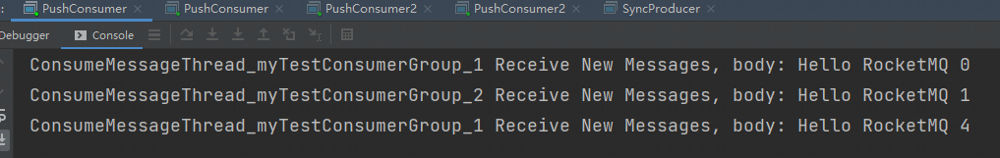

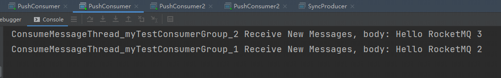

2. 广播消费模式结果

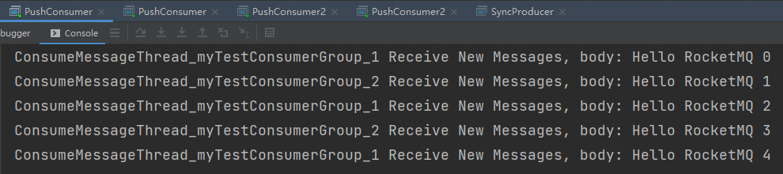

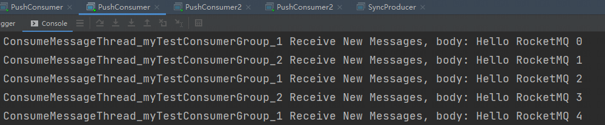

## 顺序消息

顺序消息指的是，严格按照消息的发送顺序进行消费的消息。

默认情况下生产者会把消息以 Round Robin 轮询方式发送到不同的 Queue 分区队列中；而消费消息时会从多个 Queue 上拉取消息，这种情况下的发送和消费不能保证顺序的。如果将消息仅发送到同一 Queue 中，消费时也只从这个 Queue 上拉取消息，就严格保证了消息的顺序性

### 全局有序
当发送和消费参与的 Queue 只有一个时所保证的有序是整个 Topic 中消息的顺序，称为全局有序

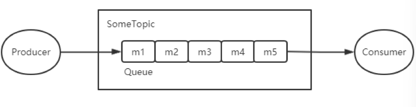

### 分区有序
如果有多个 Queue 参与，其仅可保证在该 Queue 分区队列上的消息顺序，则称为分区有序

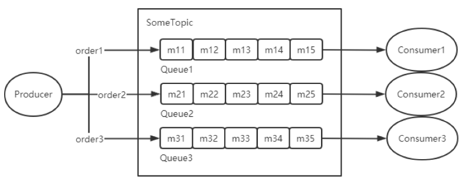

```java
public class Producer {
    public static void main(String[] args) throws MQClientException, MQBrokerException, RemotingException, InterruptedException {
        DefaultMQProducer producer = new DefaultMQProducer("pg");
        producer.setNamesrvAddr("127.0.0.1:9876");
        //设置 queue 的数量为 1，则为全局有序
//        producer.setDefaultTopicQueueNums(1);
        producer.start();
        String[] tags = {"tagA", "tagB", "tagC"};
        for (int i = 0; i < 100; i++) {
            int orderId = i % 10;
            Message msg = new Message("topic4", tags[i % tags.length], ("Hello MQ" + i).getBytes());
            msg.setKeys(i + "");
            SendResult result = producer.send(msg, new MessageQueueSelector() {
                @Override
                public MessageQueue select(List<MessageQueue> list, Message message, Object o) {
                    //第一种方法：根据 key 来来进行路由
                    Integer id = Integer.valueOf(msg.getKeys());
                    //第二种方法：传递参数来进行路由，send 方法的第三个参数会传递到 o 参数中
                    Integer p = (Integer) o;
                    int index = p % list.size();
                    return list.get(index);
                }
            }, orderId);
            System.out.println(result);
        }
        producer.shutdown();
    }

    /**
     * 消费顺序消息
     */
    public static void main(String[] args) throws Exception {
        DefaultMQPushConsumer consumer = new DefaultMQPushConsumer("og");
        consumer.setNamesrvAddr("192.168.18.128:9876");
        consumer.setConsumeFromWhere(ConsumeFromWhere.CONSUME_FROM_FIRST_OFFSET);
        consumer.subscribe("orderTopic", "*");
        consumer.setMessageModel(MessageModel.BROADCASTING);
        consumer.registerMessageListener(new MessageListenerConcurrently() {
            @Override
            public ConsumeConcurrentlyStatus consumeMessage(List<MessageExt> list, ConsumeConcurrentlyContext consumeConcurrentlyContext) {
                list.stream().filter(item -> item.getKeys().equals("1"))
                        .forEach(item -> {
                            System.out.println("当前消息的内容为：" + new String(item.getBody()));
                        });
                return ConsumeConcurrentlyStatus.CONSUME_SUCCESS;
            }
        });
        consumer.start();
        System.out.println("消费完成");
    }
}
```

## 延迟消息
### 延时等级
延时消息的延迟时长不支持随机时长的延迟，是通过特定的延迟等级来指定的。延时等级定义来 RocketMQ 服务端的 MessageStoreConfig 类中的如下变量中：

```java
private String messageDelayLevel = "1s 5s 10s 30s 1m 2m 3m 
    4m 5m 6m 7m 8m 9m 10m 20m 30m 1h 2h";
```

比如：如果指定等级为 3，则延迟为 10s，延迟等级从 1 开始

注意：如果需要自定义延时等级，可以通过在 broker 加载的配置中添加配置，配置文件在 RocketMQ 安装目录下的 conf 目录中


### 延迟消息原理
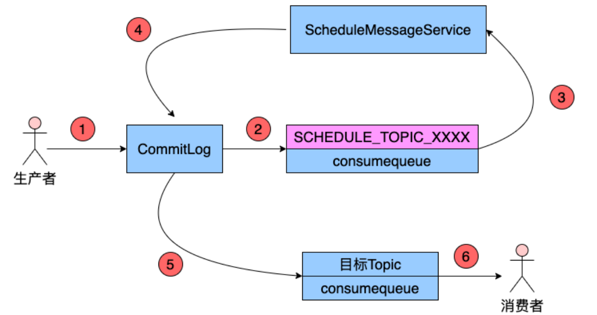

Producer 将消息发送到 Broker 之后，Broker 先将消息发送到 commitLog 文件，然后将其分发到相应的 consumerqueue。不过，在分发之前，系统会判断消息中是否带有延迟等级，没有则直接正常分发；若有

1. 修改消息的 topic 为 SCHEDULE_TOPIC_XXXX
2. 根据延时等级，在 consumequeue 目录中 SCHEDULE_TOPIC_XXXX 主题下创建出相应的 queueId 与 consumequeue 文件（如果没有这些目录与文件）。注意：延迟等级与 queueId 的对应关系为 queueId = delayLevel-1
3. 修改消息索引单元内容：索引单元中的 MessagetagHashCode 部分原本存放的是消息的 tag 的 hash 值，现在修改为消息的投递时间。投递时间 = 消息存储时间+延迟时间，即投递时间存的是其真正需要被分发回原 queue 的时间
4. 投递延迟消息：Broker 内部有一个延迟消息服务类 ScheduleMessageService，负责将消息投递到目标 topic（内部用 Timer 定时器实现）
5. 将消息重新写入 commitlog，形成新的索引条目分发到相应的 queue 中

```java
public class TimeProducer {
    public static void main(String[] args) throws MQBrokerException, RemotingException, InterruptedException, MQClientException {
        DefaultMQProducer producer = new DefaultMQProducer("pg");
        producer.setNamesrvAddr("127.0.0.1:9876");
        producer.start();
        for (int i = 0; i < 100; i++) {
            Message msg = new Message("delay", "tag", ("delay message" + i).getBytes());
            //设置延时等级
            msg.setDelayTimeLevel(3);
            producer.send(msg);
        }
        producer.shutdown();
    }
}
```

## 批量消息
### 发送限制
生产者进行消息发送时可以一次发送多条消息，这可以大大提升 Producer 的发送效率

1. 批量发送的消息必须具有相同的 Topic
2. 批量发送的消息必须具有相同的刷盘策略
3. 批量发送的消息不能是延时消息与事务消息

### 批量发送大小
生产者通过 send()发送的 Message，并不是直接将 Message 序列化后发送到网络上的，而是通过这个 Message 生成一个字符串发送出去的。这个字符串由四部分组成：Topic、消息 Body、消息日志（占 20 字节），及用于描述消息的一堆属性 key-value。这些属性中包含列入生产者地址、生产时间、要发送的 QueueId 等。最终写入到 Broker 中消息单元的数据都是来自于这些属性

默认情况下，一批发送的消息总大小不能超过 4MB，如果想要超出该值，有以下两种方法：

1. 将批量消息进行拆分，拆分为若干不大于 4M 的消息集合分多次批量发送
2. 在 Producer 端与 Broker 端修改属性
+ Producer 端需要在发送之前设置 Producer 的 maxMessageSize 属性
+ Broker 端需要修改其加载的配置文件中的 maxMessageSize 属性

```java
/**
 * 消息列表分割器：其只会处理每条消息的大小不超过 4M 的情况。若存在某条消息，
 * 其本身大小大于 4M，会直接将这条消息构成一个子列表返回
 */
public class MessageListSplitter implements Iterator<List<Message>> {
    //指定极限值为 4M
    private final int SIZE_LIMIT = 4 * 1024 * 1024;
    //存放所有要发送的消息
    private final List<Message> messages;
    //要进行批量发送消息的小集合起始索引
    private int currIndex;

    public MessageListSplitter(List<Message> messages) {
        this.messages = messages;
    }

    @Override
    public boolean hasNext() {
        //判断当前开始遍历的消息索引要小于消息总数
        return currIndex < messages.size();
    }

    @Override
    public List<Message> next() {
        int nextIndex = currIndex;
        //记录当前要发送的这一批次消息列表的大小
        int totalSize = 0 ;
        for(; nextIndex < messages.size(); nextIndex ++){
            //获取当前遍历的消息
            Message message = messages.get(nextIndex);

            //统计当前遍历的 message 的大小
            int tmpSize = message.getTopic().length() + message.getBody().length;
            Map<String, String> properties = message.getProperties();
            for (Map.Entry<String,String> entry : properties.entrySet()){
                tmpSize += entry.getKey().length() + entry.getValue().length();
            }
            tmpSize = tmpSize + 20 ;

            //判断当前消息本身是否大于 4M
            if(tmpSize > SIZE_LIMIT) {
                if(nextIndex - currIndex == 0){
                    nextIndex ++ ;
                }
                break;
            }
            if (tmpSize + totalSize > SIZE_LIMIT){
                break;
            }else{
                totalSize += tmpSize;
            }
        }
        //获取当前 messages 列表的子集合[currIndex, nextIndex)
        List<Message> subList = this.messages.subList(currIndex, nextIndex);
        //下次遍历的开始索引
        currIndex = nextIndex;
        return subList;
    }  
}
```

```java
public class BatchProducer {
    public static void main(String[] args) throws MQClientException {
        DefaultMQProducer producer = new DefaultMQProducer("pg");
        producer.setNamesrvAddr("127.0.0.1:9876");
        producer.start();

        List<Message> messages=new ArrayList<>();
        for (int i = 0; i < 100; i++) {
            byte[] bytes = ("hi" + i).getBytes();
            Message msg = new Message("topic", "tag", bytes);
            messages.add(msg);
        }

        //定义消息列表分割器，将消息列表分割为多个不超出 4M 大小的列表
        MessageListSplitter splitter = new MessageListSplitter(messages);
        while (splitter.hasNext()){
            try {
                List<Message> list = splitter.next();
                producer.send(list);
            }catch (Exception e){
                e.printStackTrace();
            }
        }
        producer.shutdown();
    }
}
```

```java
public class BatchConsumer {
    public static void main(String[] args) throws MQClientException {
        DefaultMQPushConsumer consumer = new DefaultMQPushConsumer("cg");
        consumer.setNamesrvAddr("127.0.0.1:9876");
        consumer.setConsumeFromWhere(ConsumeFromWhere.CONSUME_FROM_FIRST_OFFSET);
        consumer.subscribe("topic","*");
        
        //指定每次可以消费 10 条消息，默认为 1
        consumer.setConsumeMessageBatchMaxSize(10);
        //指定每次可以从 Broker 拉取 40 条消息，默认为 32
        consumer.setPullBatchSize(40);
        consumer.registerMessageListener(new MessageListenerConcurrently() {
            @Override
            public ConsumeConcurrentlyStatus consumeMessage(List<MessageExt> list, ConsumeConcurrentlyContext consumeConcurrentlyContext) {
                for (MessageExt messageExt : list) {
                    System.out.println(messageExt);
                }
                return ConsumeConcurrentlyStatus.CONSUME_SUCCESS;
            }
        });
        consumer.start();
    }
}
```

### 批量消费消息
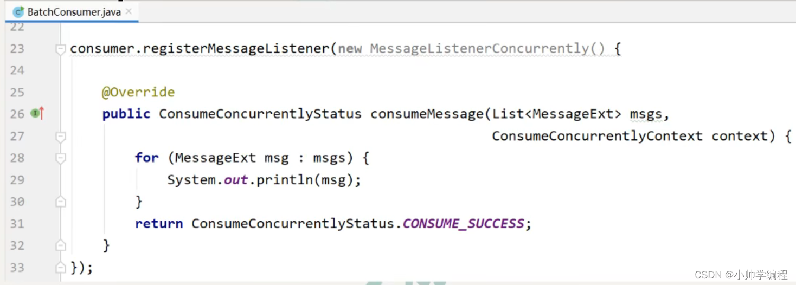

Consumer 的 MessageListenerConcurrent 监听接口的 consume Message 方法的第一个参数为消息列表，但默认情况下每次只能消费一条消息，若要使其一次可以消费多条消息，则可以通过修改 Consumer 的 ConsumeMessageBatchMaXSize 属性来指定，不过，该值不能超过 32。因为默认情况下消费者每次可以拉取的消息最多是 32 条，若要修改一次拉去的最大值，则可通过修改 Consumer 的 pullBatchSize 属性来指定

```java
producer.setMaxMessageSize(); //设置发送消息的大小
consumer.setPullBatchSize(13);//设置每次拉取消息的大小
consumer.setConsumeMessageBatchMaxSize(13);//设置批量消费消息的最大值
```

注意：

1. pullBatchSize 值设置的越大，Consumer 每次拉取一次需要的时间就会越长，且在网络上传输问题的可能性就越高。若在拉取过程中若出现了问题，那么本批次所有消息都需要重新拉取。
2. consumeMessageBatchMaxSize 值设置的越大，Consumer 的消息并发消费能力越低，且这批被消费的消息就有相同的消费结果，因为 consumeMessageBatchMaxSize 指定的一批消息只会使用一个线程进行处理，且在处理工程中只要有一个消息处理异常，则这批消息需要全部重新再次消费处理

## 消息过滤
### Tag 过滤
通过 consumer 的 subscribe()方法指定要订阅消息的 Tag，如果订阅多个 Tag 的消息，Tag 间使用或运算符（双竖线||）连接

```java
public class TagProducer {
    public static void main(String[] args) throws MQClientException, MQBrokerException, RemotingException, InterruptedException {
        DefaultMQProducer producer = new DefaultMQProducer("pg");
        producer.setNamesrvAddr("127.0.0.1:9876");
        producer.start();
        String[] tags = {"tagA", "tagB", "tagC"};
        for (int i = 0; i < 10; i++) {
            byte[] bytes = ("hi" + i).getBytes();
            String tag = tags[i % tags.length];
            Message msg = new Message("topic", tag, bytes);
            SendResult result = producer.send(msg);
            System.out.println(result);
        }
        producer.shutdown();
    }
}
```

```java
public class TagConsumer {
    public static void main(String[] args) throws MQClientException {
        DefaultMQPushConsumer consumer = new DefaultMQPushConsumer("cg");
        consumer.setNamesrvAddr("127.0.0.1:9876");
        consumer.setConsumeFromWhere(ConsumeFromWhere.CONSUME_FROM_FIRST_OFFSET);
        //tag 过滤
        consumer.subscribe("topic","tagA || tagB");
        consumer.registerMessageListener(new MessageListenerConcurrently() {
            @Override
            public ConsumeConcurrentlyStatus consumeMessage(List<MessageExt> list, ConsumeConcurrentlyContext consumeConcurrentlyContext) {
                for (MessageExt messageExt : list) {
                    System.out.println(messageExt);
                }
                return ConsumeConcurrentlyStatus.CONSUME_SUCCESS;
            }
        });
        consumer.start();
    }
}
```

### SQL 过滤
SQL 过滤是一种通过特定表达式对事先埋入到消息中的用户属性进行筛选过滤的方式。通过 SQL 过滤，可以实现对消息的复杂过滤，不过，只有使用 PUSH 模式的消费者才能使用 SQL 过滤

默认情况下 Broker 没有开启消息的 SQL 过滤功能，需要在 Broker 加载的配置文件中添加如下属性：enablePropertyFilter = true

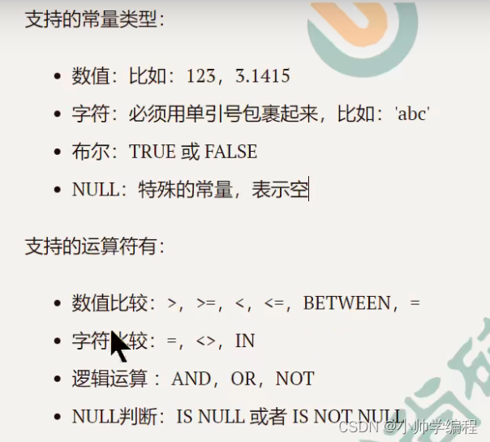

```java
public class SQLProducer {
    public static void main(String[] args) throws MQBrokerException, RemotingException, InterruptedException, MQClientException {
        DefaultMQProducer producer = new DefaultMQProducer("pg");
        producer.setNamesrvAddr("127.0.0.1:9876");
        producer.start();
        for (int i = 0; i < 10; i++) {
            byte[] bytes = ("hi" + i).getBytes();
            Message msg = new Message("topic", "tag", bytes);
            //设置属性
            msg.putUserProperty("age",i+"");
            SendResult result = producer.send(msg);
            System.out.println(result);
        }
        producer.shutdown();
    }
}
```

```java
public class SQLConsumer {
    public static void main(String[] args) throws MQClientException {
        DefaultMQPushConsumer consumer = new DefaultMQPushConsumer("cg");
        consumer.setNamesrvAddr("127.0.0.1:9876");
        consumer.setConsumeFromWhere(ConsumeFromWhere.CONSUME_FROM_FIRST_OFFSET);
        //sql 过滤
        consumer.subscribe("topic", MessageSelector.bySql("age between 0 and 6"));
        consumer.registerMessageListener(new MessageListenerConcurrently() {
            @Override
            public ConsumeConcurrentlyStatus consumeMessage(List<MessageExt> list, ConsumeConcurrentlyContext consumeConcurrentlyContext) {
                for (MessageExt messageExt : list) {
                    System.out.println(messageExt);
                }
                return ConsumeConcurrentlyStatus.CONSUME_SUCCESS;
            }
        });
        consumer.start();
    }
}
```

## 事务消息
### 出现场景
需求场景：工行用户 A 向建行用户 B 转账 1 万元

使用同步消息来处理时（存在问题：若第 3 步中的扣款操作失败，但消息已经成功发送到了 Broker，对于 MQ 来说，只要消息写入成功，那么这个消息就可以被消费）

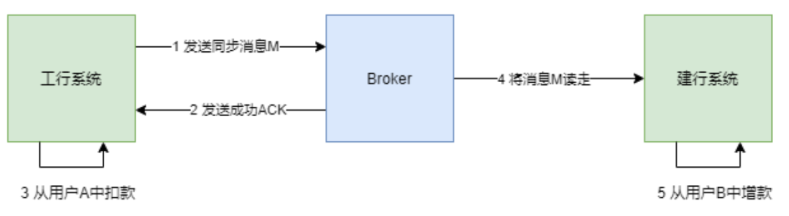

### 解决方法
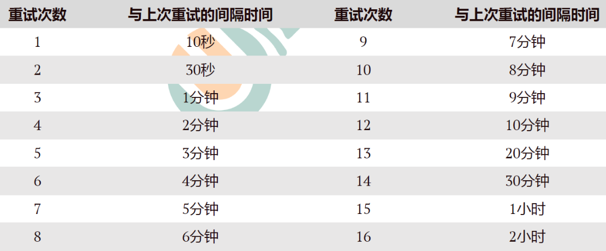

1. 事务管理器 TM 向事务协调器 TC 发起指令，开启全局事务
2. 工行系统发一个给 B 增款 1 万元的事务消息 M 给 TC
3. TC 向 Broker 发送半事务消息 prepareHalf，将消息 M 预提交到 Broker，此时的建行系统是看不到 Broker 中的消息 M 的
4. Broker 会将预提交执行结果 Report 给 TC
5. 如果预提交失败，则 TC 会向 TM 上报预提交失败的响应，全局事务结束；如果预提交成功，TC 会调用工行系统的回调操作，去完成工行用户 A 的预扣款 1 万元的操作
6. 工行系统会向 TC 发送预扣款执行结果，即本地事务的执行状态
7. TC 收到预扣款执行结果后，会将结果上报给 TM
8. TM 会根据上报结果向 TC 发出不同的确认指令
+ 若预扣款成功（本地事务状态为 COMMIT_MESSAGE），则 TM 向 TC 发送 Global Commit 指令
+ 若预扣款失败（本地事务状态为 ROLLBACK_MESSAGE），则 TM 向 TC 发送 Global Rollback 指令
+ 若为未知状态（本地事务状态为 UNKNOW），则会触发工行系统的本地事务状态回查操作。回查操作会将回查结果，即 COMMIT_MESSAGE 或 ROLLBACK_MESSAGE Report 给 TC，TC 将结果上报给 TM，TM 会再向 TC 发送最终确认指令 Global Commit 或 Global Rollback
9. TC 在接收到指令后会向 Broker 与工行系统发出确认指令
+ TC 接收的若是 Global Commit 指令，则向 Broker 与工行系统发送 Branch Commit 指令。此时 Broker 中的消息 M 才可被建行系统看到，此时的工行用户 A 中的扣款操作才真正被确认
+ TC 接收的若是 Global Rollback 指令，则向 Broker 与工行系统发送 Branch Rollback 指令。此时 Broker 中的消息 M 将被撤销，工行用户 A 中的扣款操作将被回滚

### 本地事务状态
```java
public enum LocalTransactionState {
    // 本地事务执行成功
    COMMIT_MESSAGE,
    // 本地事务执行失败
    ROLLBACK_MESSAGE,
    // 不确定，表示需要进行回查以确定本地事务的执行结果
    UNKNOW;
}
```

### 消息回查
消息回查：重新查询本地事务的执行状态

1. 引发消息回查的原因：
+ 回调操作返回 UNKNOWN
+ TC 没有接收到 TM 的最终全局事务确认指令
2. 消息回查属性设置（在 broker 加载的配置文件中设置）：
+ transactionTimeout = 20，指定 TM 在 20 秒内应将最终确认状态发送给 TC，否则引发消息回查，默认为 60 秒
+ transactionCheckMax = 5，指定最多回查 5 次，超过后将丢弃消息并记录错误日志，默认 15 次
+ transactionCheckInterval = 10，指定设置的多次消息回查的时间间隔为 10 秒，默认为 60 秒

### XA 模式
1. TC（Transaction Coordinator，事务协调者）：维护全局和分支事务的状态，驱动全局事务提交或回滚
2. TM（Transaction Manager，事务管理器）：定义全局事务的范围，开始全局事务、提交或回滚全局事务
3. RM（Resource Manager，资源管理器）：管理分支事务处理的资源，与 TC 交谈以主从分支事务和报告分支事务的状态，并驱动分支事务提交或回滚

执行原理：

1. TM 向 TC 发起指令，开启一个全局事务
2. 根据业务要求，各个 RM 会逐个向 TC 注册分支事务，然后 TC 会逐个向 RM 发出预执行指令
3. 各个 RM 在接收到指令后会在本地事务预执行
4. RM 将预执行结果 Repore 给 TC
5. TC 在接收到各个 RM 的 Repore 后会将汇总结果上报给 TM，根据汇总结果 TM 向 TC 发出确认指令
+ 若所有结果都是成功响应，则向 TC 发送 Global Commit 指令
+ 只要有结果是失败响应，则向 TC 发送 Global Rollback 指令
6. TC 在接收到指令后再次向 RM 发送确认指令

```java
public class Listener implements TransactionListener {

    /**
     * 回调操作方法
     * 消息预提交成功就会触发该方法的执行，用于完成本地事务
     */
    @Override
    public LocalTransactionState executeLocalTransaction(Message message, Object o) {
        System.out.println("预提交消息成功：" + message);
        if (StringUtils.equals("TagA", message.getTags())) {
            return LocalTransactionState.COMMIT_MESSAGE;
        } else if (StringUtils.equals("TagB", message.getTags())) {
            return LocalTransactionState.ROLLBACK_MESSAGE;
        }
        return LocalTransactionState.UNKNOW;
    }

    /**
     * 消息回查方法
     * 引发消息回查的原因：
     * 1.回调操作返回 UNKNOWN
     * 2.TC 没有接收到 TM 的最终全局事务确认指令
     */
    @Override
    public LocalTransactionState checkLocalTransaction(MessageExt messageExt) {
        System.out.println("执行消息回查：body" + new String(messageExt.getBody()));
        return LocalTransactionState.COMMIT_MESSAGE;
    }
}
```

```java
public class TransactionProducer {
    public static void main(String[] args) throws InterruptedException, MQClientException {
        //事务消息生产者
        TransactionMQProducer producer = new TransactionMQProducer("pg");
        producer.setNamesrvAddr("127.0.0.1:9876");
        ThreadPoolExecutor executor = new ThreadPoolExecutor(2, 5, 100, TimeUnit.SECONDS, new ArrayBlockingQueue<Runnable>(2000), new ThreadFactory() {
            @Override
            public Thread newThread(Runnable r) {
                Thread thread = new Thread(r);
                thread.setName("transaction-thread");
                return thread;
            }
        });
        //为生产者指定线程池
        producer.setExecutorService(executor);
        //为生产者添加事务监听器
        producer.setTransactionListener(new Listener());
        producer.start();

        String[] tags = {"TagA", "TagB", "TagC"};
        for (int i = 0; i < 10; i++) {
            Message msg = new Message("topic", tags[i % tags.length], ("hi" + i).getBytes());
            TransactionSendResult result = producer.sendMessageInTransaction(msg, null);
            System.out.println(result);
            Thread.sleep(10);
        }
        for (int i = 0; i < 10000; i++) {
            Thread.sleep(1000);
        }
        producer.shutdown();
    }
}
```

```java
public class TransactionConsumer {
    public static void main(String[] args) throws MQClientException {
        DefaultMQPushConsumer consumer = new DefaultMQPushConsumer("cg");
        consumer.setNamesrvAddr("127.0.0.1:9876");
        consumer.subscribe("topic","*");
        consumer.registerMessageListener(new MessageListenerConcurrently() {
            @Override
            public ConsumeConcurrentlyStatus consumeMessage(List<MessageExt> list, ConsumeConcurrentlyContext consumeConcurrentlyContext) {
                for (MessageExt messageExt : list) {
                    System.out.printf("%s Receive Message:%s,property:%s %n",Thread.currentThread().getName(),new String(messageExt.getBody()),messageExt.getProperties());
                }
                return ConsumeConcurrentlyStatus.CONSUME_SUCCESS;
            }
        });
        consumer.start();
    }
}
```

## 重试机制
### 消息发送重试机制
1. 生产者在发送消息时，若采用同步或异步发送方式，发送失败会重试，但 oneway 消息发送方式发送失败是没有重试机制的
2. 只有普通消息具有发送重试机制，顺序消息是没有的
3. 消息重投机制可以保证消息尽可能发送成功、不丢失，但可能会造成消息重复，消息重复在 RocketMQ 中是无法避免的问题
4. 消息重复在一般情况下不会发送，当出现消息量大、网络抖动，消息重复就会成为大概率事件
5. producer 主动重发、consumer 负载变化（发生 Rebalance，不会导致消息重复，但可能出现重复消费）也会导致重复消息
6. 消息重复无法避免，但要避免消息的重复消费，避免消息重复消息的解决方法是：为消息添加唯一标识（如消息 key），使消费者对消息进行消费判断来避免重复消费

#### 同步发送失败策略
对于普通消息，消息发送默认采用 round-robin 策略来选择所发送到的队列。如果发送失败，默认重试 2 次，但在重试时不会选择上次发送失败的 Broker，而是选择其他 Broker。若只有一个 Broker 也只能发送到该 Broker，但会尽量发送到该 Broker 上的其他 Queue

```java
DefaultMQProducer producer = new DefaultMQProducer("syncProducer");
producer.setNamesrvAddr("192.168.13.111:9876");
// 设置发送失败的重试次数，默认是 2 次
producer.setRetryTimesWhenSendFailed(4);
// 设置消息发送超时时长是 5s，默认是 3s
producer.setSendMsgTimeout(5 * 1000);
```

Broker 具有失败隔离功能，使 Producer 尽量选择未发生过发送失败的 Broker 作为目标 Broker，其可以保证其他消息尽量不发送到问题 Broker，为了提升消息发送效率，降低消息发送耗时

如果超过重试次数，则抛出异常，由 Producer 去保证消息不丢。当生产者出现 RemotingException、MQClientException 和 MQBrokerException 时，Producer 会自动重投消息

#### 异步发送失败策略
异步发送失败重试时，异步重试不会选择其他 broker，仅在同一个 broker 上重试，所以该策略无法保证消息不丢

```java
DefaultMQProducer producer = new DefaultMQProducer("asyncProducer");
producer.setNamesrvAddr("192.168.13.111:9876");
// 指定异步发送失败后不进行消息重试
producer.setRetryTimesWhenSendAsyncFailed(0);
producer.start();
```

#### 消息刷盘失败策略
消息刷盘超时（Master 或 Slave）或 slave 不可用（slave 在做数据同步时向 master 返回状态不是 SEND_OK）时，默认是不会将消息尝试发送到其他 Broker 的。对于重要消息可以通过在 Broker 的配置文件设置 retryAnotherBrokerWhenNotStoreOK 属性为 true 来开启

### 消息消费重试机制
#### 顺序消息的消费重试
对于顺序消息，当 Consumer 消费消息失败后，为了保证消息的顺序性，其会自动不断地进行消息重试，直到消费成功。消费重试默认间隔时间为 1000 毫秒，重试期间应用会出现消息被阻塞的情况

注意：顺序消息没有发送失败重试机制，但具有消费失败重试机制

```java
consumer.setSuspendCurrentQueueTimeMillis(1000);
```

#### 无序消息的消费重试
对于无序消息（普通消息、延时消息、事务消息），当 Consumer 消费消息失败时，可以通过设置返回状态达到消息重试的效果。无序消息的重试只对集群消费方式生效，广播消费方式不提供失败重试特性，即对于广播消费，消费失败后，失败消息不再重试，继续消费后续消息

消息重试次数间隔：对于无序消息集群消费下的重试消费，每条消息默认最多重试 16 次，但每次重试的间隔时间是不同的，会逐渐变长


若一条消息在一直消费失败的前提下，将会在正常消费后的第 4 小时 46 分后进行第 16 次重试，若仍然失败，则将消息投递到死信队列

对于修改过的重试次数，将按照以下策略执行：

1. 若修改值小于 16，则按照指定间隔进行重试
2. 若修改值大于 16，则超过 16 次的重试时间间隔均为 2 小时

对于 Consumer Group，若仅修改了一个 Consumer 的消费重试次数，则会应用到该 Group 中所有其他 Consumer 实例。若出现多个 Consumer 均做了修改的情况，则采用覆盖方式生效，即最后被修改的值会覆盖前面设置的值

```java
DefaultMQPushConsumer consumer = new DefaultMQPushConsumer("myTestConsumerGroup");
/**
 * 默认时间： 10s 30s 1m 2m 3m 4m 5m 6m 7m 8m 9m 10m 20m 30m 1h 2h
 * 修改后时间规则： 如果次数小于十六，按原来时间执行； 超过 16 每次都是 2 小时
 * 对于 ConsumerGroup, 修改一个会影响当前 consumerGroup 的所有实例，采用覆盖的方式以最后一次修改为准(因为规则跑在 mq 服务端)
 */
consumer.setMaxReconsumeTimes(10);
```

#### 重试队列
对于需要重试消费的消息，并不是 Consumer 在等待了指定时长后再次去拉取原来的消息进行消费，而是将这些需要重试消费的消息放入到了一个特殊 Topic 的队列中，而后进行再次消费的。这个特殊的队列就是重试队列

当出现需要进行重试消费的消息时，Broker 会为每个消费组都设置一个 Topic 名称为%RETRY%consumerGroup@consumerGroup 的重试队列

1. 这个重试队列是针对消息才组的，而不是针对每个 Topic 设置的（一个 Topic 的消息可以让多个消费者组进行消费，所以会为这些消费者组各创建一个重试队列）
2. 只有当出现需要进行重试消费的消息时，才会为该消费者组创建重试队列

Broker 对于重试消息的处理是通过延时消息实现的，先将消息保存到 SCHEDULE_TOPIC_XXXX 延迟队列中，延迟时间到后，会将消息投递到%RETRY%consumerGroup@consumerGroup 重试队列中

#### 消费重试配置方式
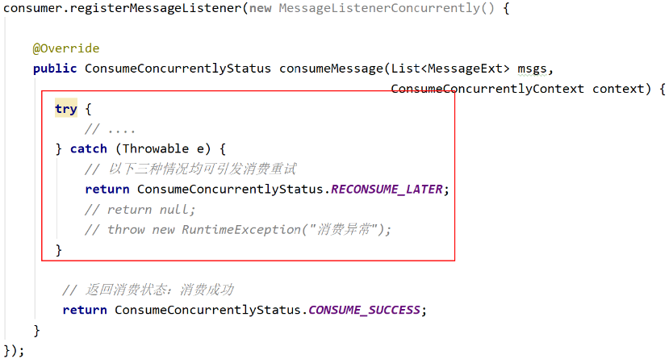

集群消费方式下，消息消费失败后若希望消费重试，则需要在消息监听器接口的实现中明确进行如下三种方式之一的配置：

1. 返回 ConsumerConcurrentlyStatus.RECONSUME_LATER（推荐）
2. 返回 Null
3. 抛出异常

#### 消费不重试配置方式
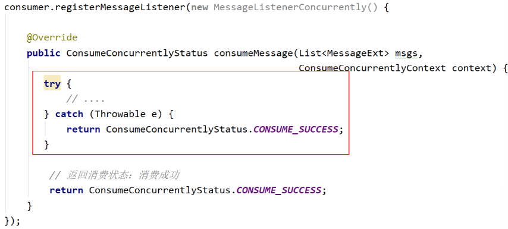

集群消费方式下，消息消费失败后若不希望消息重试，则在捕获到异常后同时也返回与消费成功后的相同的结果，即 ConsumeConcurrentlyStatus.CONSUME_SUCCESS，则不进行消费重试

## 死信队列
### 什么是死信队列？
当一条消息初次消费失败，消息队列会自动进行消费重试；达到最大重试次数后，若消费依然失败，则表明消费者在正常情况下无法正确地消费该消息，此时，消息队列不会立刻将消息丢弃，而是将其发送到该消费者对应的特殊队列中。这个队列就是死信队列（DLQ），而其中的消息则称为死信消息（DLM）

### 特征
1. 死信队列中的消息不会再被消费者正常消费，即 DLQ 对于消费者是不可见的
2. 死信存储有效期与正常消息相同，均为 3 天（commitlog 文件的过期时间），3 天后会被自动删除
3. 死信队列就是一个特殊的 Topic，名称为%DLQ%consumerGroup@consumerGroup，即每个消费者组都有一个死信队列
4. 如果一个消费者组未产生死信消息，则不会为其创建相应的死信队列

```java
public class PushConsumer {

    public static void main(String[] args) throws InterruptedException, MQClientException {
        DefaultMQPushConsumer consumer = new DefaultMQPushConsumer("myTestConsumerGroup3");
        /**
         * 默认时间： 10s 30s 1m 2m 3m 4m 5m 6m 7m 8m 9m 10m 20m 30m 1h 2h
         * 修改后时间规则： 如果次数小于十六，按原来时间执行； 超过 16 每次都是 2 小时
         * 对于 ConsumerGroup, 修改一个会影响当前 consumerGroup 的所有实例，采用覆盖的方式以最后一次修改为准(因为规则跑在 mq 服务端)
         */
        consumer.setMaxReconsumeTimes(2);
        // 设置线程数量
        consumer.setConsumeThreadMax(4);
        consumer.setConsumeThreadMin(2);
        // 指定 nameserver
        consumer.setNamesrvAddr("192.168.13.111:9876");
        // 指定消费的 topic 与 tag
        consumer.subscribe("dlqTopic", "*");
        consumer.registerMessageListener(new MessageListenerConcurrently() {
            @Override
            public ConsumeConcurrentlyStatus consumeMessage(List<MessageExt> msgs,
                                                            ConsumeConcurrentlyContext context) {
                for (MessageExt msg : msgs) {
                    System.out.printf("%s Receive New Messages, body: %s %n", Thread.currentThread().getName(), new String(msg.getBody()));
                }
                // 返回非正常结果，进入死信队列中
                return null;
            }
        });

        consumer.start();
        System.out.printf("Consumer Started.%n");
    }
}
```

## SpringBoot 整合 RocketMQ
```xml
<dependency>
  <groupId>org.apache.rocketmq</groupId>
  <artifactId>rocketmq-spring-boot-starter</artifactId>
  <version>2.2.0</version>
</dependency>
```

```yaml
# rocketmq 配置项，对应 RocketMQProperties 配置类
rocketmq:
  name-server: 101.133.227.13:9876 # RocketMQ Namesrv
  # Producer 配置项
  producer:
    group: test-producer-group # 生产者分组
    send-message-timeout: 3000 # 发送消息超时时间，单位：毫秒。默认为 3000 。
    compress-message-body-threshold: 4096 # 消息压缩阀值，当消息体的大小超过该阀值后，进行消息压缩。默认为 4 * 1024B
    max-message-size: 4194304 # 消息体的最大允许大小。。默认为 4 * 1024 * 1024B
    retry-times-when-send-failed: 2 # 同步发送消息时，失败重试次数。默认为 2 次。
    retry-times-when-send-async-failed: 2 # 异步发送消息时，失败重试次数。默认为 2 次。
    retry-next-server: false # 发送消息给 Broker 时，如果发送失败，是否重试另外一台 Broker 。默认为 false
    access-key: # Access Key ，可阅读 https://github.com/apache/rocketmq/blob/master/docs/cn/acl/user_guide.md 文档
    secret-key: # Secret Key
    enable-msg-trace: true # 是否开启消息轨迹功能。默认为 true 开启。可阅读 https://github.com/apache/rocketmq/blob/master/docs/cn/msg_trace/user_guide.md 文档
    customized-trace-topic: RMQ_SYS_TRACE_TOPIC # 自定义消息轨迹的 Topic 。默认为 RMQ_SYS_TRACE_TOPIC 。
  # Consumer 配置项
  consumer:
    listeners: # 配置某个消费分组，是否监听指定 Topic 。结构为 Map<消费者分组, <Topic, Boolean>> 。默认情况下，不配置表示监听。
      test-consumer-group:
        topic1: false # 关闭 test-consumer-group 对 topic1 的监听消费
```

### 同步消息
```java
/**
* 普通发送
*/
public <T> void send(String topic, T msg) {
    rocketMQTemplate.convertAndSend(topic + ":tag1", msg);
    //rocketMQTemplate.send(topic + ": tag1", MessageBuilder.withPayload(msg).build()); // 等价于上面一行
}


/**
* 发送带 tag 的消息，直接在 topic 后面加上 ": tag"
*/
public <T> SendResult sendTagMsg(String topic, String tag, T msg) {
    topic = topic + ":" + tag;
    return rocketMQTemplate.syncSend(topic, MessageBuilder.withPayload(msg).build());
}


/**
* 发送同步消息（阻塞当前线程，等待 broker 响应发送结果，这样不太容易丢失消息）
*/
public <T> SendResult sendMsg(String topic, T msg) {
    Message<T> message = MessageBuilder.withPayload(msg).build();
    SendResult sendResult = rocketMQTemplate.syncSend(topic, message);
    log.info("【sendMsg】sendResult={}", JSON.toJSONString(sendResult));
    return sendResult;
}
```

这里存在两种消息体，一种是 Object 的，另一种是 Message <?>，在发送 Object 的时候，底层是有帮我们做转换的


### 异步消息
```java
/**
 * 发送异步消息（通过线程池执行发送到 broker 的消息任务，执行完后回调：在 SendCallback 中可处理相关成功失败时的逻辑）
 * （适合对响应时间敏感的业务场景）
 */
public <T> void asyncSend(String topic, T msg) {
    Message<T> message = MessageBuilder.withPayload(msg).build();
    asyncSend(topic, message, new SendCallback() {
        @Override
        public void onSuccess(SendResult sendResult) {
            log.info("topic:{}消息---发送MQ成功---", topic);
        }

        @Override
        public void onException(Throwable throwable) {
            log.error("topic:{}消息---发送MQ失败 ex:{}---", topic, throwable.getMessage());
        }
    });
}


/**
 * 发送异步消息（通过线程池执行发送到 broker 的消息任务，执行完后回调：在 SendCallback 中可处理相关成功失败时的逻辑）
 * （适合对响应时间敏感的业务场景）
 */
public void asyncSend(String topic, Message<?> message, SendCallback sendCallback) {
    rocketMQTemplate.asyncSend(topic, message, sendCallback);
}


/**
 * 发送异步消息
 */
public void asyncSend(String topic, Message<?> message, SendCallback sendCallback, long timeout) {
    rocketMQTemplate.asyncSend(topic, message, sendCallback, timeout);
}
```

### 单向消息
```java
/**
 * 单向消息
 * 特点为只负责发送消息，不等待服务器回应且没有回调函数触发，即只发送请求不等待应答
 * 此方式发送消息的过程耗时非常短，一般在微秒级别
 * 应用场景：适用于某些耗时非常短，但对可靠性要求并不高的场景，例如日志收集
 */
public <T> void sendOneWayMsg(String topic, T msg) {
    Message<T> message = MessageBuilder.withPayload(msg).build();
    rocketMQTemplate.sendOneWay(topic, message);
}
```

### 批量消息
```java
/**
 * 发送批量消息
 */
public <T> SendResult asyncSendBatch(String topic, List<T> msgList) {
    List<Message<T>> messageList = msgList.stream()
            .map(msg -> MessageBuilder.withPayload(msg).build())
        	.collect(Collectors.toList());
    return rocketMQTemplate.syncSend(topic, messageList);
}
```

### 同步延迟消息
```java
/**
 * 同步延迟消息
 * rocketMQ 的延迟消息发送其实是已发送就已经到 broker 端了，然后消费端会延迟收到消息。
 * RocketMQ 目前只支持固定精度的定时消息。
 * 固定等级：1 到 18 分别对应 1s 5s 10s 30s 1m 2m 3m 4m 5m 6m 7m 8m 9m 10m 20m 30m 1h 2h
 * 延迟的底层方法是用定时任务实现的。
 * 发送延时消息（delayLevel 的值就为 0，因为不延时）
 */
public <T> void sendDelay(String topic, T msg, long timeout, int delayLevel) {
    Message<T> message = MessageBuilder.withPayload(msg).build();
    rocketMQTemplate.syncSend(topic, message, timeout, delayLevel);
}
```

### 异步延迟消息
```java
/**
 * 发送异步延迟消息
 */
public void asyncSendDelay(String topic, Message<?> message, SendCallback sendCallback, long timeout, int delayLevel) {
    rocketMQTemplate.asyncSend(topic, message, sendCallback, timeout, delayLevel);
}


/**
 * 发送异步延迟消息
 */
public void asyncSendDelay(String topic, Message<?> message, long timeout, int delayLevel) {
    rocketMQTemplate.asyncSend(topic, message, new SendCallback() {
        @Override
        public void onSuccess(SendResult sendResult) {
            log.info("topic:{}消息---发送MQ成功---", topic);
        }

        @Override
        public void onException(Throwable throwable) {
            log.error("topic:{}消息---发送MQ失败 ex:{}---", topic, throwable.getMessage());
        }
    }, timeout, delayLevel);
}
```

### 顺序消息
```java
/**
 * 发送顺序消息
 */
public <T> void syncSendOrderly(String topic, T msg, String hashKey) {
    Message<T> message = MessageBuilder.withPayload(msg).build();
    log.info("发送顺序消息，topic:{}, hashKey:{}", topic, hashKey);
    rocketMQTemplate.syncSendOrderly(topic, message, hashKey);
}


/**
 * 发送顺序消息
 */
public <T> void syncSendOrderly(String topic, T msg, String hashKey, long timeout) {
    Message<T> message = MessageBuilder.withPayload(msg).build();
    log.info("发送顺序消息，topic:{}, hashKey:{}, timeout:{}", topic, hashKey, timeout);
    rocketMQTemplate.syncSendOrderly(topic, message, hashKey, timeout);
}
```

### 消费者
1. RocketMQPushConsumerLifecycleListener：可以指明消费的起始位置

```java
@Component
@RocketMQMessageListener(topic = MQConstants.STRING_EXT_TOPIC, 
                         selectorExpression = "tag0||tag1", 
                         consumerGroup = "${spring.application.name}-message-ext-consumer")
public class MessageExtConsumer implements RocketMQListener<MessageExt>, RocketMQPushConsumerLifecycleListener {

    @Override
    public void onMessage(MessageExt message) {
        System.out.printf("------- MessageExtConsumer received message, msgId: %s, body:%s \n", message.getMsgId(), new String(message.getBody()));
    }

    @Override
    public void prepareStart(DefaultMQPushConsumer consumer) {
        // set consumer consume message from now
        consumer.setConsumeFromWhere(ConsumeFromWhere.CONSUME_FROM_TIMESTAMP);
        consumer.setConsumeTimestamp(UtilAll.timeMillisToHumanString3(System.currentTimeMillis()));
    }
}
```

2. RocketMQReplyListener：消费并且回复消息

```java
@Component
@Slf4j
@RocketMQMessageListener(
        topic = MQConstants.SPRING_RECEIVE_OBJ,
        consumerGroup = MQConstants.SPRING_RECEIVE_OBJ + "-consumer")
public class ObjectConsumerWithReply implements RocketMQReplyListener<User, User> {

    @Override
    public User onMessage(User message) {
        log.info("message: {}", message);
        User replyUser = new User().setUserAge((byte) 111).setUserName("replyUsername");
        return replyUser;
    }
}
```

3. RocketMQListener：单向的消费消息

```java
@Component
@Slf4j
@RocketMQMessageListener(
//        nameServer = "192.168.13.101:9876", // 指定其他 nameserver
        topic = MQConstants.STRING_TOPIC,
        selectorType = SelectorType.TAG, // 默认就是按 TAG 过滤
        selectorExpression = "tag0||tag1",  // 默认是 *， 接收所有的 TAG
        consumeMode = ConsumeMode.CONCURRENTLY, // 默认就是该值。ConsumeMode.ORDERLY 和 MessageModel.BROADCASTING 不能一起设置
        messageModel = MessageModel.BROADCASTING, // 默认是集群模式
        consumerGroup = MQConstants.STRING_TOPIC + "-consumer2")
public class StringConsumer2 implements RocketMQListener<String> {

    @Override
    public void onMessage(String message) {
        log.info("message: {}", message);
    }
}
```

### 事务消息
```java
/**
 * 发送事务消息
 */
public <T> void sendTransaction(String txProducerGroup, String topic, String tag, T msg, T arg){
    if(!StringUtils.isEmpty(tag)){
        topic = topic + ":" + tag;
    }
    String transactionId = UUID.randomUUID().toString();
    Message<T> message = MessageBuilder.withPayload(msg)
            //header 也有大用处
            .setHeader(RocketMQHeaders.TRANSACTION_ID, transactionId)
            .setHeader("share_id", msg.getId())
            .build();
    TransactionSendResult result = rocketMQTemplate.sendMessageInTransaction(txProducerGroup, topic, message, arg);
    if(result.getLocalTransactionState().equals(LocalTransactionState.COMMIT_MESSAGE)
            && result.getSendStatus().equals(SendStatus.SEND_OK)){
        log.info("事物消息发送成功");
    }
    log.info("事物消息发送结果:{}", result);
}
```

```java
/**
 * 事物消息 Producer 事务监听器
 */
@Slf4j
@Component
@RocketMQTransactionListener(txProducerGroup = "tx-add-bonus-group")
public class TransactionListenerImpl implements RocketMQLocalTransactionListener {

    @Autowired
    private ShareService shareService;

    @Autowired
    private RocketmqTransactionLogMapper rocketmqTransactionLogMapper;

    /**
     * 发送 prepare 消息成功此方法被回调，该方法用于执行本地事务
     * @param message   回传的消息，利用 transactionId 即可获取到该消息的唯一 Id
     * @param arg       调用 send 方法时传递的参数，当 send 时候若有额外的参数可以传递到 send 方法中，这里能获取到
     * @return          返回事务状态，COMMIT：提交  ROLLBACK：回滚  UNKNOW：回调
     */
    @Override
    public RocketMQLocalTransactionState executeLocalTransaction(Message message, Object arg) {
        MessageHeaders headers = message.getHeaders();
        String transactionId = (String)headers.get(RocketMQHeaders.TRANSACTION_ID);
        Integer shareId = Integer.parseInt((String)headers.get("share_id"));
        try {
            shareService.auditBYIdWithRocketMqLog(shareId,(ShareAuditDTO)auditDTO,transactionId);
            //本地事物成功，执行 commit
            return RocketMQLocalTransactionState.COMMIT;
        } catch (Exception e) {
            log.error("本地事物执行异常，e={}",e);
            //本地事物失败，执行 rollback
            return RocketMQLocalTransactionState.ROLLBACK;
        }
    }

    //mq 回调检查本地事务执行情况
    @Override
    public RocketMQLocalTransactionState checkLocalTransaction(Message message) {
        MessageHeaders headers = message.getHeaders();
        String transactionId = (String)headers.get(RocketMQHeaders.TRANSACTION_ID);

        RocketmqTransactionLog rocketmqTransactionLog = rocketmqTransactionLogMapper.selectOne(RocketmqTransactionLog
                .builder().transactionId(transactionId).build());
        if(rocketmqTransactionLog == null){
            log.error("如果本地事物日志没有记录，transactionId={}",transactionId);
            //本地事物失败，执行 rollback
            return RocketMQLocalTransactionState.ROLLBACK;
        }
        //如果本地事物日志有记录，执行 commit
        return RocketMQLocalTransactionState.COMMIT;
    }
}
```

```java
@Slf4j
@Component
@RocketMQMessageListener(consumerGroup = "transaction-group",
        topic = "transaction-str",
        consumeMode = ConsumeMode.ORDERLY)
public class TransactionConsumer implements RocketMQListener<String> {

    @Override
    public void onMessage(String message) {
        log.info("监听到消息：message:{}", message);
    }
}
```

ConsumerMode 有两种值：

1. CONCURRENTLY：默认值，并发同时接受异步传递的消息
2. ORDERLY：顺序消费时开启，只开启一个线程，同一时间有序接受一个队列的消息


