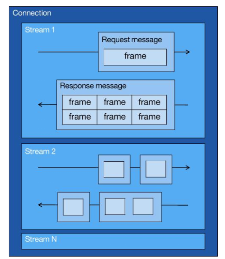
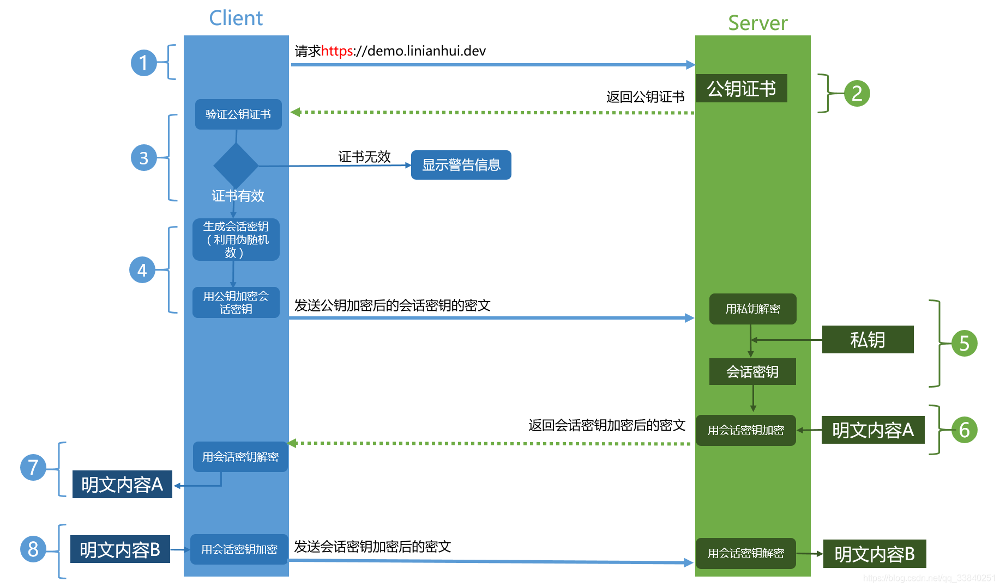

## HTTP

### 一次完整的 HTTP 请求过程
1. DNS 解析：浏览器查询 DNS，获取域名对应的 IP 地址
2. TCP 连接：浏览器获得域名对应的 IP 地址以后，浏览器向服务器请求建立连接，发起三次握手
3. 发送 HTTP 请求：TCP 连接建立起来后，浏览器向服务器发送 HTTP 请求
4. 服务器处理请求并返回 HTTP 报文：服务器接收到这个请求，并根据路径参数映射到特定的请求处理器进行处理，并将处理结果及相应的视图返回给浏览器
5. 浏览器解析渲染页面：浏览器解析并渲染视图，若遇到对 JS 文件、CSS 文件及图片等静态资源的引用，则重复上述步骤并向服务器请求这些资源；浏览器根据其请求到的资源、数据渲染页面，最终向用户呈现一个完整的页面
6. 连接结束

### HTTP 长连接和短连接
1. 在 HTTP1.0 中默认使用短连接。客户端和服务器每进行一次 HTTP 操作，就建立一次连接，任务结束就中断连接。当客户端浏览器访问的某个 HTML 或其他类型的 Web 页中包含其他的 Web 资源（js、css 文件等），每遇到这样一个 Web 资源，浏览器就会重新建立一个 HTTP 会话
2. 从 HTTP1.1 起，默认使用长连接，用以保持连接特性。使用长连接的 HTTP 协议，会在响应头加入这行代码，Connection：keep-alive。在交互过程中如果数据传送完了，还不想断开连接：在 HTTP 中响应体的 Connection 字段指定为 keep-alive，connection: keep-alive
3. 使用长连接的情况下，当一个网页打开完成后，客户端和服务器之间用于传输 HTTP 数据的 TCP 连接不会关闭，客户端再次访问这个服务器时，会继续使用这一条已经建立的连接
4. Keep-Alive 不会永久保持连接，它有一个保持时间，可以在不同的服务器软件中设定这个时间。实现长连接需要客户端和服务端都支持长连接

长连接缺点：由于有保活功能，当遇到大量的恶意操作时，服务器的压力会越来越大，这时服务器需要采取一些策略，关闭一些长时间没有进行读写事件的连接

### HTTP 缺点
1. 使用明文进行通信，内容可能会被窃听
2. 不验证通信方的身份，通信方的身份有可能遭遇伪装
3. 无法证明报文的完整性，报文有可能遭篡改

### HTTP 请求方法
1. GET：查询，发送请求来获得服务器上的资源，请求体中不会包含请求的参数，请求数据放在协议头中
2. HEAD：类似于 GET 请求，只不过返回的响应中没有具体的内容，用于获取报头
3. POST：向指定资源提交数据进行处理请求（如提交表单或上传文件），数据包含在请求体中。POST 请求可能会导致新的资源的建立和已有资源的修改
4. PUT：向服务器提交资源，并使用提交的新资源，替换服务器对应的旧资源
5. PATCH：是对 PUT 方法的补充，用来对已知资源进行局部更新
6. DELETE：请求服务器删除指定的资源
7. CONNECT：建立一个到目标资源标识的服务器的隧道
8. OPTIONS：获取 http 服务器支持的 http 请求方法，允许客户端查看服务器的性能
9. TRACE：沿着目标资源的路径执行一个消息环回测试，主要用于测试或诊断

### HTTP 状态码
#### 1xx

表示目前是协议的中间状态，还需要后续请求

1. 101：切换请求协议，从 HTTP 切换到 WebSocket

#### 2xx

表示请求成功

1. 200：请求成功，有响应体
2. 201：成功请求并创建了新的资源
3. 202：已经接受请求，但未处理完成
4. 203：请求成功，但返回的 meta 信息不在原始的服务器，而是一个副本
5. 204：服务器成功处理，但未返回内容，在未更新网页的情况下，可确保浏览器不用刷新，继续显示当前文档
6. 205：服务器处理成功，用于终端（如：浏览器）应该重置文档视图，可以通过此返回码清空/重置浏览器的表单域

#### 3xx

表示重定向状态，需要重新请求

1. 301：永久重定向（会缓存）
2. 302：临时重定向（不会缓存）
3. 303：表示请求的资源被分配了新的 URL，应使用 GET 方法定向获取请求的资源
4. 304：协商缓存命中，自动上次请求过后，网页未被修改过，客户端发送请求，有缓存则返回 304，客户端使用缓存资源

浏览器的缓存有两种模式：强缓存模式和协商缓存

**301 和 302 的区别**

1. 301 重定向，指页面永久性转移，表示为资源或页面永久性地转移到了另一位置

301 重定向有利于网站首选域的确定，对于同一资源多条路径的 301 重定向有助于 URL 权重的集中。例如：www.conimo.com 和 conimo.com 是两个不同的域名，但是指向的内容完全相同，搜索引擎会对两个域名收录情况不同，这样导致网站权重和排名被分散；对 conimi.com 做 301 重定向跳转到 www.conimo.com 后，权重和排名集中到 www.conimi.com，从而提升自然排名

2. 302 重定向，指页面暂时性转移，表示资源或页面暂时转移到另一个位置，常被用作网址劫持，容易导致网站降权，严重时网站会被封掉，搜索引擎会抓取新的内容而保存旧的网址并认为新的网址只是暂时的

#### 4xx

表示请求报文错误

1. 400：语义有误，当前请求无法被服务器理解，除非进行修改，否则客户端不应该重复提交这个请求
2. 401：当前请求需要用户验证，登陆后，服务器可能会返回对页面的此响应
3. 403：服务器禁止访问
4. 404：资源未找到
5. 405：禁用请求中所指定的方法（GET 请求误使用 POST 请求）
6. 406：无法使用请求的内容特性来响应请求的网页
7. 407：要求进行代理身份验证，类似于 401，表示客户必须先经过代理服务器的授权
8. 408：请求超时，服务器等待客户端发送的请求时间过长、超时
9. 409：服务器在完成请求时发生冲突，服务器必须包含有关响应中所发生的冲突的信息，服务器在响应与前一个请求相冲突的 PUT 请求时可能会返回此代码，同时会提供两个请求的差异列表
10. 410：如果请求的资源已被永久删除，那么服务器会返回此响应，该代码与 404 类似，但在资源以前有但现在已经不复存在的情况下，有时会代替 404 出现，如果资源已被永久删除，那么应当使用 301 指定该资源的新位置
11. 411：服务器拒绝在没有定义 Content-Length 头的情况下接受请求
12. 412：服务器未满足请求者在请求中设置的其中一个前提条件
13. 413：服务器无法处理请求，因为请求实体过大，已超出服务器的处理能力
14. 414：请求的 URI（通常为网址）过长，服务器无法进行处理
15. 415：请求的格式不受请求页面的支持
16. 416：如果请求是针对页面的无效范围进行的，那么服务器会返回此状态代码
17. 417：服务器未满足“期望”请求标头字段的要求

#### 5xx

服务器端错误

1. 500：服务器端错误，无法完成请求
2. 501：服务器不具备完成请求的某个功能，如：当服务器无法识别请求方法时，服务器可能会返回此代码
3. 502：服务器作为网关或代理，从上游服务器收到了无效的响应
4. 503：服务器繁忙
5. 504：服务器作为网关或代理，未及时从上游服务器接收请求
6. 505：服务器不支持请求中所使用的 HTTP 协议版本

### HTTP 缓存技术
1. 强制缓存

指只要浏览器判断缓存没有过期，则直接使用浏览器的本地缓存，决定是否使用缓存的主动性在于浏览器这边

2. 协商缓存

指与服务端协商之后，通过协商结果来判断是否使用本地缓存

#### 缓存时间
HTTP 中有个缓存机制，但如何保证缓存是最新的呢？

1. max-age 指令出现在请求报文，并且缓存资源的缓存时间小于该指令指定的时间，那么就能接受该缓存
2. max-age 指令出现在响应报文，表示缓存资源在缓存服务器中保存的时间，例如：Cache-Control: max-age = 31536000
3. Expires 首部字段也可以用于告知缓存服务器该资源什么时候会过期，例如：Expires: Wed, 04 Jul 2012 08:26:05 GMT

#### 私有和公有字段
1. Cache-Control：private

private 指令规定了将资源作为私有缓存，只能被单独用户使用，一般存储在用户浏览器中

2. Cache-Control：public

public 指令规定了将资源作为公共缓存，可以被多个用户使用，一般存储在代理服务器中

### 优化过程

#### HTTP1.1

1. 使用长连接的方式改善了 HTTP/1.0 短连接造成的性能开销
2. 支持管道网络传输，只要第一个请求发出去了，不必等其回来，就可以发第二个请求出去，可以减少整体的响应时间

#### HTTP2

1. 头部压缩

HTTP2 会压缩头，如果你同时发出多个请求，他们的头是一样的或者是相似的，那么就会帮你消除重复的部分，即 HPACK 算法：在客户端和服务器同时维护一张头信息表，所有字段都会存入这个表，生成一个索引号，以后就不发送同样字段了，只发送索引号，这样就提高速度了

2. 二进制格式

HTTP2 不再像 HTTP1.1 里的纯文本形式的报文，而是全面采用了二进制格式，头信息和数据体都是二进制，并且统称为帧：头信息帧和数据帧。因为计算机只懂二进制，那么收到报文后，无需再将明文的报文转成二进制，而是直接解析二进制报文，这增加了数据传输的效率。比如：状态码 200，在 HTTP1.1 是用'2''0''0'三个字符来表示（二进制：00110010 00110000 00110000），共用了 3 个字节；在 HTTP2 的二进制编码是 10001000，只用了 1 字节就能表示，相比 HTTP1.1 节省了 2 个字节

3. 并发传输

HTTP1.1 的实现是基于请求-响应模型的，同一个连接中，HTTP 完成一个事务（请求与响应），才能处理下一个事务，即在发出请求等待响应的过程中，是没办法做其他事情的，如果响应迟迟不来，那么后续的请求是无法发送的，也造成了队头阻塞的问题

HTTP2 引入了 Stream，多个 Stream 复用在一条 TCP 连接，1 个 TCP 连接包含多个 Stream，Stream 里可以包含 1 个或多个 Message，Message 对应 HTTP1 中的请求或响应，由 HTTP 头部和包体构成，Message 里包含一条或者多个 Frame，Frame 是 HTTP2 最小单位，以二进制压缩格式存放 HTTP1 中的内容（头部和包体）

4. 服务器主动推送资源

HTTP2 在一定程度上改善了传统的请求-应答工作模式，服务端不再是被动地响应，可以主动向客户端发送消息

客户端和服务器双方都可以建立 Stream，客户端建立的 Stream 必须是奇数号，而服务器建立的 Stream 必须是偶数号

客户端通过 HTTP1.1 请求从服务器获取到了 HTML 文件，而 HTML 可能还需要依赖 CSS 来渲染页面，这时客户端还要再发起获取 CSS 文件的请求，需要两次消息往返；在 HTTP2 中，客户端在访问 HTML 时，服务器可以直接主动推送 CSS 文件，减少了消息传递的次数

## HTTPS
### HTTPS 和 HTTP 的区别
1. 端口不同：HTTP 和 HTTPS 使用不同的连接方式，用的端口也不一样，前者是 80，后者是 443
2. 资源消耗：和 HTTP 通信相比，HTTPS 通信会由于加密处理消耗更多的 CPU 和内存资源
3. 开销：HTTPS 通信需要证书，而证书一般需要向认证机构购买
4. 传输：HTTP 是超文本传输协议，信息是明文传输；HTTPS 协议是由 SSL+HTTP 协议构建的可进行加密传输、身份认证的网络协议，要比 HTTP 协议安全

### 什么是 SSL/TLS？
SSL 代表安全套接字层，它是一种用于加密和验证应用程序（如浏览器）和 Web 服务器之间发送的数据的协议，身份验证、加密 HTTPS 的加密机制是一种共享密钥加密和公开密钥加密并用的混合加密机制

SSL/TLS 协议作用：认证用户和服务，加密数据，维护数据的完整性的应用层协议。

### 对称加密与非对称加密
1. 对称加密：指加密和解密使用同一个密钥的方式，这种方式存在的最大问题就是密钥发送问题，即如何安全地将密钥发给对方
2. 非对称加密：指使用一对非对称密钥，即公钥和私钥，公钥可以随意发布，但私钥只有自己知道。发送密文的一方使用对方的公钥进行加密处理，对方接收到加密信息后，使用自己的私钥进行解密

区别：

1. 由于非对称加密的方式不需要发送用来解密的私钥，所以可以保证安全性；但是和对称加密比起来，它非常慢，所以还是要用对称加密来传送消息，但对称加密所使用的密钥可以通过非对称加密的方式发送出去。
2. 非对称密钥除了用来加密，还可以用来进行签名，因为私有密钥无法被其他人获取，因此通信发送方使用其私有密钥进行签名，通信接收方使用发送方的公开密钥对签名进行解密，判断这个签名是否正确

### 数字签名
为了避免数据在传输过程中被替换，比如黑客修改了你的报文内容，但是你并不知道，所以我们让发送端做一个数字签名，把数据的摘要消息进行一个加密，比如 MD5，得到一个签名，和数据一起发送。然后接收端把数据摘要进行 MD5 加密，如果和签名一样，则说明数据确实是真的

### 数字证书
对称加密中，双方使用公钥进行解密。虽然数字签名可以保证数据不被替换，但是数据是由公钥加密的，如果公钥也被替换，则仍然可以伪造数据，因为用户不知道对方提供的公钥其实是假的。所以为了保证发送方的公钥是真的，CA 证书机构会负责颁发一个证书，里面的公钥保证是真的，用户请求服务器时，服务器将证书发给用户，这个证书是经由系统内置证书的备案的

### 如何保证公钥不被篡改？
将公钥放在数字证书中，只要证书是可信的，公钥就是可信的。数字证书认证机构（CA）是客户端与服务器双方都可信赖的第三方机构。服务器的运营人员向 CA 提出公开密钥的申请，CA 在判明提出申请者的身份之后，会对已申请的公开密钥做数字签名，然后分配这个已签名的公开密钥，并将该公开密钥放入公开密钥证书后绑定在一起

进行 HTTPS 通信时，服务器会把证书发送给客户端，客户端取得其中的公开密钥之后，先使用数字签名进行验证，如果验证通过，就可以开始通信了

**公钥加密计算量太大，如何减少耗用的时间？**

每一次对话（session），客户端和服务器端都生成一个“对话密钥”（session key），用它来加密信息。由于“对话密钥”是对称加密，所以运算速度非常快，而服务器公钥只用于加密“对话密钥”本身，这样就减少了加密运算的消耗时间

1. 客户端向服务器端索要并验证公钥
2. 双方协商生成“对话密钥”
3. 双方采用“对话密钥”进行加密通信

### HTTPS 的工作过程
1. 客户端提交 HTTPS 请求
2. 服务器响应客户端，并把数字证书和证书公钥发给客户端，客户端在本地找到 CA 中心的公钥（根证书），验证证书公钥
3. 客户端验证证书公钥的有效性（能否用证书公钥解开数字证书，解开后得到服务端的公钥）
4. 有效后，生成一个会话密钥
5. 用服务端的公钥加密这个会话密钥后，发送给服务器
6. 服务器收到公钥加密的会话密钥后，用自己的私钥解密，得到会话密钥
7. 客户端与服务器双方利用这个会话密钥加密要传输的数据进行通信

**优点**

1. 使用 HTTPS 协议可认证用户和服务器，确保数据发送到正确的客户机和服务器
2. HTTPS 协议是由 SSL+HTTP 协议构建的可进行加密传输、身份认证的网络协议，要比 HTTP 协议安全，可防止数据在传输过程中被窃取、改变，确保数据的完整性
3. HTTPS 是现行架构下最安全的解决方案，虽然不是绝对安全，但他大幅增加了中间人攻击的成本
4. 谷歌曾调整搜索引擎算法，比起同等 HTTP 网站，采用 HTTPS 加密的网站在搜索结果中的排名会更高

**缺点**

1. HTTPS 协议握手阶段比较费时，会使页面的加载时间延长近 50%，增加 10%到 20%的耗电
2. HTTPS 连接缓存不如 HTTP 高效，会增加数据开销和功耗，甚至已有的安全措施也会因此而受到影响
3. SSL 证书需要钱，功能越强大的证书费用越高，个人网站、小网站没有必要，一般不会用
4. SSL 证书通常需要绑定 IP，不能在同一 IP 上绑定多个域名，IPv4 资源不可能支撑这个消耗
5. HTTPS 协议的加密范围也比较有限，在黑客攻击、拒绝服务攻击、服务器劫持等方面几乎起不到什么作用。SSL 证书的信用链体系并不安全，特别是在某些国家可以控制 CA 根证书的情况下，中间人攻击一样可行

