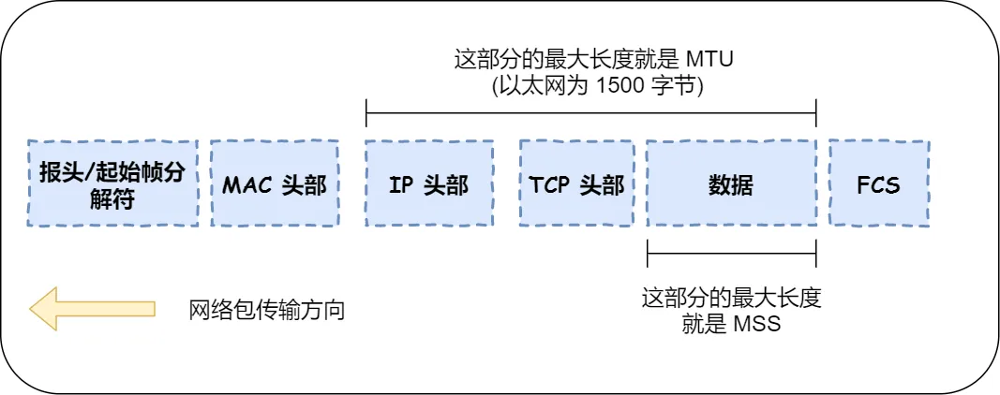
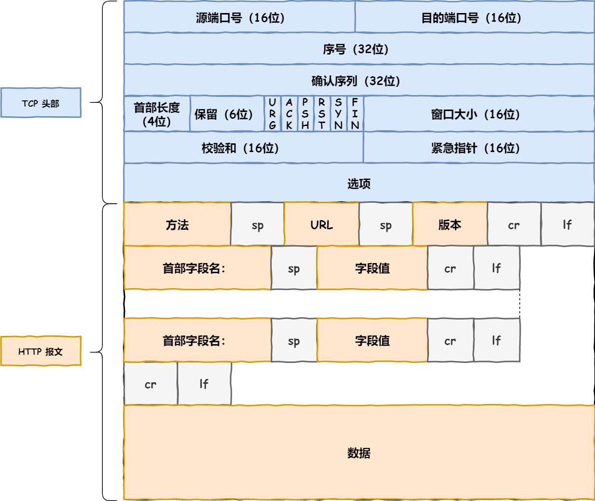
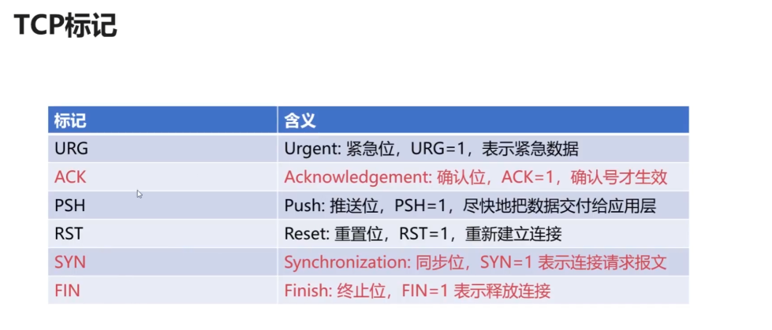
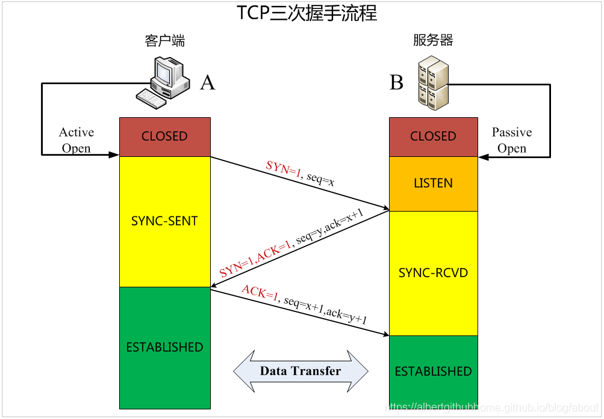
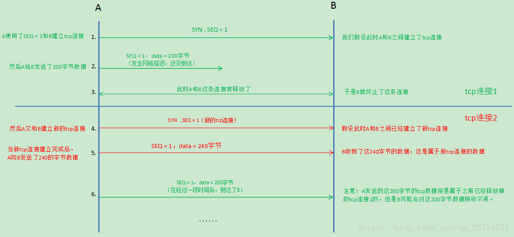
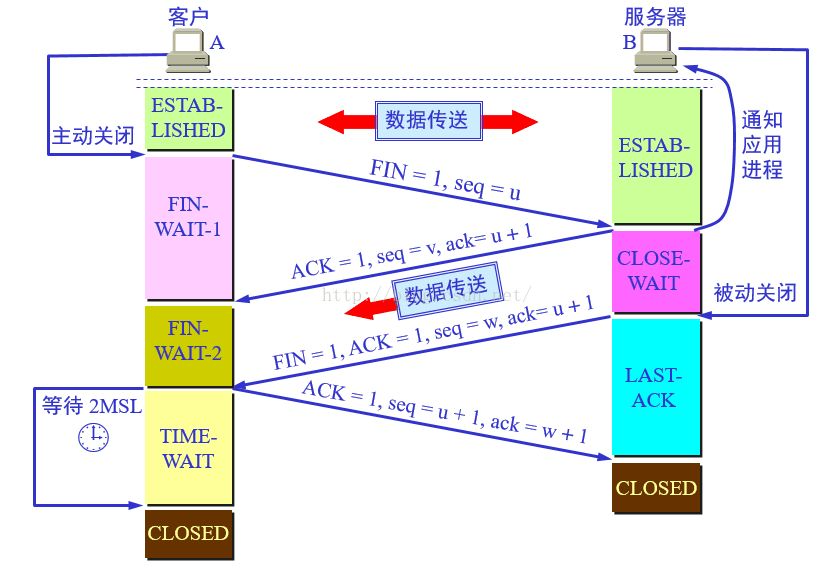
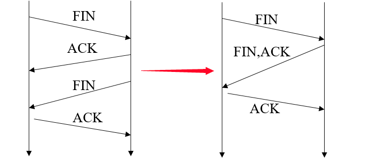
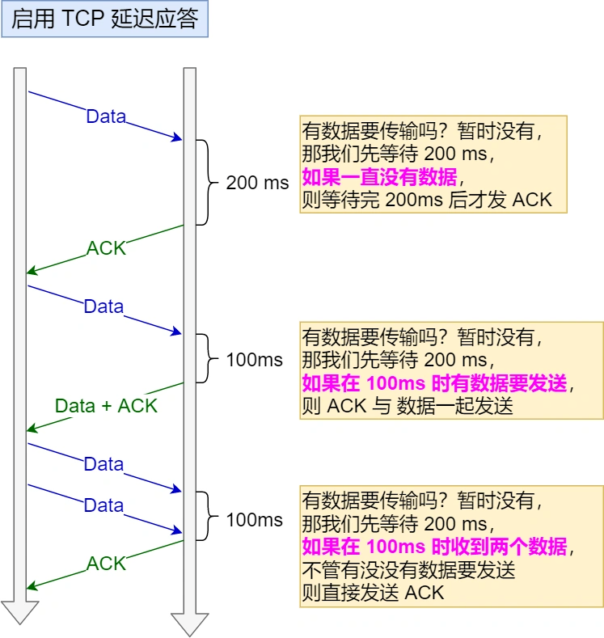

## TCP

### TCP 分割数据

1. MTU：最大传输单元，由硬件规定，如以太网的 MTU 为 1500 字节
2. MSS：最大分节大小，为 TCP 数据包每次传输的最大数据分段大小，一般由发送端向对端 TCP 通知对端在每个分节中能发送的最大 TCP 数据，MSS 值为 MTU 值减去 IPv4 Header（20 Byte）和 TCP Header（20 Byte）得到

数据会被以 MSS 的长度为单位进行拆分，拆分出来的每一块数据都会被放进单独的网络包中，即在每个被拆分的数据加上 TCP 头信息，然后交给 IP 模块来发送数据

### TCP 报文生成
TCP 协议里面会有两个端口，一个是浏览器监听的端口（通常是随机生成的），一个是 Web 服务器监听的端口（HTTP 默认端口号是 80，HTTPS 默认端口是 443）。在双方建立了连接后，TCP 报文中的数据部分就是存放 HTTP 头部+数据，组装好 TCP 报文之后，就交给下面的网络层处理

网络包的报文如下图：

### 三次握手

1. 客户端给服务端发一个 SYN 报文，并指明客户端的初始化序列号 ISN（c），此时客户端处于 SYN_SEND 状态
2. 服务器收到客户端的 SYN 报文之后，会以自己的 SYN 报文作为应答，并且也指定了自己的初始化序列号 ISN（s），同时会把客户端的 ISN+1 作为 ACK 的值，表示自己已经收到了客户端的 SYN，此时处于 SYN_RCVD 的状态
3. 客户端收到 SYN 报文之后，会发送一个 ACK 报文，把服务端的 ISN+1 作为 ACK 的值，表示已经收到了服务端的 SYN 报文，此时客户端处于 ESTABLISHED 状态，服务器收到 ACK 报文之后，也处于 ESTABLISHED 状态。此时，双方已建立起了连接

#### 为什么要三次握手？
1. 第一次握手：客户端发送网络包，服务端收到了。 这样服务端就能得出结论：客户端的发送能力、服务端的接收能力是正常的。
2. 第二次握手：服务端发包，客户端收到了。 这样客户端就能得出结论：服务端的接收、发送能力，客户端的接收、发送能力是正常的。不过此时服务器并不能确认客户端的接收能力是否正常。
3. 第三次握手：客户端发包，服务端收到了。 这样服务端就能得出结论：客户端的接收、发送能力正常，服务器自己的发送、接收能力也正常。

#### 保活计时器
客户端已主动与服务器建立了 TCP 连接，但后来客户端的主机突然发生故障，显然服务器以后就不能再收到客户端发来的数据。因此就应当有措施使服务器不要再白白等待下来，这就需要使用保活计时器了

服务器每收到一次客户的数据，就重新设置保活计时器，时间的设置通常是两个小时。若两个小时都没有收到客户端的数据，服务端就发送一个探测报文段，以后则每隔 75 秒钟发送一次，若连续发送 10 个探测报文段后仍然无客户端的响应，服务端就认为客户端出了故障，接着就关闭这个连接

#### 半连接和全连接队列
1. 半连接队列：服务器第一次收到客户端的 SYN 之后，就会处于 SYN_RCVD 状态，此时双方还没有完全建立其连接，服务器会把此种状态下请求连接放在一个队列里
2. 全连接队列：就是已经完成三次握手，建立起连接的就会放在全连接队列中，如果队列满了就有可能出现丢包现象

SYN-ACK 重传次数：服务器发送完 SYN-ACK 包，如果未收到客户确认包，服务器进行首次重传，等待一段时间仍未收到客户确认包，进行第二次重传。如果重传次数超过系统规定的最大重传次数，系统将该连接消息从半连接队列中删除。

注意：每次重传等待的时间不一定相同，一般会是指数增长

#### ISN 是固定的吗？
当一端为建立连接而发送它的 SYN 时，它为连接选择一个初始序号，ISN 随时间而变化，因此每个连接都将具有不同的 ISN，这样选择序号的目的在于防止在网络中被延迟的分组在以后又被传送，导致连接的一方对它做错误的解释。如果 ISN 是固定的，攻击者很容易猜出后面的序列号，因此 ISN 是动态生成的

使用固定序列号存在的问题：

由于 A 和 B 之间的一个 TCP 连接通常是由 A 和 B 的 2 个 IP 地址，2 个端口号构成的四元组，因此当 A 出现了故障把这个 TCP 连接断开了，之后再以相同的四元组建立新的 TCP 连接（A 和 B 两次建立 TCP 连接都是使用了相同的 IP 地址），就会出现数据乱序的问题

如果被一些恶意攻击者利用 TCP 的这种缺点：选择合适的序号、IP 地址和端口的话，就能伪造出一个 TCP 报文段，从而打断正常的 TCP 连接，但是初始化序号的方式（通过算法来随机生成序号）就会使序号难以猜出，也就不容易利用这种缺点来进行一些恶意攻击行为

#### 三次握手过程中可以携带数据吗？
第三次握手的时候可以携带数据，第一次、第二次握手不可以携带数据

假如第一次握手可以携带数据的话，如果有人要恶意攻击服务器，那他每次都在第一次握手中的 SYN 报文中放入大量的数据。因为攻击者根本就不理服务器的接收、发送能力是否正常，然后疯狂着重复发 SYN 报文的话，这会让服务器花费很多时间、内存空间来接收这些报文

第三次握手时，此时客户端已经处于 ESTABLISHED 状态，对于客户端来说，它已经建立起了连接，并且也知道服务器的接收、发送能力是正常的了，所以能携带数据也没毛病

#### SYN 攻击是什么？
SYN 攻击：Client 在短时间内伪造大量不存在的 IP 地址，并向 Server 不断地发送 SYN 包，Server 则回复确认包，并等待 Client 确认，由于源地址不存在，因此 Server 需要不断重发直至超时， 这些伪造的 SYN 包将长时间占用未连接队列 ，导致正常的 SYN 请求因为队列慢而被丢弃，从而引起网络拥塞甚至系统瘫痪。

SYN 攻击是一种典型的 Dos/DDos 攻击，检测 SYN 攻击非常的方便，当你在服务器上看到大量的半连接状态时，特别是源 IP 地址是随机的，基本上就可以断定这是一次 SYN 攻击

常见的防御 SYN 攻击的方法：

1. 缩短超时（SYN Timeout）时间
2. 增加最大半连接数
3. 过滤网关防护
4. SYN cookies 技术

### 四次挥手

1. 客户端发送一个 FIN 报文，报文中会指定一个序列号，即发出连接释放报文段（FIN = 1，序号 seq = u），并停止再发送数据，主动关闭 TCP 连接，进入 FIN_WAIT1 状态（终止等待 1）状态，等待服务端的确认
2. 服务端收到 FIN 之后，会发送 ACK 报文，且把客户端的序列号值+1 作为 ACK 报文的序列号值，表明已经收到客户端的报文了，即服务端收到连接释放报文段后发出确认报文段（ACK = 1，确认号 ack = u+1，序列号 seq = v），服务端进入 CLOSE_WAIT（关闭等待）状态，此时的 TCP 处于半关闭状态，客户端到服务端的连接释放。客户端收到服务端的确认后，进入 FIN_WAIT2（终止等待 2）状态，等待服务端发出的连接释放报文段
3. 如果服务端也想断开连接了，和客户端的第一次挥手一样，发送 FIN 报文，且指定一个序列号，即服务端没有要向客户端发出的数据了，服务端发出连接释放报文段（FIN = 1，ACK = 1，序号 seq = w，确认号 ack = u+1），服务端进入 LAST_ACK（最后确认）状态，等待客户端的确认
4. 客户端收到 FIN 之后，发送一个 ACK 报文作为应答，且把服务端的序列号值+1 作为自己 ACK 报文的确认号值，即客户端收到服务端的连接释放报文段后，对此发出确认报文段（ACK = 1，seq = u+1，ack = w+1），客户端进入 TIME_WAIT（时间等待）状态，此时 TCP 未释放掉，需要经过时间等待计时器设置的时间 2MSL 后，客户端才进入 CLOSED 状态

#### 为什么要四次挥手？
当客户端发送 FIN 报文段时，只是表示客户端没有数据要发送了，客户端告诉服务器，它的数据已经全部发送完毕了，但是这时候客户端还是可以接受来自服务端的数据，当服务端返回 ACK 报文段时，表示它已经知道客户端没有数据要发送了，但是服务端还是可以发送数据到客户端的；当服务器发送了 FIN 报文段时，这个时候就表示服务端也没有数据要发送了，就会告诉客户端，我也没有数据要发送了，之后彼此就会断开 TCP 连接

前 2 次挥手用于关闭一个方向的数据通道，后 2 次挥手用于关闭另一个方向的数据通道

#### FIN_WAIT2，CLOSE_WAIT 和 TIME_WAIT 的意义
1. FIN_WAIT2：半关闭状态，发送断开请求的一方还有接收数据能力，但已经没有发送数据能力
2. CLOSE_WAIT：被动关闭连接一方接收到 FIN 包会立即回应 ACK 包表示已接收到断开请求。如果还有剩余数据要发送就会进入 CLOSE_WAIT 状态
3. TIME_WAIT：如果客户端直接进入 CLOSED 状态，如果服务端没有接收到最后一次 ACK 包会在超时之后重新再发 FIN 包，此时因为客户端已经 CLOSED，所以服务端就不会收到 ACK 而是收到 RST。TIME_WAIT 状态目的是防止最后一次握手数据没有到达对方而触发重传 FIN 准备的，在 2MSL 时间内，同一个 socket 不能再被使用，否则有可能和旧连接数据混淆（如果新连接和旧连接的 socket 相同的话）

#### 四次挥手释放连接时，等待 2MSL 的意义？
1. 为了保证客户端发送的最后一个 ACK 报文段能够到达服务器，因为这个 ACK 有可能丢失，从而导致处在 LAST-ACK 状态的服务器收不到对 FIN+ACK 的确认报文。服务器会超时重传这个 FIN+ACK，接着客户端再重传一次确认，重新启动时间等待计时器，最后客户端和服务器都能正常的关闭。假设客户端不等待 2MSL，而是发送完 ACK 之后直接释放关闭，一旦这个 ACK 丢失的话，服务器就无法正常地进入关闭连接状态
2. 防止已失效的连接请求报文段出现在本连接中，A 在发送完最后一个 ACK 报文段，再经过时间 2MSL，就可以使本连接持续的时间内所产生的所有报文端都从网络中消失，这样就可以使下一个连接中不会出现这种旧的连接请求报文段

#### 什么情况会出现三次挥手？
当被动关闭方在 TCP 挥手过程中，没有数据要发送并且开启了 TCP 延迟确认机制，那么第二和第三次挥手就会合并传输，这样就出现了三次挥手。因为 TCP 延迟确认机制是默认开启的，所以导致我们抓包时，看见三次挥手的次数比四次挥手还多

 TCP 延迟确认机制 

当发送没有携带数据的 ACK，它的网络效率也是很低的，因为它也有 40 个字节的 IP 头和 TCP 头，但却没有携带数据报文。为了解决 ACK 传输效率低问题，所以就出现了 TCP 延迟确认

1. 当有响应数据要发送时，ACK 会随着响应数据一起立刻发送给对方
2. 当没有响应数据要发送时，ACK 将延迟一段时间，以等待是否有响应数据可以一起发送
3. 如果在延迟等待发送 ACK 期间，对方的第二个数据报文又到达了，这时会立刻发送 ACK

### TCP 粘包/拆包
1. 粘包

接收端只收到一个数据包，由于 TCP 是不会出现丢包的，所以这一个数据包中包含了发送端发送两个数据包的信息，这种现象即为粘包，由于接收端不知道这两个数据报的界限，所以对于接收端来说很难处理

2. 拆包

接收端接收到了两个数据包，但是这两个数据包要么是不完整的，要么就是多出来一块，这种情况即发生了拆包和粘包

**为什么会发生 TCP 粘包、拆包？**

1. 应用程序写入的数据大于套接字缓冲区大小，这将会发生拆包
2. 应用程序写入数据小于套接字缓冲区大小，网卡将应用多次写入的数据发送到网络上，这将会发生粘包
3. 进行 MSS（最大报文长度）大小的 TCP 分段，当 TCP 报文长度-TCP 头部长度 > MSS 的时候将发生拆包
4. 接收方法不及时读取套接字缓冲区数据，这将发生粘包

**解决方法**

1. 发送端给每个数据包添加包首部，首部中应该至少包含数据包的长度，这样接收端在接收到数据后，通过读取包首部的长度字段，便知道每一个数据包的实际长度了
2. 发送端将每个数据包封装为固定长度（不够的可以通过补 0 填充），这样接收端每次从接收缓冲区中读取固定长度的数据就自然而然地把每个数据包拆分开来
3. 可以在数据包之间设置边界，如添加特殊符号，这样接收端通过这个边界就可以将不同的数据包拆分开

### 为什么区域传送用 TCP 协议？
因为 TCP 协议可靠性好，且传输的内容大，如果是用最大只能传 512 字节的 UDP 协议，万一同步的数据大于 512 字节呢

### 一个 TCP 连接可以对应几个 HTTP 请求？
如果维持连接，一个 TCP 连接是可以发送多个 HTTP 请求的

### 一个 TCP 连接中 HTTP 请求发送可以一起发送么？（一起发送 3 个请求，再一起接收）
HTTP/1.1 存在一个问题，单个 TCP 连接在同一时刻只能处理一个请求，即两个请求的生命周期不能重叠，任意两个 HTTP 请求从开始到结束的时间在同一个 TCP 连接里不能重叠

在 HTTP/1.1 存在 Pipelining 技术可以完成这个多个请求同时发送，但是由于浏览器默认关闭，所以可以认为这是不可行的。在 HTTP2 中由于 Multiplexing 特点的存在，多个 HTTP 请求可以在同一个 TCP 连接中并行进行

### 浏览器在与服务器建立了一个 TCP 连接后是否会在一个 HTTP 请求完成后断开？
在 HTTP/1.0 中，一个服务器在发送完一个 HTTP 响应后，会断开 TCP 连接，但是这样每次请求都会重新建立和断开 TCP 连接，代价过大。某些服务器对 Connection: keep-alive 的 Header 进行了支持，意思为，完成这个 HTTP 请求之后，不要断开 HTTP 请求使用的 TCP 连接，这样的好处是连接可以重新使用，之后发送 HTTP 请求的时候不需要重新建立 TCP 连接，以及如果维持连接，那么 SSL 的开销也可以避免

持久连接：既然维持 TCP 连接好处这么多，HTTP/1.1 就把 Connection 头写进标准，并且默认开启持久连接，除非请求中写明 Connection: close，那么浏览器和服务器之间是会维持一段时间的 TCP 连接，不会一个请求结束就断掉。默认情况下建立 TCP 连接不会断开，只有在请求报头中声明 Connection: close 才会在请求完成后关闭连接

### TCP 怎么保证可靠传输？
1. 确认和重传：接收方收到报文就会确认，发送方发送一段时间后没有收到确认就会重传

2. 数据校验：TCP 报文头有校验和，用于校验报文是否损坏

3. 数据合理分片和排序：TCP 会按最大传输单元（MTU）合理分片，接收方会缓存未按序到达的数据，重新排序后发给应用层。UDP 

   ：IP 数据包大于 1500 字节，大于 MTU，这个时候发送方的 IP 层就需要分片，把数据报分成若干片，使得每一片都小于 MTU，而接收方 IP 层则需要进行数据报的重组。由于 UDP 的特性，某一片数据丢失时，接收方便无法重组数据报，导致丢弃整个 UDP 数据报

4. 流量控制：当接收方来不及处理发送方的数据，能通过滑动窗口，提示发送方降低发送的速率，防止包丢失

6. 拥塞控制：当网络拥塞时，通过拥塞窗口，减少数据的发送，防止包丢失

