## 作用

连接不同的物理设备，传输比特流。该层为上层协议提供了一个传输数据的可靠的物理媒体，确保原始的数据可在各种物理媒体上传输

例如：一台计算机与另一台计算机要进行通信，需要把这台计算机与其他计算机连起来，才能把数据传输过去，可以通过光纤、电缆、双绞线等介质把它们连接起来，然后才能进行通信。物理层负责把两台计算机连起来，然后在计算机之间通过高低电频来传送 0、1 这样的电信号

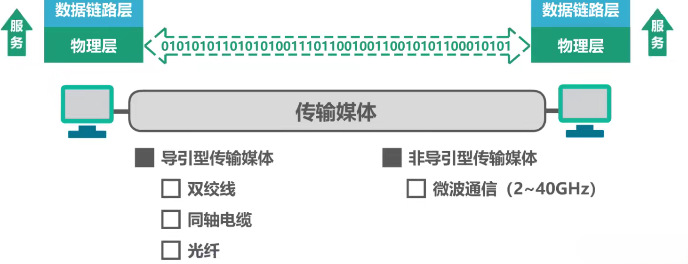

物理层为了解决传输比特 0 和 1 的问题，主要有以下四个任务

1. 机械特性：指明接口所用接线器的形状和尺寸引脚数目和排列、固定和锁定装置。
2. 电气特性：指明在接口电缆的各条线上出现的电压的范围
3. 功能特性：指明某条线上出现的某一电平的电压表示何种意义
4. 过程特性：指明对于不同功能的各种可能事件的出现顺序

## 物理设备
1. 中继器：适用于完全相同的两个网络的互连，主要功能是通过对数据信号的重新发送或者转发，来扩大网络传输的距离，对信号进行再生和还原
2. 集线器：对接收到的信号进行再生整形放大，以扩大网络的传输距离，同时把所有节点集中在以他为中心的节点上

随着计算机的增加，网线会越来越多，网口也会增加（实际上网口开不了这么多）

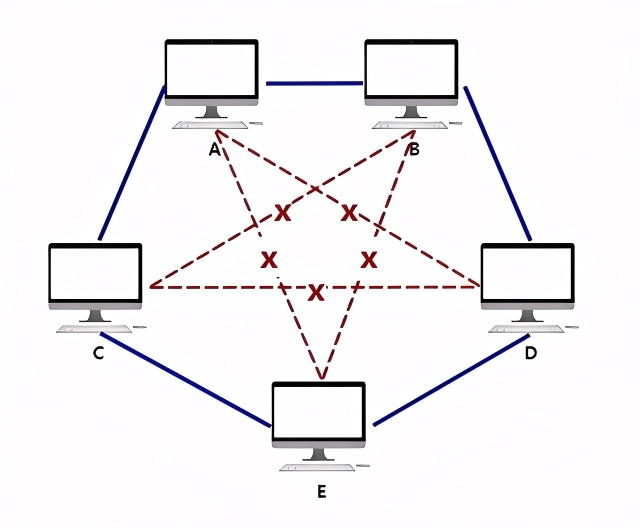

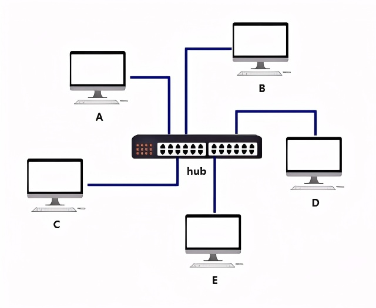

## 传输方式
### 串行、并行传输
1. 串行传输：数据是一个比特一个比特依次发送的，只需要一条数据传输线路

2. 并行传输：一次发送 n 个比特，需要 n 条传输线路

并行传输是速度是串行传输的 n 倍，但是成本高。在计算机网络中，数据远距离传输使用串行传输，计算机内部的数据传输，常使用并行传输

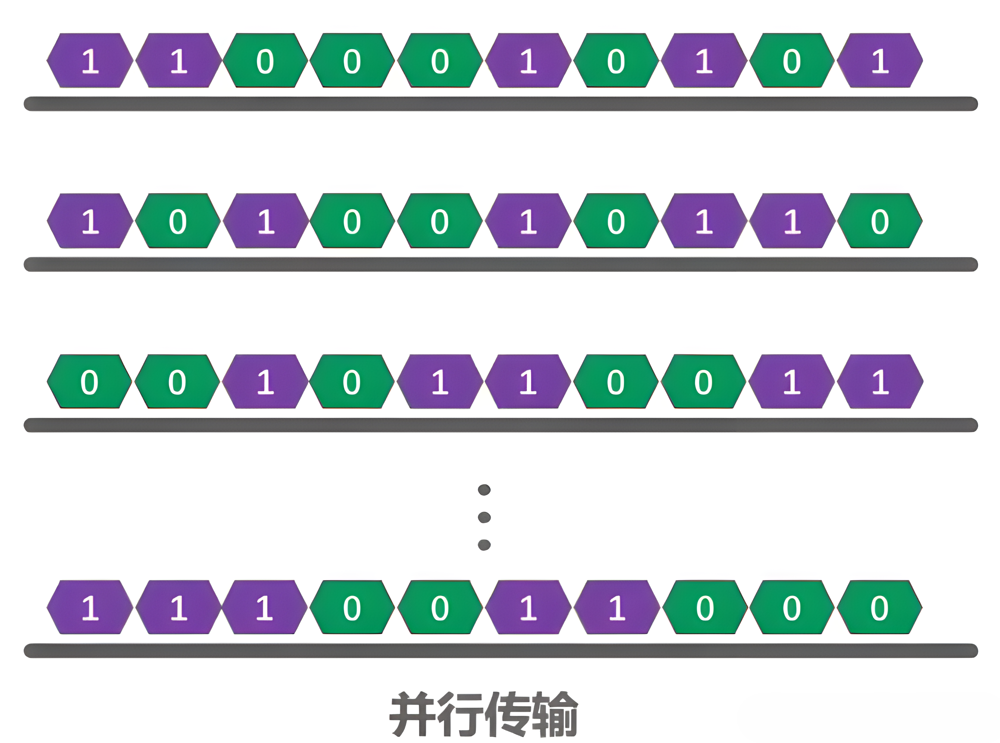

### 同步、异步传输
1. 同步传输

数据块以稳定的比特流形式传输，字节之间没有间隔，接收端在每个比特的中间时刻进行检测，以判别接收到的是比特 0 或是比特 1

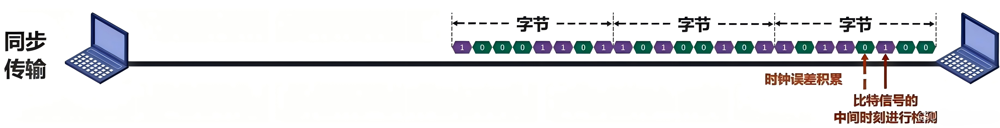

由于不用设备的时钟频率存在差异，传输大量数据时，所产生判别时刻的累计误差会导致对比特信号的判别错位，需要采取方式使双方时钟同步。

+ 外同步：在收发双方之间添加一条单独的时钟信号线
+ 内同步：发送端将时钟同步信号编码到发送数据中一起传输（例如传统以太网所采用的曼切斯特编码）
2. 异步传输

以字节为独立的传输单位，字节之间的时间间隔是不固定的，接收端仅在每个字节处对字节内的比特实现同步，为此通常在每个字节的前后分别加上起始位和结束位

+ 字节之间异步（字节之间的时间间隔不固定）
+ 字节中的每个比特仍然要同步（各比特的持续时间相同）

### 信道
1. 单工通信信道：只能一个方向通信，没有反方向反馈的信道（无线电广播）

2. 半双工通信信道：双方都可以发送和接受信息，但不能同时发送和接收（对讲机）

3. 全双工通信信道：双方都可以同时发送和接收信息（电话）

## 编码与调制
### 码元
指在使用时间域的波形表示数字信号时，代表不同离散数值的基本波形

### 编码
把数字信号（或模拟信号）转换为另一种数字信号，在数字信道中传输

**常用编码**

1. 不归零编码（NRZ）：存在同步问题

不归零：指在整个码元时间内，电平不会出现零电平

+ 需要额外一根传输线来传输时钟信号，接收方按时钟信号的节拍来逐个接收码元
+ 由于不归零编码存在同步问题，因此计算机网络中的数据传输不采用此类编码
2. 归零编码（RZ）：自同步，编码效率低

每个码元传输结束后信号都要“归零”，所以接收方只要在信号归零时进行采样即可，不需要单独的时钟信号

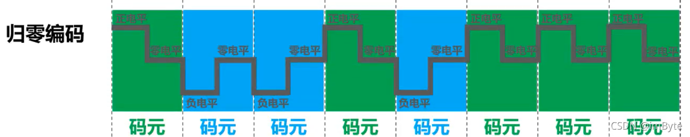

+ 归零编码相当于将时钟信号用 “归零” 方式编码在了数据之内，这种称为 “自同步” 信号
+ 归零编码中大部分的数据带宽都用来传输 “归零” 而浪费
3. 曼切斯特编码

在每个码元时间的中间时刻，信号都会发生跳变，负跳变表示比特 1，正跳变表示比特 0，码元中间时刻的跳变既表示时钟，又表示数据

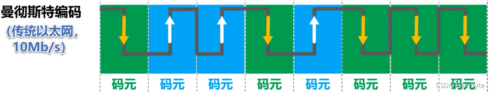

+ 码元中间时刻的跳变既表示时钟，又表示数据
+ 传统以太网就使用的曼切斯特编码
4. 差分曼切斯特编码：比曼切斯特编码变化少，更适合较高的传输速率

跳变仅表示时钟，码元开始处电平是否发生变化表示数据

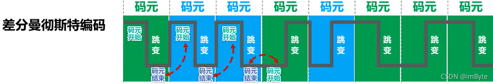

### 调制
将数字信号转换为模拟信号，在模拟信道中传输（或将模拟信号转换为另一种模拟信号）

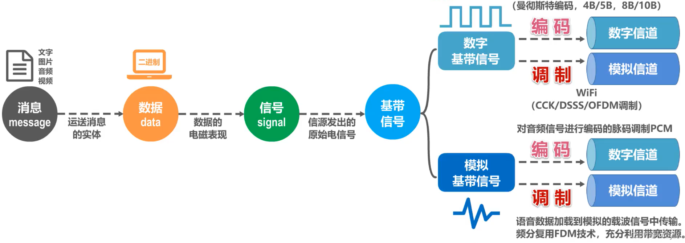

**基本调制方法**

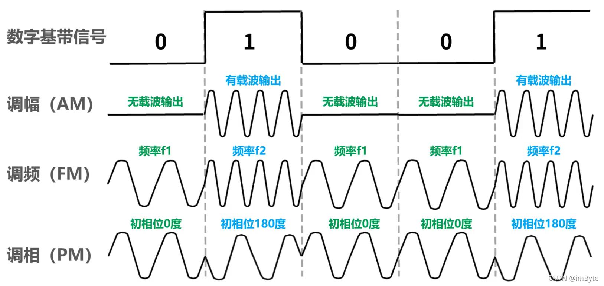

## 信道极限容量
### 信号失真
信号在传输过程中会受到各种因素的影响，使得信号波形失去码元之间的清晰界限，这种现象叫做码间串扰

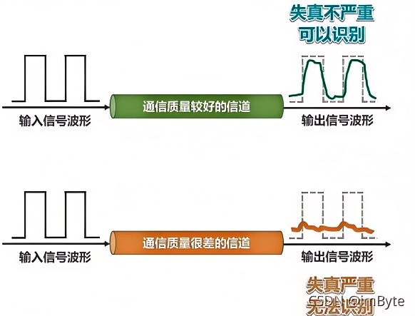

造成信号失真的因素：

1. 码元传输速率
2. 信号传输距离
3. 噪声干扰
4. 传输媒体质量

### 奈氏准则

码元传输速率 又称为 波特率、调制速率、波形速率 或 符号速率。它与比特比特率的关系：

+ 当 1 个码元只携带 1 比特的信息量时，则波特率（码元/秒）与比特率（比特/秒）在数值上是相等的
+ 当 1 个码元携带 n 比特的信息量时，则波特率转换成比特率时，数值要乘以 n

要提高信息传输速率（比特率)，就必须设法使每一个码元能携带更多个比特的信息量。这需要采用多元制，例如 QAM-16

实际信道所能传输的码元速率，要明显低于奈氏准则给出的上限值。奈氏准则是理想条件下推导的，没有考虑传输距离、噪声干扰等因素

### 香农公式
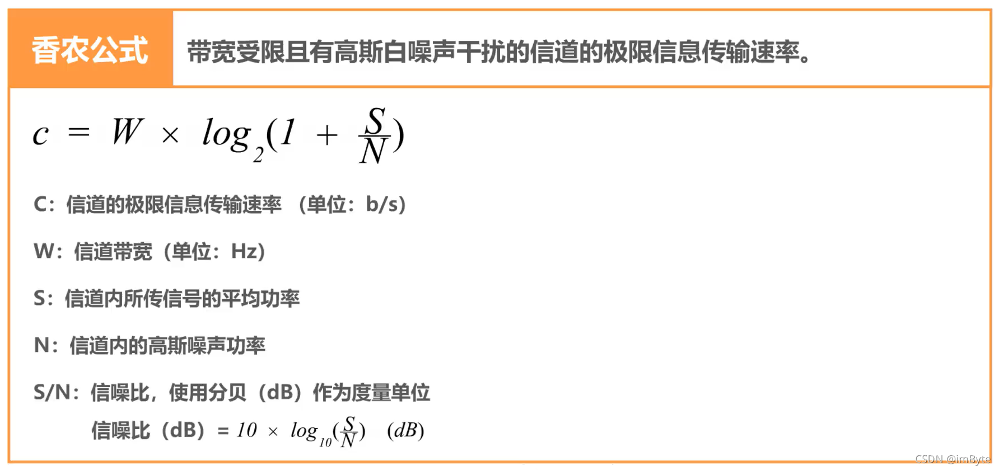

1. 信道带宽或信道中信噪比越大，信道的极限传输速率越高
2. 在实际信道上能够达到的信息传输速率要比该公式的极限传输速率低不少。这是因为在实际信道中，信号还要受到其他一些损伤，如各种脉冲干扰、信号在传输中的衰减和失真等，这些因素在香农公式中并未考虑

