## 作用

物理层只是单纯负责把计算机连接起来，并且在计算机之间传输 0、1 这样的电信号，如果这些 0、1 组合的传送毫无规则的话，计算机是解读不了的，需要制定一套规则来进行 0、1 的传送。例如：多少个电信号为一组，每一组信号应该如何标识才能让计算机读懂等

以太网协议规定，一组电信号构成一个数据包，这个数据包称之为帧，每一个帧由表头和数据两部分组成。表头部分主要是一些说明数据，例如发送者、接收者等信息，而数据部分则是这个数据包具体的、想给接收者的内容

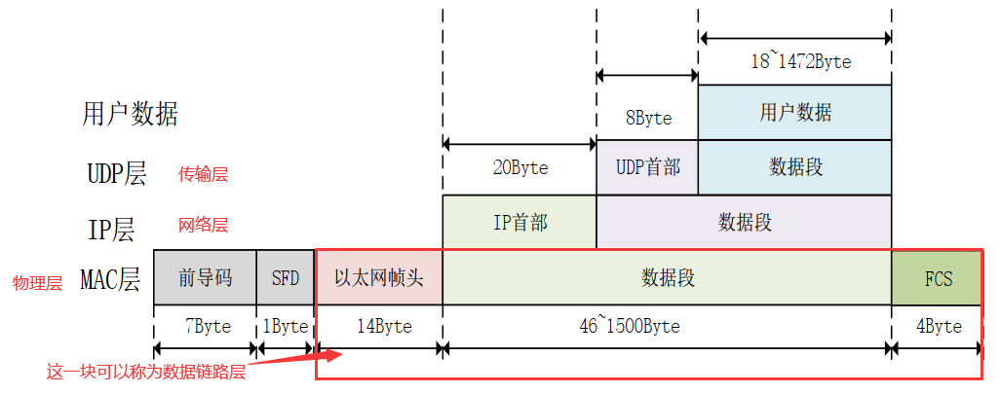

帧的大小一般为 64-1518 个字节，假如需要传送的数据很大的话，就分成多个帧来进行传送。表头部分的字节长度是固定的，并且固定为 18 个字节，如果不是固定的，每个帧都是单独发的，那计算机怎么知道表头是几个字节，数据是几个字节

## 封装成帧
在一段数据的前后部分添加首部和尾部，这样就构成了一个帧。接收端在收到物理层上交的比特流后，就能根据首部和尾部的标记，从收到的比特流中识别帧的开始和结束

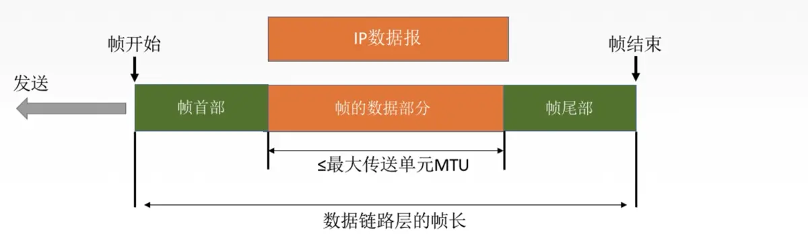

### MTU（最大传输单元）
指网络能够传输的最大数据包大小，以字节为单位。MTU 的大小决定了发送端一次能够发送报文的最大字节数，如果 MTU 超过了接收端所能够承受的最大值，或者是超过了发送路径上途径的某台设备所能够承受的最大值，就会造成报文分片甚至丢弃，加重网络传输的负担

### 帧定界
帧头和帧尾的作用之一就是帧定界，但并不是每一种数据链路层协议的帧都包含帧定界标志。例如，以太网 V2 的 MAC 帧：

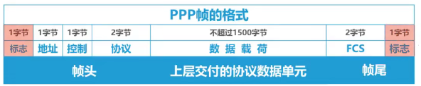

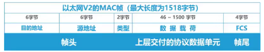

如下图，红色字段为帧定界标志

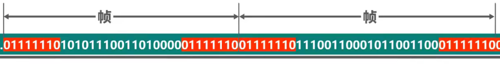

1. 前导码中的前 7 个字节为前同步码，作用是使接收方的时钟同步。之后 1 字节为帧开始定界符，表明后面紧跟的为 MAC 帧

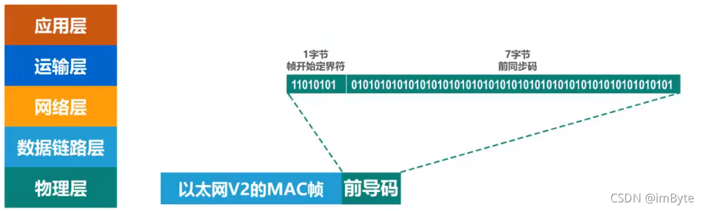

2. 以太网定义了帧间间隔为 96 比特的发送时间，因此，MAC 帧不需要帧结束定界符

### 透明传输
指不管所传数据是什么样的比特组合，都应当能够在链路上传送

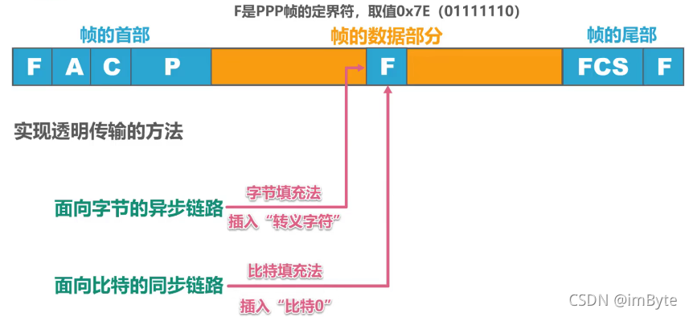

#### 面向字节的异步链路
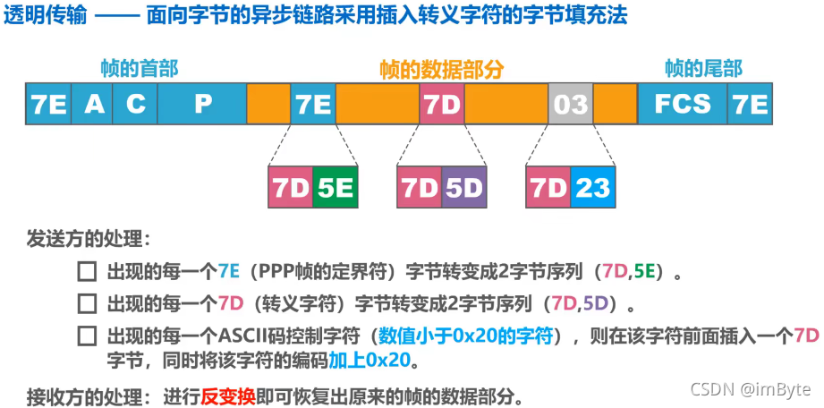

#### 面向比特的同步链路
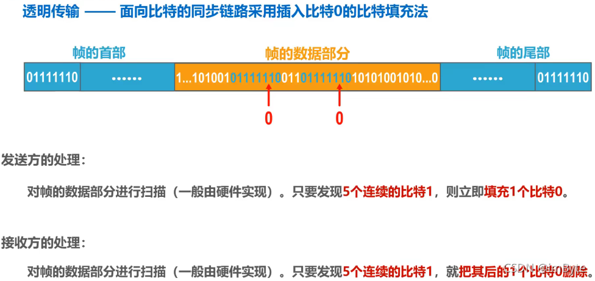

#### 字符填充法
使用 SOH、EOT 作为帧的开头、结束。这种方法当传送的帧都是由文本文件组成时（由键盘输入，都是 ascii 码，无论输入什么字符都可以实现透明传输）。

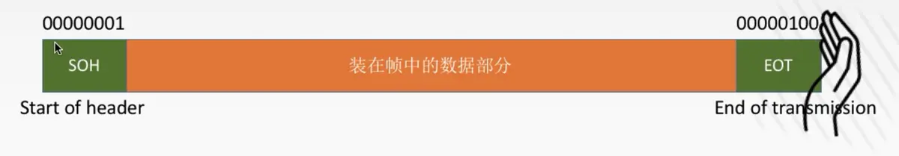

当传送的帧是由非 ascii 码的文本文件组成时（二进制代码的程序或者图像），就需要用字符填充方法（在发送端填充转义字符，在接收端去掉）实现透明传输

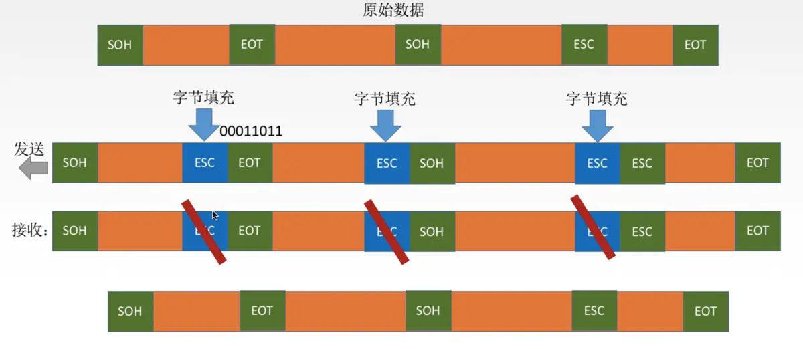

## 差错检测
### 奇偶校验码
1. 在待发送的数据后面添加 1 位奇偶校验位，使整个数据（包括所添加的校验位在内）中 “1” 的个数为奇数（奇校验）或 偶数（偶校验）
2. 如果有 奇数个位 发生误码，则奇偶性发生变化，可以检查出误码
3. 如果有 偶数个位 发生误码，则奇偶性不发生变化，不能检查出误码（漏检）

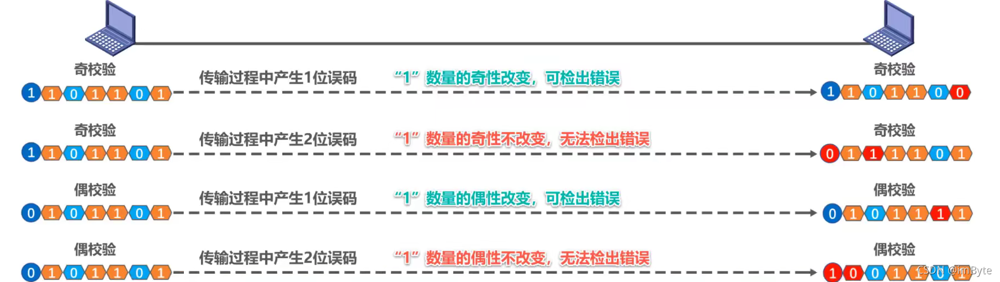

### 循环冗余校验码 CRC
1. 收发双方约定好一个 生成多项式 G(x)
2. 发送方基于待发送的数据和生成多项式计算出差错检测码（冗余码），将其添加到待传输数据的后面一起传输
3. 接收方通过生成多项式来计算收到的数据是否产生了误码

注意：检错码只能检测帧在传输过程中是否出现差错，无法定位错误、纠正错误

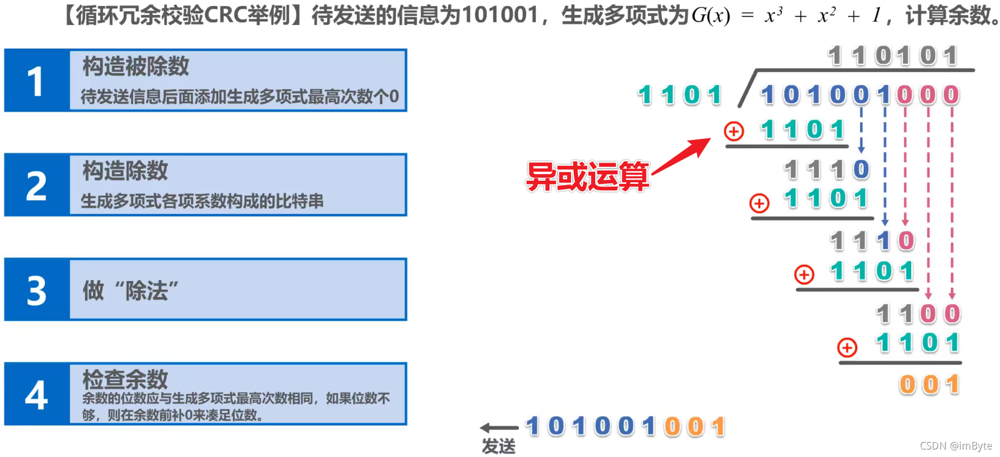

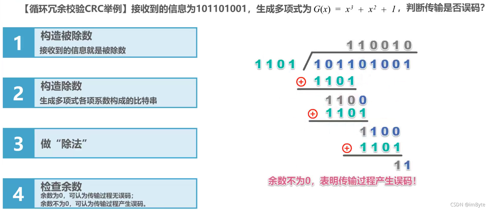

## 可靠传输

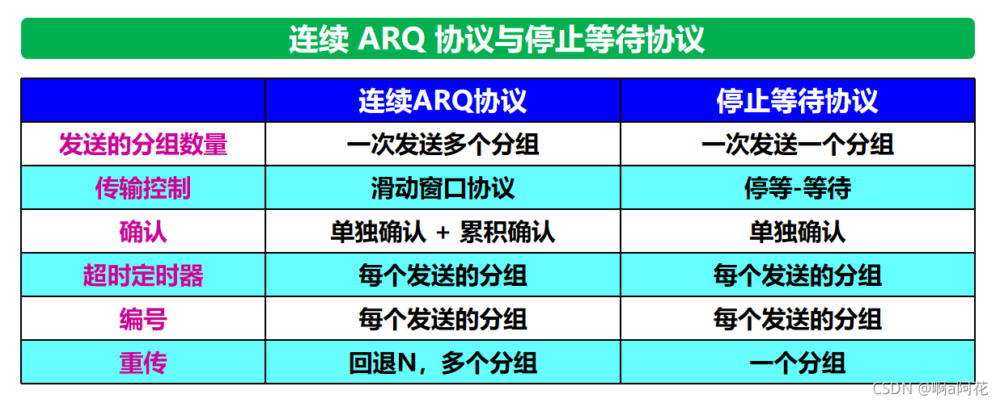

### 停止等待协议（SW）
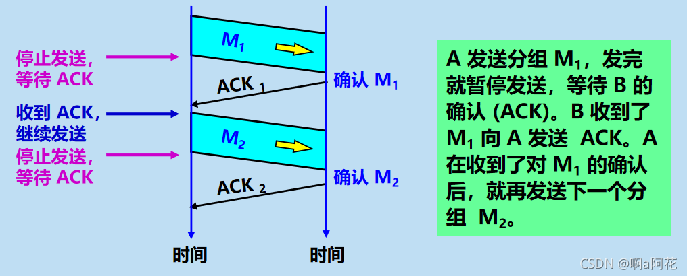

在接收方 B 会出现两种情况：

1. B 接收 M1 时检测出了差错，就丢弃 M1，其他什么也不做（不通知 A 收到有差错的分组）
2. M1 在传输过程中丢失了，B 什么都不知道，也什么都不做

在这两种情况下，B 都不会发送任何信息，A 都必须重发分组，直到 B 正确接收为止，这样才能实现可靠通信

#### 超时重传
指只要超过一段时间仍然没有收到确认，就重传前面发送过的分组（认为刚才发送过的分组丢失了）。因此每发送完一个分组需要设置一个超时计时器，其重传时间应比数据在分组传输的平均往返时间更长一些，只要在超时计时器到期之前收到了相应的确认，就撤销该超时计时器继续发送下一个分组

一般可将重传时间选为略大于 “ 从发送方到接收方的平均往返时间 ”

**A 怎么知道 B 是否正确收到了 M1？**

1. 若 A 在超时计时器规定时间内没有收到 B 的确认 ACK，就重传该分组，无论是自己的分组出错了、丢失了，或者是 B 发送的确认丢失了
2. 假设 B 又收到了重传的分组 M1，这时 B 应采取两个行动：
+ 丢弃这个重复的分组 M1，不向上层交付
+ 向 A 发送确认，不能认为已经发送过确认就不再发送，因为 A 之所以重传 M1 就表示没有收到对 M1 的确认

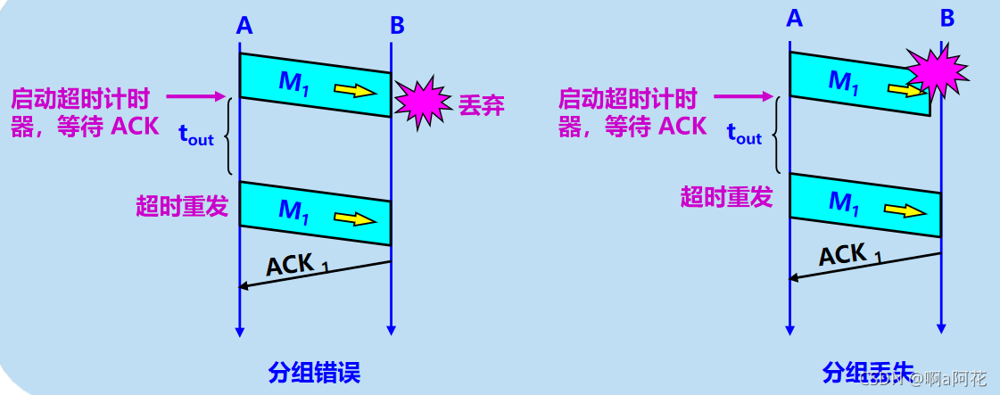

#### 编号
若分组正确到达 B，但 B 回送的确认 ACK 丢失或延迟了，A 未收到 B 的确认，会超时重发，B 可能会收到重复的 M1，B 如何知道收到了重复的分组需要重复丢弃呢？

1. A 为每一组发送的分组都进行编号，若 B 收到了编号相同的分组，则认为收到了重复分组，丢失重复的分组，并回送确认（之所以收到重复的分组就是因为发送端没有正常收到确认）
2. B 为发送的确认也进行编号，指示该确认是对哪一个分组的确认，A 根据确认及其编号，可以确定它是对哪一个分组的确认，避免重复发送，若为重复的确认，则将其丢弃

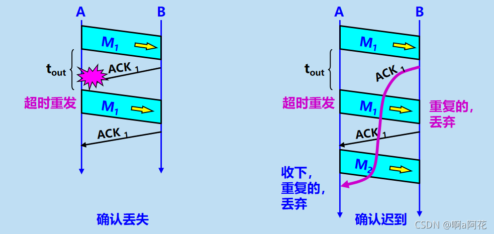

传输过程中没有出现差错，但 B 对分组 M1 的确认迟到了

1. A 会超时重发 M1，则 B 收到重复的 M1，同样要丢弃重复的 M1，并重传确认分组
2. 稍后 B 迟到的确认和重发的确认都会到达 A，A 收到重复的确认，收下后就丢弃

### 连续 ARQ 协议
连续 ARQ 协议可提高信道利用率。发送方维持一个发送窗口，凡位于发送窗口内的分组可以连续发送出去，而不需要等待对方确认。接收方一般采用累计确认，对按序到达的最后一个分组发送确认，表明到这个分组为止的所有分组都已经正确收到了

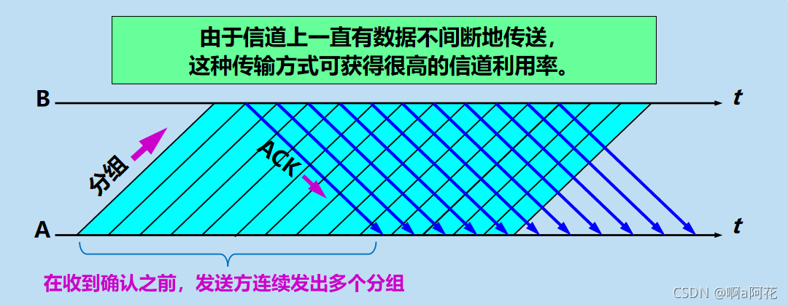

流水线传输通常要求：

1. 必须增加序号范围，因为每个输送中的分组（不计算重传）必须有一个唯一的序号，因为可能存在有多个在输送中未确认的报文
2. 协议的发送方和接收方要能缓存多个分组，发送方至少要能缓存那些已发送但没有确认的分组，接收方可能要缓存那些已正确接收的分组
3. 所需序号范围和对缓冲的要求取决于数据传输协议如何处理丢失、损坏及延时过大的分组

#### 累计确认
接收方不必对收到的分组逐个发送确认，而是对按序到达的最后一个分组发送确认。接收方不必对中间某个确认包的丢失进行重传，因为累计确认的效果，一旦一个较大序号的 ACK 被接收到，则表示这个包之间的包都已经成功收到。如果接收方收到了这个确认，则表示到这个分组为止之前的所有分组都已正确收到了

缺陷：如果发送方传送了 5 个包，但是第 3 个包丢失了，第 4 个和第 5 个正常，这时候累计确认，接收方只能传送前两个包的 ACK，在接收到第 2 个 ACK 的发送方不知道后面 3 个包是否到达，就会将后 3 个包全部进行重传，即：GO-BACK-N

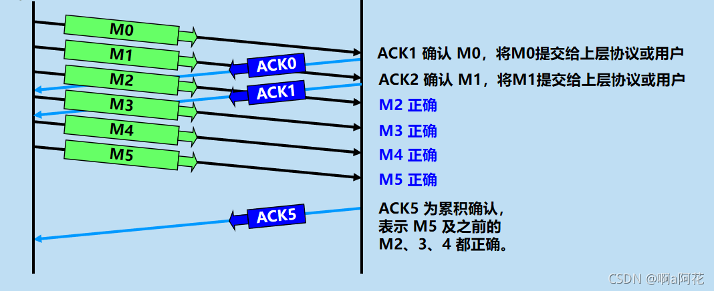

#### 滑动窗口
早期的网络通信中，通信双方不会考虑网络的拥挤情况直接发送数据，由于大家都不知道网络拥塞状况，同时发送数据，导致中间节点阻塞掉包，谁也发不了数据

TCP 中采用滑动窗口来进行传输控制，滑动窗口的大小意味着接收方还有多大的缓冲区可以用于接收数据。发送方可以通过滑动窗口的大小来确定应该发送多少字节的数据。当滑动窗口为 0 时，发送方一般不能再发送数据报。两种情况除外，一种情况是可以发送紧急数据，例如，允许用户终止在远端机上的运行进程。另一种情况是发送方可以发送一个 1 字节的数据报来通知接收方重新声明它希望接收的下一字节及发送方的滑动窗口大小

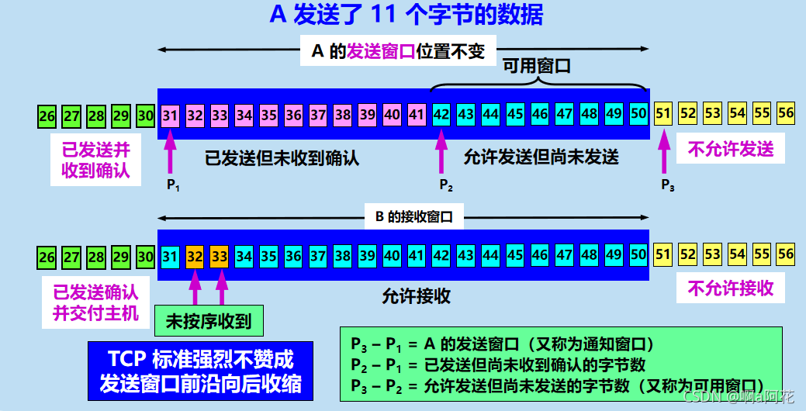

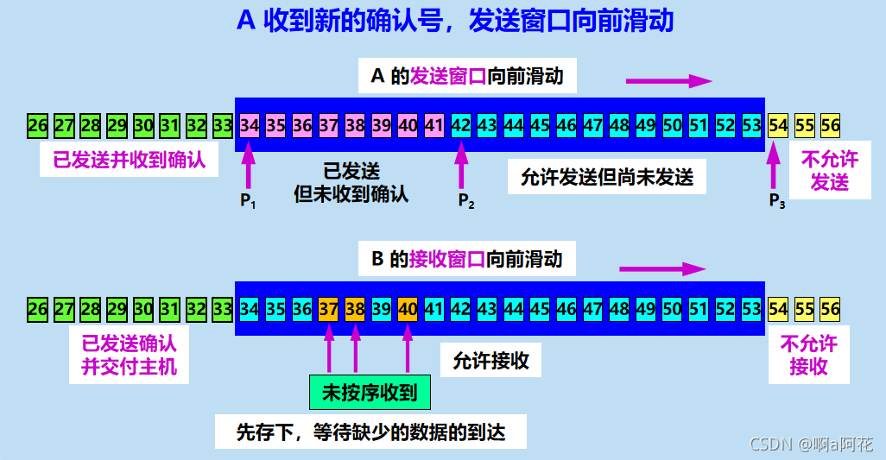

为了解决流水线传输的差错，TCP 协议提供两种滑动窗口：回退 N 和选择重传来解决这个问题

#### 回退 N 帧协议 GBN（GO-BACK-N）

如果发送方发送了前 5 个分组，而中间的第 3 个分组丢失了，这时接收方只能对前 2 个分组发出确认，发送方无法知道后面 3 个分组的下落，表示需要再退回来重传已发送过的 N 个分组

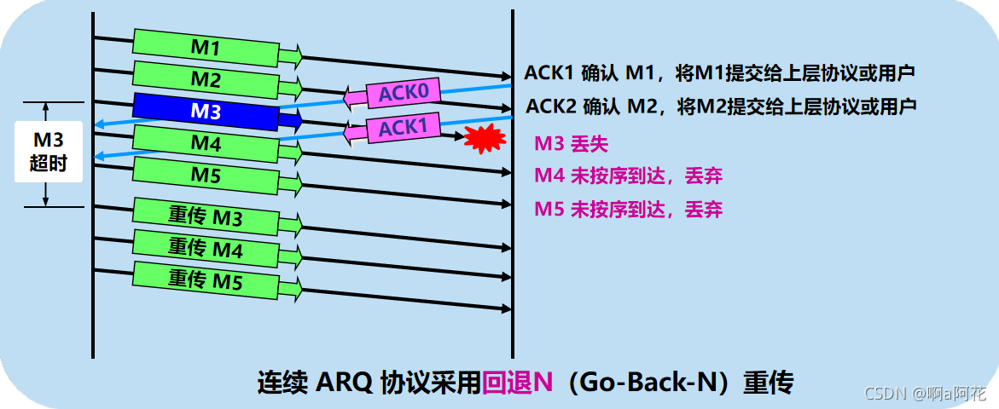

如果下面的网络层协议丢失了很多分组，那么返回 N 协议的效率就会很低，因为每当一个分组损坏，发送方就需要重传所有待确认的分组，虽然其中有些分组实际上已经完整地被接收了

#### 选择重传协议（SELECTIVE REPEAT）

1. 发送方维持着一个窗口，包含可发送或已发送但未被确认的序号

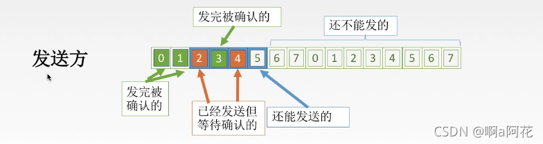

2. 接收方维持着一个窗口，包含可接收的序号，每个序号还保留一个缓冲区，与每个缓冲区相关联的还有一个标志位，用来指明缓冲区是满的还是空的

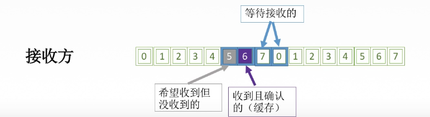

3. 每到达一个帧，接收方通过检查它的序号，看是否落在窗口内，如果确实落在窗口内且之前没有接收过，则接收该分组然后保存在缓冲区并返回一个确认，等前面这些帧都到达后一起交付给上层
4. 发送端每个发送缓冲都设有一个超时计时器，一个超时事件发生后相应缓冲区的帧都会被重发

非顺序接收也引发了一些问题，假设我们用 3bit 的序号（0~7），那么发送方允许发送 8 个帧，然后开始等待确认。刚开始，发送方和接收方的窗口如下：

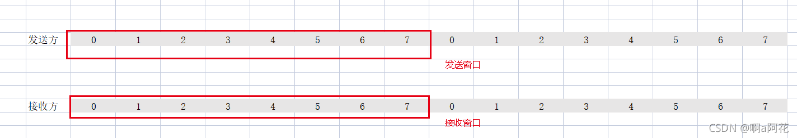

现在发送方发出 0~7 帧，接收方的窗口接收任何序号落在 0~7 之间的帧

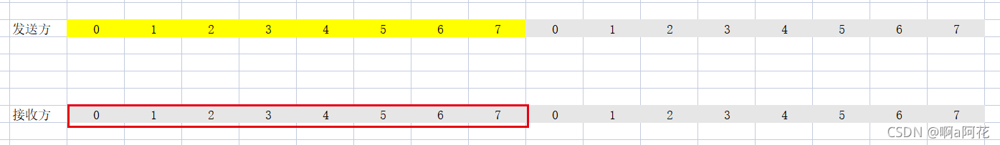

这 8 个帧全部到达后，接收方发送确认（发送方还未收到），并且向前移动它的窗口，允许下一次接收 0、1、2、3、4、5、6、7 号帧

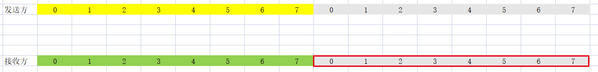

这时会存在两种情况：

1. 发送方收到了全部确认，发送窗口前移，然后继续发送后面的数据（0 号帧）

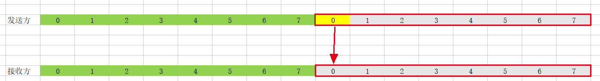

2. 假设第一次发出的所有确认都丢失了，所以接收方在超时之后便会重传 0 号帧（其他帧也会重传，只不过 0 号帧先被发送、先超时、先重传）

因为接收方已经接收了 0~7 号帧，并已发送了确认（虽然发送方未收到），所以窗口会向前移动，允许下一次接收 0、1、2、3、4、5、6、7 号帧

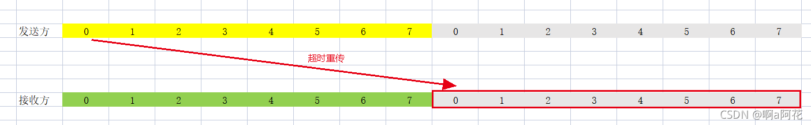

此时接收方也能收到一个 0 号帧，两种情况下接收方都能收到 0 号帧，一个是重传的，一个是新发送的，接收方没法区分两个 0 号帧

通过设置窗口大小来解决：

1. 让接收窗口大小等于发送窗口大小（大了会溢出，小了没意义）
2. 发送窗口 = 接收窗口 = 2^(n-1)，n 表示用多少 bit 来表示允许发送的帧序号，上文发送了 8 个帧（2^3），为 3bit，所以窗口大小应该小于等于 2^(3-1)= 4，即序列号的一半

## 媒体介入控制
### 基本概念
共享信道要着重考虑的一个问题就是如何协调多个发送和接收站点对一个共享传输媒体的占用，即 媒体接入控制 MAC（Medium Access Control）

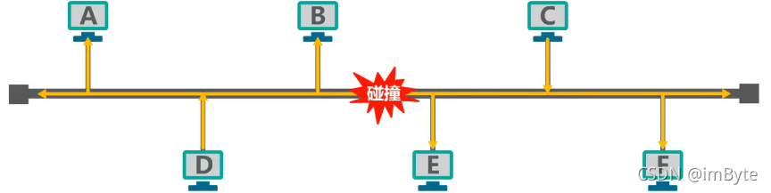

**主要分类**

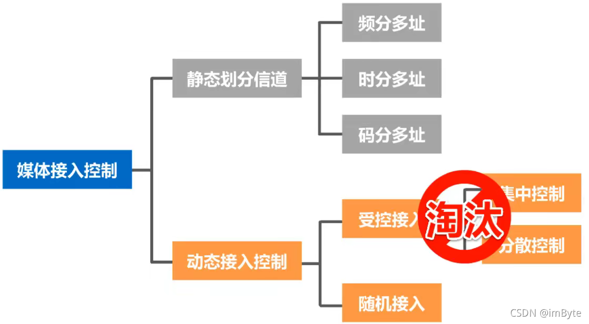

### 静态划分信道
静态划分信道也就是预先固定分配好信道，这类方法非常不灵活，对于突发性数据传输信道利用率会很低

通常在无线网络的物理层中使用，而不是在数据链路层中使用

1. 频分复用 FDM

频分复用的所有用户同时占用不同的频带资源并行通信

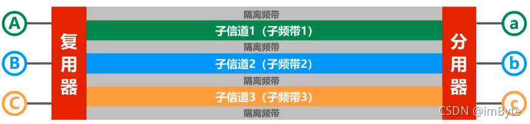

2. 时分复用 TDM

时分复用的所有用户在不同的时间占用同样的频带宽度，每对用户只在所分配的时隙里使用线路传输数据

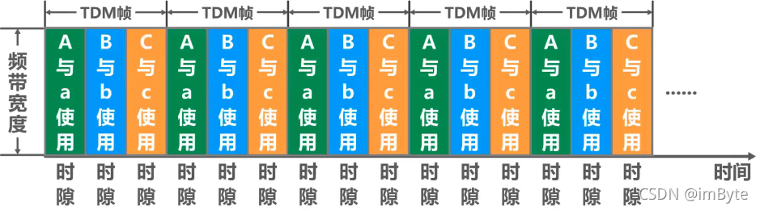

3. 波分复用 WDM

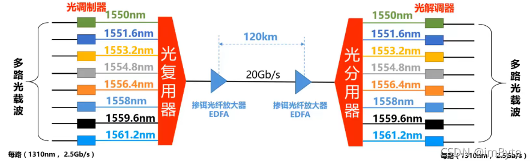

4. 码分复用 CDM

### 随机接入-CSMA/CD 协议
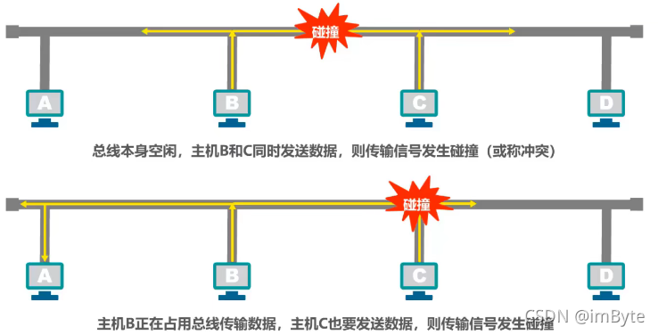

1. 多址接入 MA

多个站连接在一条总线上，竞争使用总线

2. 载波监听 CS

每个站在发送帧之前先要检测一下总线上是否有其他站点在发送帧（先听后说），若检测到总线空闲 96 比特时间，则发送这个帧；若检测到总线忙，则继续检测并等待总线时间转为 96 空闲比特时间，然后发送这个帧

96 比特时间：指发送 96 比特所耗费的时间，也称为帧间最小间隔。其作用是使接收方可以检测出一个帧的结束，同时也使得其他站点有机会平等竞争信道并发送帧

3. 碰撞检测 CD

每一个正在发送帧的站边发送边检测碰撞（边听边说），一旦发现总线上出现碰撞，即立即停止发送，退避一段随机时间后再次发送

#### 监听过程
假设在主机 B 发送帧的过程中，主机 C 也要发送帧，主机 C 进行载波监听，发现总线空闲 96 比特后立即发送帧，这必然导致碰撞

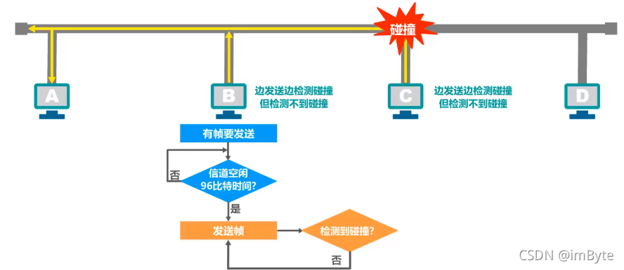

1. 碰撞信号沿总线传播，主机 C 比主机 B 更早检测到碰撞并停止发送，退避一段随机时间后，重新发送之前所发送的帧

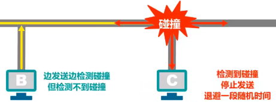

2. 当主机 B 检测到碰撞后，同样也停止发送退避一段随机时间，重新发送之前所发送的帧

注意：以太网还采用了一种强化碰撞的措施，当发送帧的站点一旦检测到碰撞，除了立即停止发送帧外，还要继续发送 32 比特或 48 比特的人为干扰信号，以便有足够多的碰撞信号使所有站点都能检测出碰撞

#### 争用期（碰撞窗口）
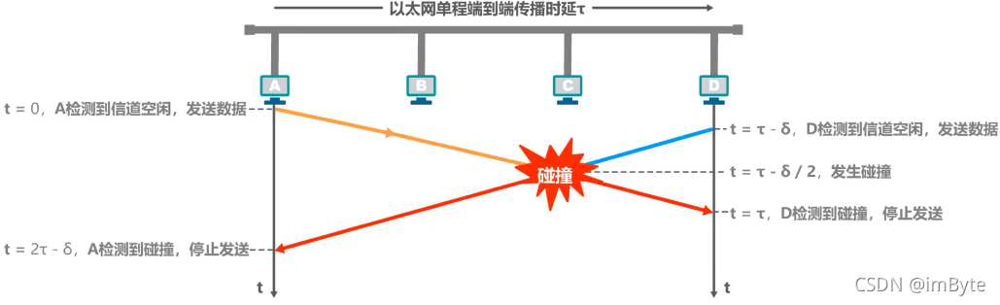

经过争用期这段时间还没有检测到碰撞，才能肯定这次发送不会发送碰撞

每一个主机在自己发送帧之后的一小段时间内，存在着偶遇碰撞的可能性。这一小段时间取决于另一个发送帧的主机到本主机的距离，但不会超过总线端到端的往返传播时延，也就是一个争用期时间

显然，在以太网中发送帧的主机越多，端到端往返传播时延越大，发生碰撞的概率就越大。因此，共享式以太网不能连接太多的主机，使用的总线也不能太长

#### 最小帧长
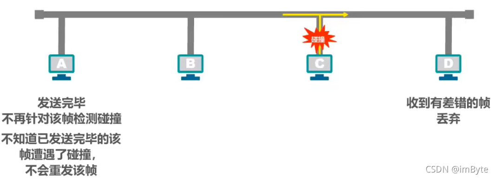

以太网规定最小帧长为 64 字节，即 512 比特（512 比特时间即为争用期），如果要发送的数据非常少，那么必须加入一些填充字节，使帧长不少于 64 字节

以太网的最小帧长确保了主机可在帧发送之前就检测到该帧的发送过程中是否遭遇了碰撞

1. 如果在争用期（共发送 64 字节）没有检测到碰撞，那么后续发送的数据就一定不会发生碰撞
2. 如果在争用期内检测到碰撞，就立即中止发送，这时已经发送出去的数据一定小于 64 字节，因此，凡是长度小于 64 字节的帧都是由于碰撞而异常中止的无效帧

#### 截断二进制指数退避算法

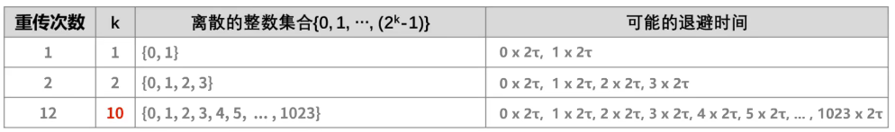

若连续多次发送碰撞，就表明可能有较多的主机参与竞争通道，但使用上述退避算法可使重传需要推迟的平均时间随重传次数而增大（称为动态退避），因此减小发生碰撞的概率，有利于整个系统的稳定

注意：当重传 16 次仍不能成功时，表明同时打算发送帧的主机太多，以至于发生碰撞，则丢弃该帧，并向高层报告

#### 帧发送与接收过程
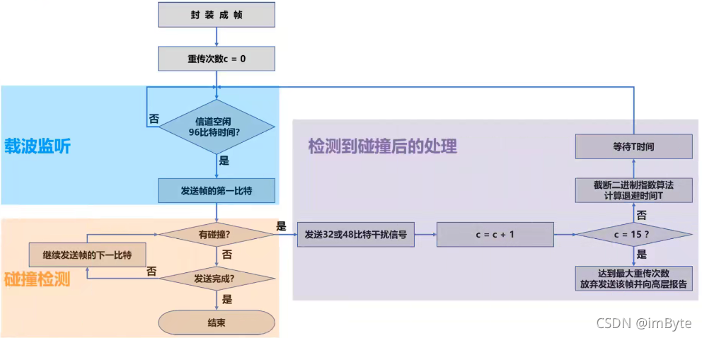

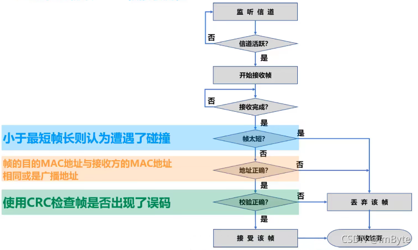

### 随机接入-CSMA/CA 协议（TODO）
## MAC 地址
### 与 IP 地址区别
MAC 地址就好像个人的身份证号，人的身份证号和人户口所在的城市、出生的日期有关，但是和人所在的位置没有关系，人是会移动的，知道一个人的身份证号，并不能找到这个人，知道一个设备的 MAC 地址，并不能在网络中将数据发给他，除非他和发送方在同一个网络内

1. 信息传递的时候，需要知道两个地址：终点地址、下一跳的地址。IP 地址本质上是终点地址，它在跳过路由器的时候不会改变，而 MAC 地址则是下一跳的地址，每跳过一次路由器都会改变，它起到了记录下一跳的信息的作用
2. 早期的以太网只有集线器，没有交换机，所以发出的包能被以太网内的所有机器监听到，因此要附带上 MAC 地址，每个机器只需要接受与自己 MAC 地址相匹配的包
3. MAC 地址和 IP 地址用于分别表示物理地址和逻辑地址，这样分层可以使网络层和数据链路层的协议更灵活地替换

### 作用
把一台计算机的数据通过物理层和数据链路层发送给另一台计算机，是发给谁的，计算机与计算机之间如何区别，于是 MAC 地址出现了。连接网络的每一个计算机都会有网卡接口，每一个网卡都会有一个唯一的地址，这个地址就叫做 MAC 地址，计算机之间的数据传送，就是通过 MAC 地址来唯一寻找、传送的

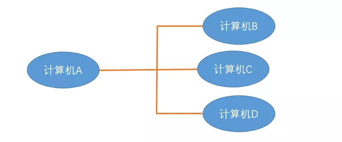

1. 使用点对点信道的数据链路层不需要使用地址

2. 使用广播信道的数据链路层必须使用地址来区分各主机

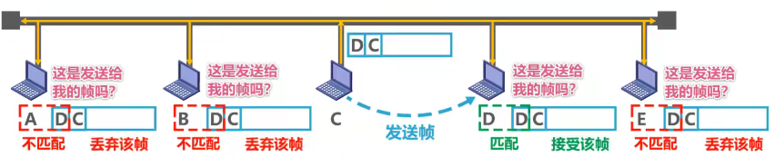

### 分类
1. 单播 MAC 地址

主机 B 首先要构建该单播帧，在帧首部中目的地址字段填入主机 C 的 MAC 地址，源地址字段填入自己的 MAC 地址，再加入帧首部中的其他字段、数据载荷以及帧尾部，构成了该单播帧

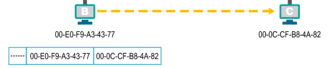

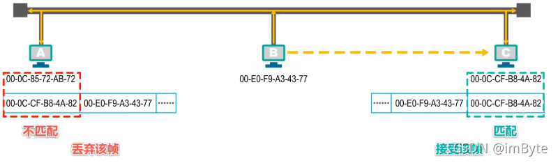

2. 广播 MAC 地址

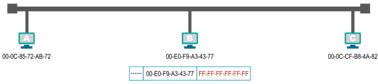

主机 B 将该广播帧发送出去，主机 A 和 C 收到后，发现该广播帧首部中目的地址字段的内容是广播地址，就知道该帧是广播帧，于是接收该帧，并交给上层处理

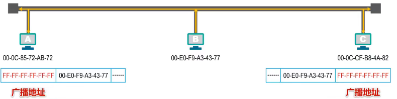

3. 多播 MAC 地址

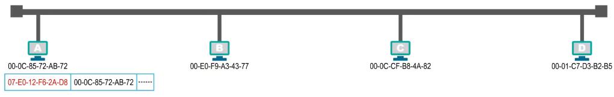

主机 A 将该多播帧发送出去，主机 B、C、D 收到该多播帧后，将该多播帧的目的 MAC 地址与自己的多播组列表中地址匹配，主机 B、C 匹配成功后，接收该帧，并交予上层处理，而主机 D 则丢弃该多播帧

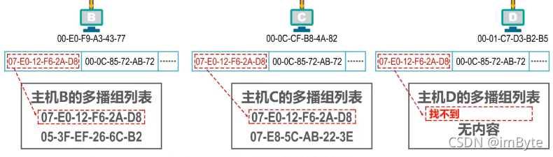

判断 MAC 地址是否为多播地址的方法

## 集线器与交换机
### 交换机自学习和转发帧（TODO）
### 交换机的生成树协议 STP
如果交换机 A 与 B 直接链路故障，则导致交换机 B 上连接的所有主机无法与交换机 A、C 上所连主机通信

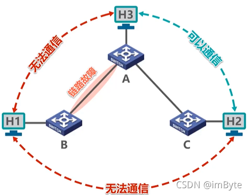

可以通过添加冗余链路来提高以太网的可靠性

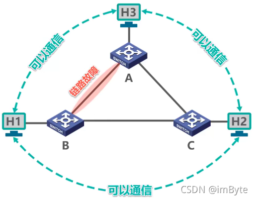

冗余链路也会带来负面效应——形成网络环路

网络环路会带来以下问题：

1. 广播风暴：大量消耗网络资源，使得网络无法正常转发其他数据帧

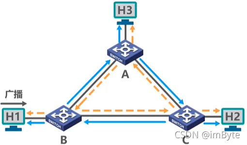

2. 主机收到重复的广播帧：大量消耗主机资源
3. 交换机的帧交换表震荡（漂移）

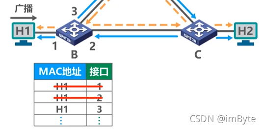

以太网交换机使用生成树协议 STP，可以在增加冗余链路提高网络可靠性的同时又避免网络环路带来的问题。无论交换机之间采用怎样的物理连接，交换机都能够自动计算并构建一个逻辑上没有环路的网络，其逻辑拓扑结构必须是树型的，最终生成的树型逻辑拓扑要确保连通整个网络，当首次连接交换机或网络物理拓扑结构发生变化时（有可能是人为改变或故障），交换机都会进行生成树的重新计算

### 两者区别
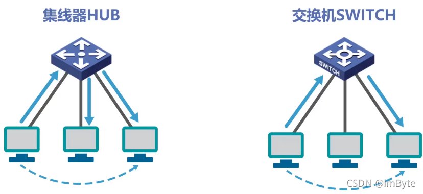

1. 以太网交换机通常都有多个接口。每个接口都可以直接与一台主机或另一个以太网交换机相连。一般都工作在全双工方式，发送和接收帧可以同时进行

注意：使用集线器的以太网在逻辑上是共享总线的，需要使用 CSMA/CD 协议来协调各主机争用总线，只能工作在半双工模式，收发帧不能同时进行

2. 以太网交换机具有并行性，能同时连通多对接口，使多对主机能同时通信，无碰撞（不使用 CSMA/CD 协议）

3. 以太网交换机一般都具有多种速率的接口，如：10Mb/s、100Mb/s、1Gb/s、10Gb/s 接口的多种组合
4. 以太网交换机工作在数据链路层（也包括物理层），它收到帧后，在帧交换表中查找帧的目的 MAC 地址所对应的接口号，然后通过该接口转发帧

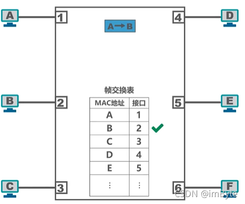

5. 以太网交换机是一种即插即用的设备，其内部的帧交换表是通过自学习算法自动地逐渐建立起来的

**总结**

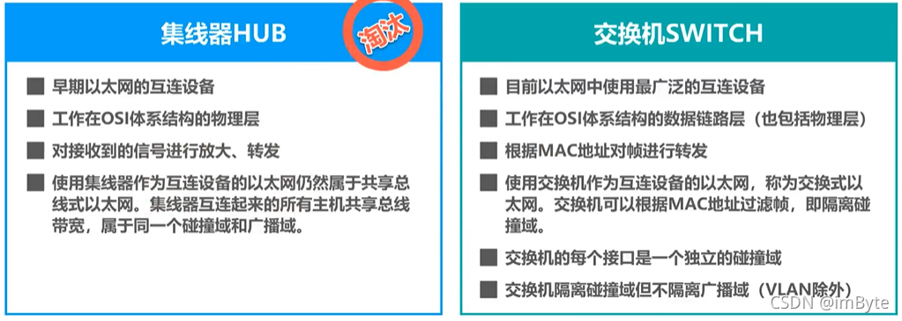

### 帧发送方式
1. 单播帧

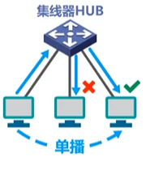 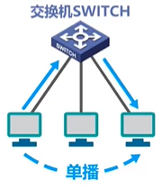

2. 广播帧

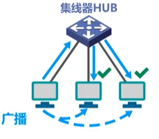 

3. 多台主机同时向另一台主机发送单播帧

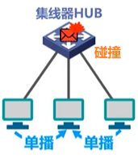 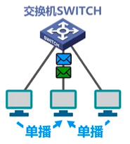

4. 扩展以太网下发送单播帧

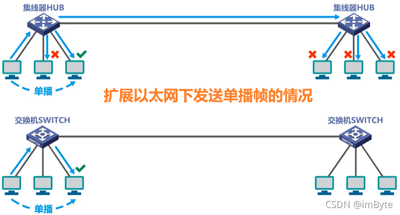

5. 扩展以太网下发送广播帧

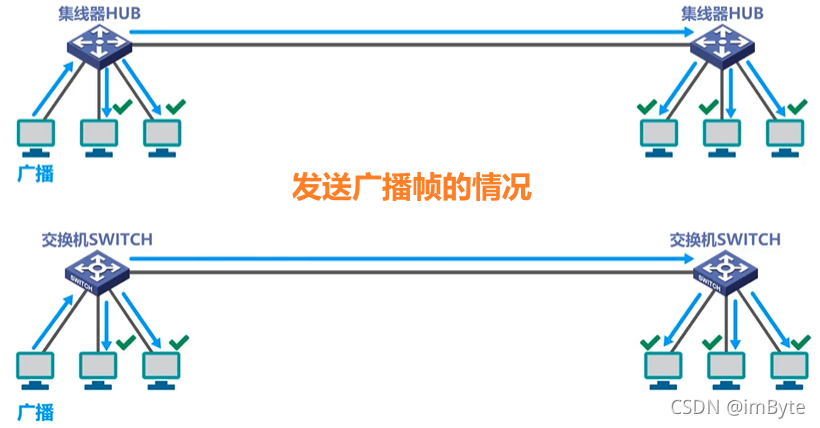

6. 扩展以太网下多主机发送单播帧

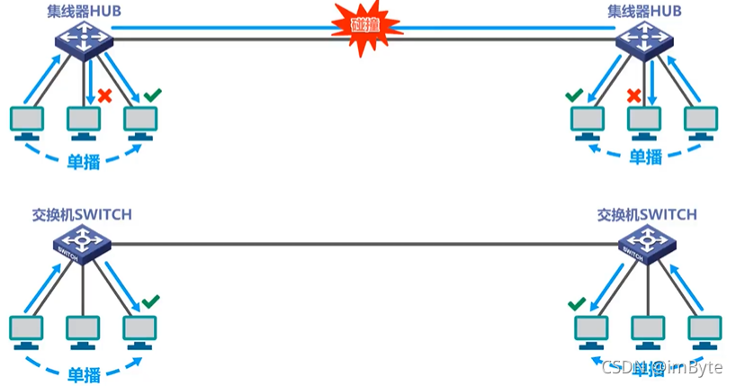

## 虚拟局域网 VLAN
随着交换式以太网规模的扩大，广播域相应扩大，巨大的广播域会带来很多弊端

1. 广播风暴

其主机为获取目的主机 MAC 地址，发送 ARP 广播请求，该请求会传遍整个网络，网络中的其他所有主机都会收到该广播

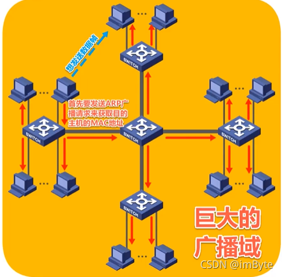

2. 难以管理和维护
3. 潜在的安全问题

使用路由器可以隔离广播域，路由器默认情况下不对广播数据包进行转发，因此路由器可以很自然地隔离广播域，但是路由器成本较高，局域网内部全部使用路由器来隔离广播域是不现实的

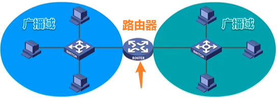

虚拟局域网 VLAN 是一种将局域网内的设备划分成与物理位置无关的逻辑组技术，这些逻辑组具有某些共同的需求

虚拟局域网 VLAN 技术是在交换机上实现的，需要交换机能实现以下功能：

1. 能够处理带有 VLAN 标记的帧，即 IEEE 802.1Q 帧
2. 交换机的各端口可以支持不同的端口类型，不同类型的端口对帧的处理方式不同

**IEEE 802.1Q 帧**

IEEE 802.1Q 帧对以太网的 MAC 帧格式进行了扩展，插入了 4 字节的 VLAN 标记

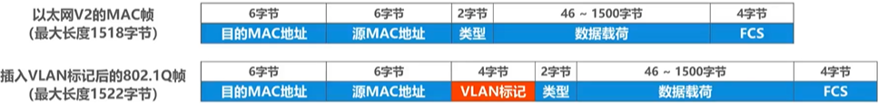

VLAN 标记的最后 12 比特称为 VLAN 标识符 VID，它唯一地标识了以太网帧属于哪一个 VLAN

802.1Q 帧是由交换机来处理的，而不是用户主机来处理的

1. 当交换机收到普通的以太网帧时，会向其插入 4 字节的 VLAN 标记转变为 802.1Q 帧，简称“打标签”
2. 当交换机转发 802.1Q 帧，可能会删除其 4 字节 VLAN 标记转变为普通以太网帧，简称“去标签”

**Access 端口**

1. Access 端口一般用于连接用户计算机
2. Access 端口只能属于一个 VLAN
3. Access 端口的 PVID 值与端口所属 VLAN 的 ID 相同（默认为 1）

交换机首次上电时，默认各配置端口属于 VLAN1，各端口的 PVID 值等于 1，默认配置各端口的类型为 Access

Access 端口接收处理方法：一般只接受“未打标签”的普通以太网 MAC 帧，根据接收端的端口的 PVID 帧“打标签”，即插入 4 字节 VLAN 标记字段，字段中的 VID 取值与端口的 PVID 取值相等

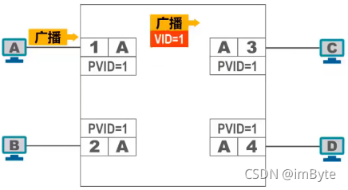

Access 端口发送处理方法：若帧中的 VID 与端口的 PVID 相等，则“去标签”并转发该帧，否则不转发

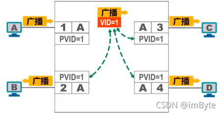

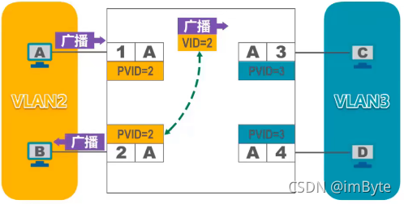

**Trunk 端口**

1. Trunk 端口一般用于交换机之间或交换机与路由器之间的互连
2. Trunk 端口可以属于多个 VLAN，Trunk 端口可以接收和发送多个 VLAN 的帧
3. 用户可以设置 Trunk 端口的 PVID 值，默认情况下，Trunk 端口的值为 1
4. Trunk 端口收报文

收到一个报文，判断是否有 VLAN 信息，如果没有则打上端口的 PVID，并进行交换转发；如果有判断该 Trunk 端口是否允许该 VLAN 的数据进入，如果允许则报文携带原有 VLAN 标记进行转发，否则丢弃该报文

5. Trunk 端口发报文

比较端口的 PVID 和将要发送的 VLAN 信息，如果两者相等则剥离 VLAN 信息再发送，否则报文将携带原有的 VLAN 标记进行转发

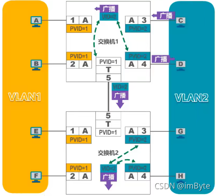

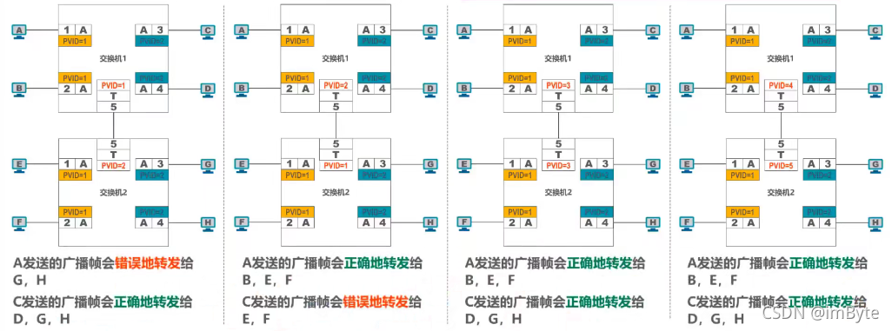

结论：互连的 Trunk 端口的 PVID 值不等，可能会造成转发错误

