## 作用

实际上我们所处的网络，是由无数个子网络构成的。广播的时候，也只有同一个子网里面的计算机能够收到。

假如没有子网这种划分的话，计算机 A 通过广播的方式发一个数据包给计算机 B，其他所有计算机也都能收到这个数据包，然后进行对比再舍弃。世界上有那么多台计算机，每一台计算机都能收到其他所有计算机的数据包，那就不得了了，因此产生了子网这么一个东西。

那么问题来了，我们如何区分哪些 MAC 地址是属于同一个子网的呢？假如是同一个子网，那我们就用广播的形式把数据传送给对方，如果不是同一个子网的，我们就会把数据发给网关，让网关进行转发。为了解决这个问题，于是，有了 IP 协议。

有了两台计算机的 IP 地址与子网掩码，我们就可以判断出它们是否处于同一个子网之中了。假如他们处于同一个子网之中，计算机 A 要给计算机 B 发送数据时。我们可以通过 ARP 协议来得到计算机 B 的 MAC 地址。

我们是如何知道对方计算机的 IP 地址的呢？当我们想要访问某个网站的时候，我们可以输入 IP 来进行访问，但是我相信绝大多数人是输入一个网址域名的，例如访问百度是输入 www.baidu.com 这个域名。其实当我们输入这个域名时，会有一个叫做 DNS 服务器的家伙来帮我们解析这个域名，然后返回这个域名对应的 IP 给我们的

**总结**

网络层负责把一个数据从一个网络传递到另外一个网络，最大的功能就是进行路由决策，比如通过 IP、子网等概念，使数据更好着在不同的局域网中传递。

## 网络层服务
### 面向连接的虚电路服务
虚电路服务核心思想为可靠传输，由网络来保证

1. 两台计算机进行通信时必须建立网络层的连接——虚电路 VC
2. 通信双方沿着已建立的虚电路发送分组，虚电路是一条逻辑上的连接，并不是真正建立了一条物理连接

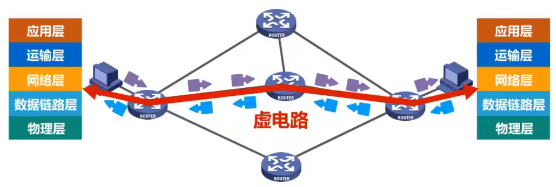

3. 目的主机的地址仅在连接建立阶段使用，之后每个分组的首部只需携带一条虚电路的编号（构成虚电路的每一段链路都有一个虚电路编号）
4. 这种方式如果再使用可靠传输的网络协议，就可使所发送的分组最终正确到达接收方（无差错按序到达、不丢失、不重复）
5. 通信结束后，需要释放之前所建立的虚电路

### 无连接的数据报服务
数据报服务核心思想是可靠通信，应由用户主机来保证

1. 两台计算机进行通信时不需要建立网络层连接，通信双方可以沿不同路径

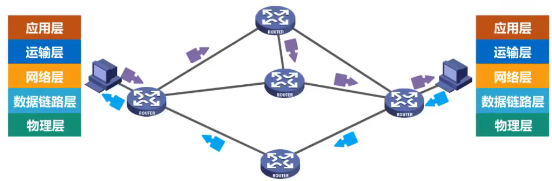

2. 每个分组的首部必须携带目的主机的完整地址，这种通信方式所传送的分组可能误码、丢失、重复和失序。
3. 由于网络本身不提供端到端的可靠传输服务，这就使网络中的路由器可以做得比较简单，而且价格低廉

## IP 地址
### IP 地址分类

1. A 类：（1.0.0.0-126.0.0.0，默认子网掩码：255.0.0.0），一般用于大型网络
+ 可指派的网络数量为 2 ^ (8 - 1) - 2 = 126（最小网络号 0，保留不指派；最大网络号 127，作为本地回环测试地址，不指派）
+ 每个网络中可分配的 IP 地址数量为 2 ^ 24 - 2 = 16777214（去除主机号全 0 的网络地址、全 1 的广播地址）
2. B 类：（128.0.0.0-191.255.0.0，默认子网掩码：255.255.0.0），一般用于中等规模网络
+ 可指派的网络数量为 2 ^ (16 - 2) = 16384
+ 每个网络中可分配的 IP 地址数量为 2 ^ 16 - 2 = 65534
3. C 类：（192.0.0.0-223.255.255.0，默认子网掩码：255.255.255.0），一般用于小型网络
+ 可指派的网络数量为 2 ^ (24 - 3) = 2097152
+ 每个网络中可分配的 IP 地址数量为 2 ^ 8 - 2 = 254
4. D 类：多播地址，一般用于多路广播用户
5. E 类：保留地址

**注意**

在 IP 地址 3 种主要类型里，各保留了 3 个区域作为私有地址，其地址范围为：

1. A 类地址：10.0.0.0-10.255.255.255
2. B 类地址：172.16.0.0-172.31.255.255
3. C 类地址：192.168.0.0-192.168.255.255

主机号为“全 0”的地址是网络地址，不能分配给主机或路由器的各接口

主机号为“全 1”的地址是广播地址，不能分配给主机或路由器的各接口

回送地址：127.0.0.1，也是本地地址，等效于 localhost 或本机 IP，一般用于测试使用。例如：ping 127.0.0.1 来测试本机 TCP/IP 是否正常

**IP 为什么要分类？**

根据 IP 地址访问终端是通过路由器，路由设备当中有一张路由表，该路由表记录了所有 IP 地址的位置，这样就可以进行包的转发了，如果不分网络位和主机位，路由器的路由表就全都是 32 位的地址，那所有的路由器维护的路由表就会很大，转发速度就会变慢（因为查询变慢），而且所有的路由器都要有足够的性能来存下全网地址，估计建造这样的 Internet 成本是现在的几万倍，甚至更高

有了网络地址，就可以限定拥有相同网络地址的终端都在同一个范围内，那么路由表只需要维护这个网络地址的方向，就可以找到相应的终端了

### 子网掩码
假如两台计算机的网络部分是一模一样的，我们就说这两台计算机是处于同一个子网中。例如：192.168.43.1 和 192.168.43.2，假设这两个 IP 地址的网络部分为 24 位，主机部分为 8 位，那么它们的网络部分都为 192.168.43，所以它们处于同一个子网中。

**如何知道网络部分是占几位，主机部分是占几位？**

子网掩码和 IP 地址都是 32 位二进制数，不过它的网络部分规定全部为 1，主机部分规定全部为 0，只需要把 IP 地址与它的子网掩码做与（and）运算，然后把各自的结果进行比较就行了，如果比较的结果相同，则代表是同一个子网

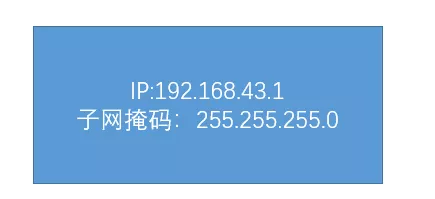

### 无分类编址
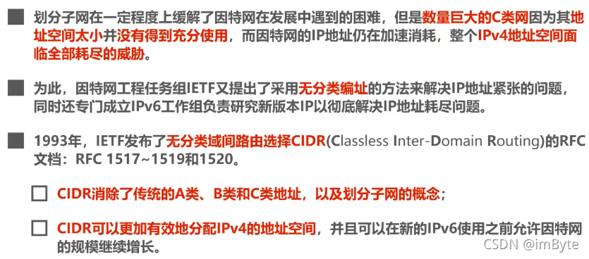

**无分类域间路由选择 CIDR**

1. CIDR 使用 “ 斜线记法 ”，或称 CIDR 记法。即在 IPv4 地址后面加上 / ，在 斜线后面写上网络前缀所占比特数量
2. CIDR 实际上是 将网络前缀都相同的连续的 IP 地址组成一个 “ CIDR 地址块 ”
3. 只要知道 CIDR 地址块中的任何一个地址，就可知道该地址块的全部细节
+ 地址块的最小地址
+ 地址块的最大地址
+ 地址块的地址数量
+ 地址块聚合某类网络（A 类、B 类或 C 类）的数量
+ 地址掩码（子网掩码）

**CIDR-路由聚合（构造超网）**

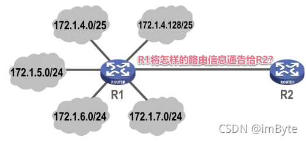

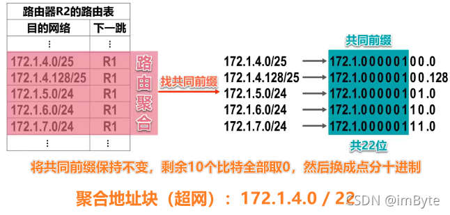

1. 网络前缀越长，地址块越小，路由越具体
2. 若路由器查表转发分组时发现有多条路由器可选，则选择网络前缀最长的那条，这称为 最长前缀匹配，因为这样的路由更具体

## IP 数据报的发送和转发过程
1. 同一个网络中的主机可以直接通信，这属于直接交付；
2. 不同网络间的主机，需要路由器中转，这属于间接交付。
3. IP 地址与子网掩码相与，不相等时知道是间接交付，需要路由器转发

### 源主机如何判断目的主机是否与自己在同一个网络中？
假设主机 C 向主机 F 发送 IP 数据报。首先，主机 C 将自己的 IP 地址和子网掩码相与，得到主机 C 所在网络的网络地址。 之后，主机 C 将主机 F 的 IP 地址与自己的子网掩码相与，得到目的网络地址。发现它们两个不相等，因此知道这是间接交付，需要路由器转发

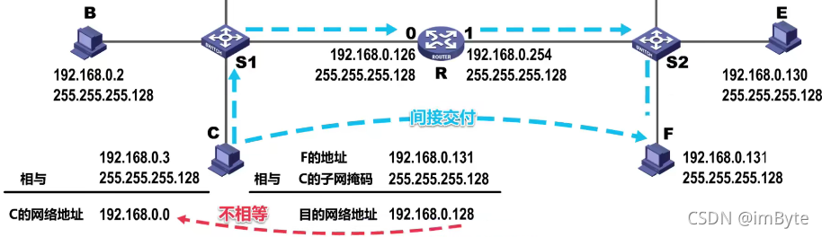

### 源主机如何知道路由器的存在？
可以通过指定路由器某接口的 IP 地址指定给各主机，所指定的路由器被称为默认网关

缺省网关（默认网关）：是子网与外网连接的设备，通常是一个路由器。当一台计算机发送信息时，根据发送信息的目的地址，通过子网掩码来判定目标主机是否在本地子网中，如果目标主机在本地子网中，则直接发送即可。如果目标不在本地子网中则将信息送到缺省网关/路由器，由路由器进一步将其转发到其他网络中，进一步寻找主机

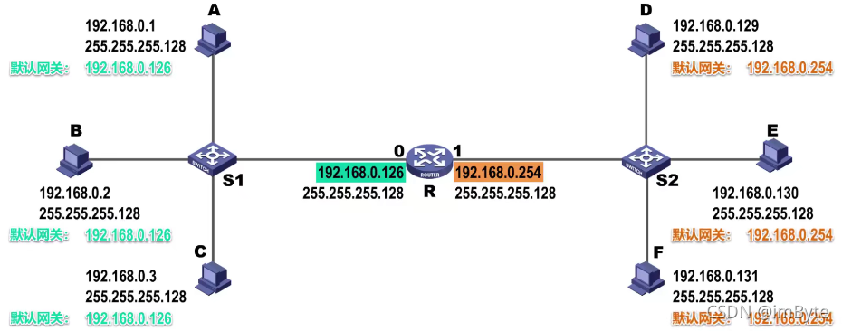

### 路由器收到 IP 数据报如何转发？
1. 检查数据报首部是否出错，若出错，则直接丢弃该 IP 数据报并通告源主机，若没有出错，则进行转发
2. 根据 IP 数据报的目的地址在路由表中查找匹配的条目，若找到匹配的条目，则转发给条目中指示的下一跳；若找不到，则丢弃该 IP 数据报并通告源主机

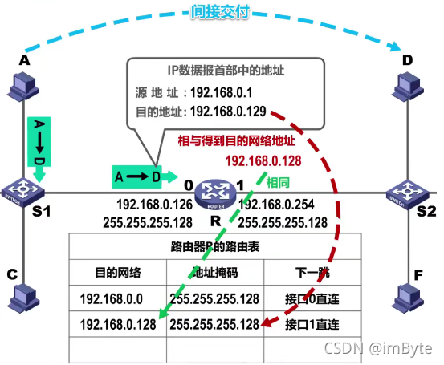

1. 假设主机 A 给本网络上各设备发送了一个广播 IP 数据报

路由器是隔离广播域的，收到后不会转发广播 IP 数据报，避免了广播风暴和资源浪费

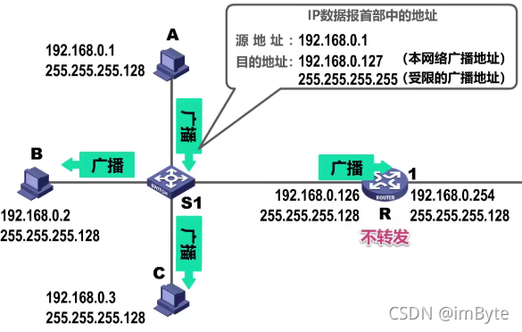

2. 主机 A 向另一个网络发送广播 IP 数据报

路由器判断出这是广播 IP 数据报，不对其进行转发

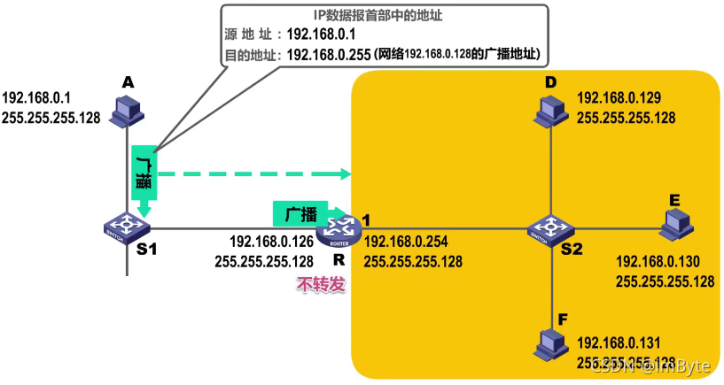

## 路由器
路由器可以连接多个网络，它有多个端口，分别连接不同的网络区域，通过识别目的 IP 地址的网络号，再根据路由表进行数据转发，路由器会维护一张路由表，通过路由表的信息，路由器才能正确地转发 IP 报文

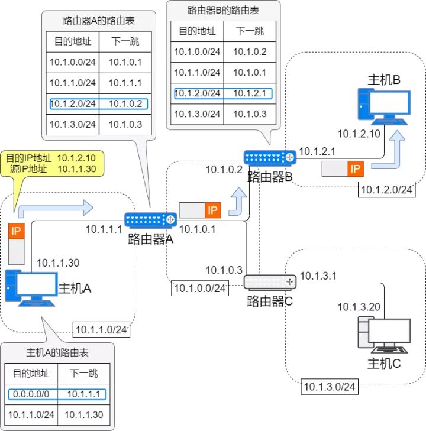

### 路由
网络层的作用是实现终端的点对点通信，IP 协议通过 IP 地址将数据包发送给目的主机，能够让互联网上任何两台主机进行通信，IP 地址可以识别主机和路由器，路由器可以把全世界的网络连接起来

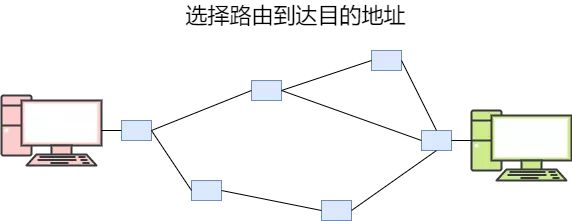

路由是网络设备根据 IP 地址对数据进行转发的操作，当路由器收到一个数据包时，它根据数据包的目的地址查询路由表，如果有匹配的路由条目，就根据查询结果将数据包转发出去，如果没有任何匹配的路由条目，则将数据包丢弃，这个过程就是 IP 路由。除了路由器，三层交换机、防火墙、负载均衡设备甚至主机等设备都可以进行路由操作，只要这个设备支持路由功能

### 路由表
为了将数据包发给目的节点，所有节点都维护着一张路由表，路由表是路由器通过各种途径获得的路由条目，每一个路由条目包含目的网段地址/子网掩码、路由协议、出接口、下一跳 IP 地址、路由优先级和度量值等信息。路由表记录 IP 包在下一跳应该发给哪个路由器，IP 包根据路由表在各个数据链路上传输

路由表来源：

1. 直连路由：路由器直接连接的路由条目，只要路由器接口配置了 IP 地址，接口状态正常，就会自动生成对应的直连路由
2. 静态路由：通过命令手动添加的路由条目
3. 动态路由：通过路由协议从相邻路由器动态学习到的路由条目

## 路由选择
### 分类
路由选择可分为静态路由选择和动态路由选择

1. 静态路由选择
+ 由人工配置的网络路由、默认路由、特定主机路由、黑洞路由等都属于静态路由
+ 这种人工配置方式简单、开销小，但不能及时适应网络状态（流量、拓扑等）的变化
+ 一般只在小规模网络中采用
2. 动态路由选择
+ 路由器通过路由选择协议自动获取路由信息
+ 比较复杂、开销比较大，但能较好地适应网络状态变化
+ 适用于大规模网络

### 应用
1. 因特网所采用的路由选择协议的主要特点

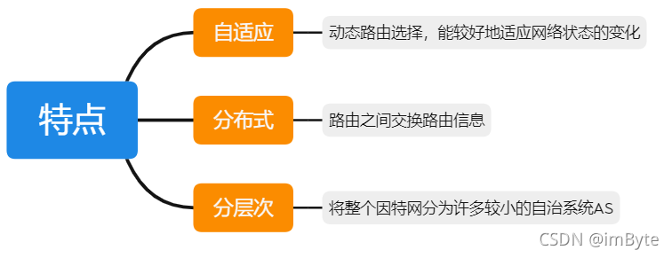

2. 因特网采用分层次的路由选择协议

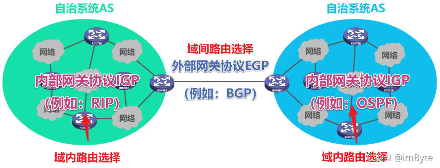

3. 因特网有两大类路由选择协议
+ 内部网关协议 IGP： 内部网关协议即在一个自治系统内部使用的路由选择协议，它与互连网中其他自治系统选用什么路由选择协议无关。目前这类路由选择协议使用得最多，如 RIP 和 OSPF。
+ 外部网关协议 EGP：若源站和目的站处在不同的自治系统中，当数据报传到一个自治系统的边界时（两个自治系统可能使用不同的 IGP），就需要使用 外部网关协议 协议将路由选择信息传递到另一个自治系统。目前使用最多的外部网关协议是 BGP-4。

**自治系统（Autonomous System，AS）**

单一技术管理下的一组路由器，这些路由器使用一种 AS 内部的路由选择协议和共同的度量来确定分组在该 AS 内的路由，同时还使用一种 AS 之间的路由选择协议来确定分组在 AS 之间的路由

**域内路由、域间路由**

自治系统内部的路由选择称为域内路由选择，自治系统之间的路由选择称为域间路由选择

### 路由信息协议 RIP
适用于小互联网，是一种分布式的基于距离向量的路由选择协议，要求网络中每一个路由器都维护从它自己到其他每一个目的网络的唯一最佳距离记录。

距离：通常为“跳数”，即从源端口到目的端口所经过的路由器个数，经过一个路由器跳数+1。特别的，从一路由器到直接连接的网络距离为 1，RIP 允许一条路由最多只能包含 15 个路由器，此距离为 16 表示网络不可达

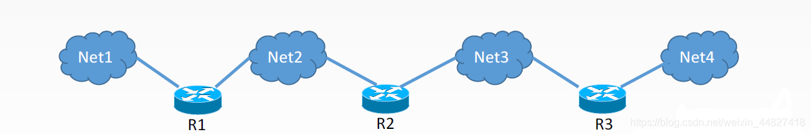

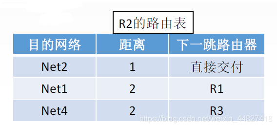

#### RIP 的交换过程
1. 仅和相邻路由器交换信息
2. 路由器交换的信息是自己的路由器
3. 每 30 秒交换一次路由信息，然后路由器根据新信息更新路由表，若超过 180 秒没收到邻居路由器的通告，则判定邻居没了，并更新自己路由表
4. 路由器刚开始工作时，只知道直接连接的网络的距离（距离为 1），接着每一个路由器也只和数目非常有限的相邻路由器交换并更新路由信息

#### 路由表的更新
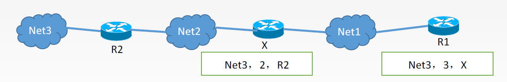

1. 修改相邻路由器发来的 RIP 报文中所有表项，对地址为 x 的相邻路由器发送的 RIP 报文，修改此报文中的所有项目：把“下一跳”字段中的地址改为 X，并把所有“距离”字段+1
2. 对修改后的 RIP 报文中的每一个项目，进行以下步骤
+ R1 路由表中若没有 Net3，则把该项目填入 R1 路由表
+ R1 路由表中若有 Net3，则查看下一跳路由器地址

若下一跳是 x，则用收到的项目替换源路由表中的项目；若下一跳不是 x，原来距离比从 x 走的距离远则更新，否则不做处理

3. 若 180s 还没收到相邻路由器 X 的更新路由表，则把 X 记为不可达的路由器，即把距离设置为 16

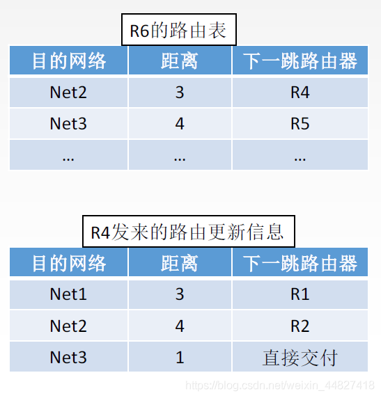

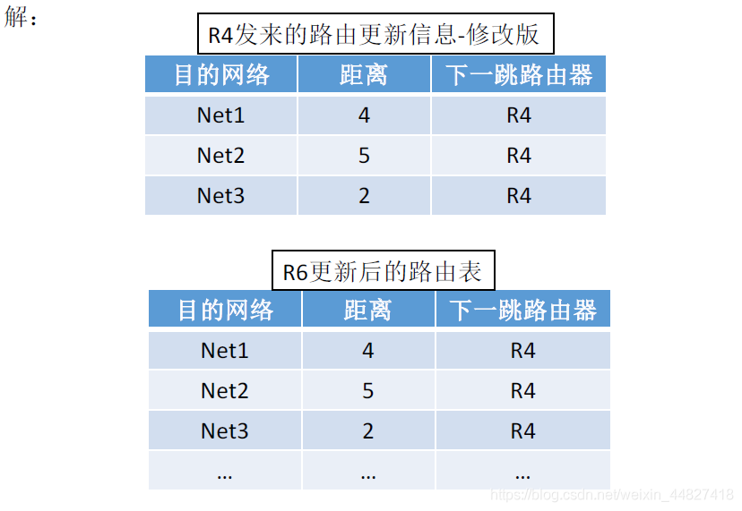

#### RIP 存在“坏消息传得慢”问题
网络出现故障时，会出现慢收敛现象（即需要较长时间才能将此信息传送到所有路由器），俗称“坏消息传得慢”，使更新过程的收敛时间长

假设 R1 到达其直连网络 N1 的链路出现了故障，当 R1 检查出该故障后，会将到达 N1 的路由条目中距离改为 16，表示不可达，并等待 RIP 更新周期到时后，发送该路由信息给 R2，但是，如果 R2 抢先一步将自己的路由信息发送给了 R1，则会出现下面问题：

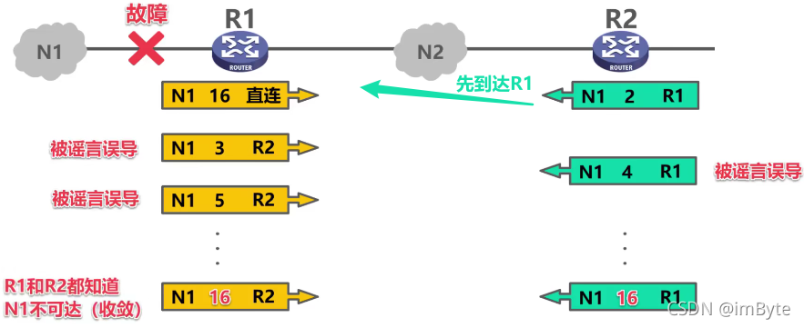

“坏消息传得慢”又称为路由环路或无穷计数问题，这是距离向量算法的一个固有问题，可以采用多种措施减少该问题出现的概率或减小该问题的危害：

1. 限制最大路径距离为 15（16 不可达）
2. 当路由表发生变化时就立即发送更新报文（触发更新），而不仅是周期更新
3. 让路由器记录收到某特定路由信息的接口，而不让同一路由信息再通过此接口反方向传送（水平分隔）

即使采用上述算法路由环路问题也无法避免，这是距离向量算法本质所决定的

### 开放最短路径优先协议 OSPF
#### 特点
1. OSPF 是基于链路状态的，而不像 RIP 那样是基于距离向量的

链路状态：指本路由器和哪些路由器相连，以及相应链路的“代价”

代价：用来表示费用、距离、时延、带宽等，由网络管理人员决定

2. OSPF 采用 SPF 算法计算路由，从算法上保证了不会产生路由环路
3. OSPF 不限制网络规模，更新效率高，收敛速度快

#### 问候分组 Hello
OSPF 相邻路由器之间通过交互问候（Hello）分组，建立和维护邻居关系

1. Hello 分组封装在 IP 数据报中，发往组播地址 224.0.0.5

2. 问候分组的发送周期为 10 秒
3. 若 40 秒未收到来自邻居路由器的 Hello 分组，则认为该邻居路由器不可达

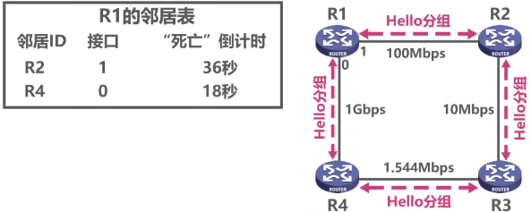

#### 分组类型
1. 问候分组：用来发现和维护邻居路由器的可达性
2. 数据库描述分组：向邻居路由器给出自己的链路状态数据库中的所有链路状态项目的摘要信息
3. 链路状态请求分组：向邻居路由器请求发送某些链路状态项目的详细信息
4. 链路状态更新分组：用洪泛法对全文更新链路状态
5. 链路状态确认分组：对链路状态更新分组的确认

#### 工作原理
使用 OSPF 的每个路由器都会产生链路状态通告 LSA，LSA 中包含以下内容：

1. 直连网络的链路状态信息
2. 邻居路由器的链路状态信息

LSA 被封装在链路状态更新分组 LSU 中，采用洪泛法发送

1. 洪泛法是一种简单的路由算法，将收到的封包往所有的可能连接路径上递送，直到封包到达为止
2. 收到链路状态更新分组的路由器，将从自己其他所有接口转发该分组

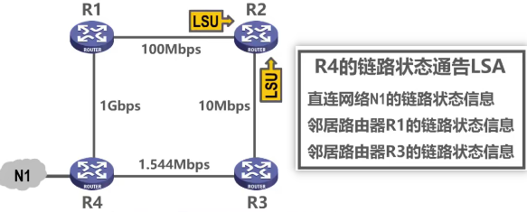

使用 OSPF 的每个路由器都有一个链路状态数据库 LSDB，用于存储 LSA，通过各路由器洪泛发送封装有自己 LSA 的 LSU 分组，各路由器的 LSDB 最终将达到一致

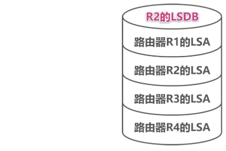

使用 OSPF 的各路由器基于 LSDB 进行最短路径优先 SPF 计算，构建出各自到达其他各路由器的最短路径，即构建各自的路由表

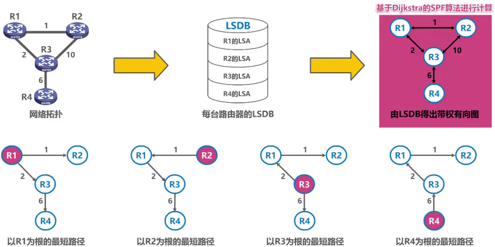

#### 基本工作过程
相邻路由器之间周期性发送问候分组，以便建立和维护邻居关系，建立邻居关系后，给邻居路由器发送数据库描述分组，即将自己的链路状态数据库中的所有链路状态项目的摘要信息发送给邻居路由器

1. R1 收到 R2 的数据库描述分组后，发现自己缺少其中的某些链路状态项目，于是就给 R2 发送链路状态请求分组，R2 收到后，将 R1 所缺少的链路状态项目的详细信息封装在链路状态更新分组中发送给 R1
2. R1 收到后，将这些缺少的链路状态项目的详细信息添加到自己的链路状态数据库中，并给 R2 发送链路状态确认分组
3. 最终 R1 和 R2 的链路状态数据库达到一致，也就是链路状态数据库达到同步

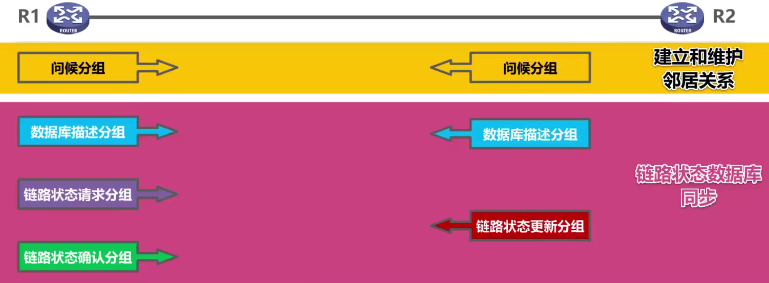

每隔 30 分钟或者链路状态发送变化时，路由器都会发送链路状态更新分组，收到该分组的其他路由器将洪泛转发该分组，并给该路由器发回链路状态确认分组，这称为新情况下的链路状态数据库同步

#### 多点接入网络中路由器邻居关系的建立
当 OSPF 路由器在多点接入网络中建立邻居关系时，如果不采用其他机制，将会产生大量多播分组

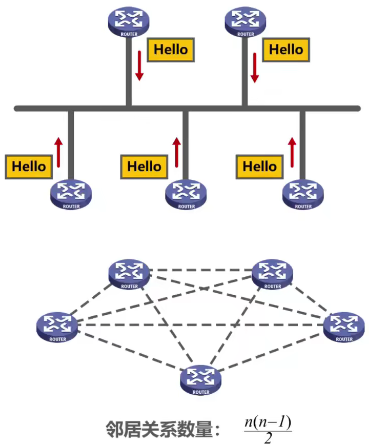

为了减少所发送分组的数量，OSPF 采用选举指定路由器 DR 和备用的路由器 BDR 的方法

所有的非 DR/BDR 只与 DR/BDR 建立邻居关系，非 DR/BDR 之间通过 DR/BDR 交换信息

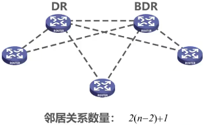

#### 区域
为了使 OSPF 能够用于规模更大的网络，OSPF 把一个自治系统再划分为若干个更小的范围，叫做区域

每个区域都有一个 32 比特的区域标识符，可以用点分十进制表示。主干区域的标识符必须为 0，主干区域用于连通其他区域，其他区域标识符不能为 0，且互不相同

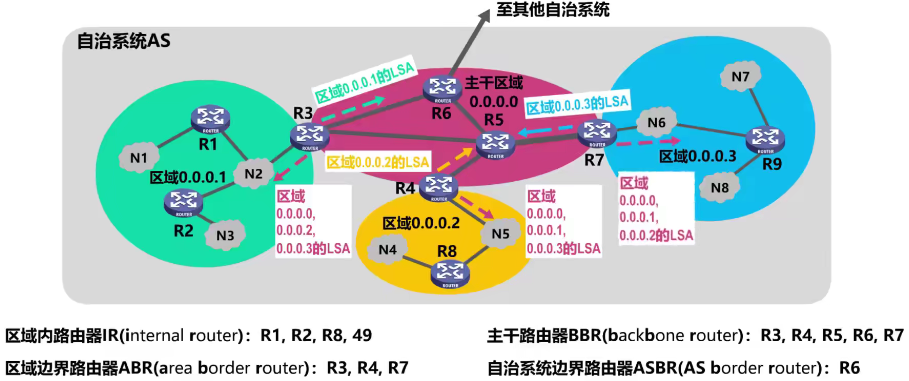

划分区域的好处：将利用洪泛法交换链路状态信息的范围局限于每个区域而非整个自治系统，减少了整个网络上的通信量，使得每个区域内部交换路由信息的通信量大大减少，因而使 OSPF 协议能够用于规模很大的自治系统中

#### RIP 与 OSPF 的对比
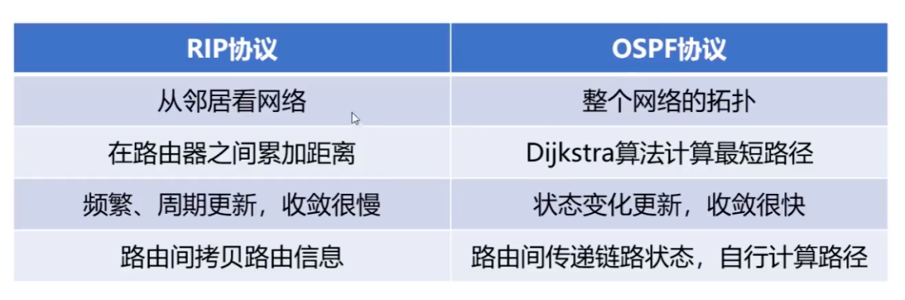

### 边界网关协议 BGP
**内部网关协议 IGP（如 RIP、OSPF）**

1. 设法使分组在同一个自治系统内尽可能有效地从源网络传输到目的网络
2. 无需考虑自治系统外部其他方面的策略

**外部网关协议 EGP（如 BGP）**

在不同自治系统内，度量路由的“代价”（距离、带宽、费用等）可能不同，由于没有统一的度量，因此寻找最佳路由是不现实的，自治系统之间的路由选择必须考虑相关策略（政治、经济、安全等）

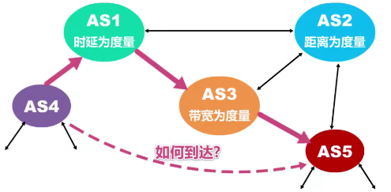

#### 工作原理
在配置 BGP 时，每个自治系统的管理员要选择至少一个路由器作为该自治系统的“发言人”。一般来说，两个 BGP 发言人都是通过一个共享网络连接在一起的，BGP 发言人往往就是 BGP 边界路由器

不同自治系统的 BGP 发言人要交换路由信息，首先必须建立 TCP 连接，端口号 179（可见 BGP 报文是通过 TCP 传送的，也就是作为 TCP 报文的数据部分）。在此 TCP 连接上交换 BGP 报文以建立 BGP 会话，利用 BGP 会话交换路由信息（如：增加新的路由、撤销过时路由、报告出错情况等），使用 TCP 连接交换路由信息的两个 BGP 发言人，彼此称为对方的邻站或对等站

BGP 发言人除了运行 BGP 外，还需要运行自己所在自治系统所使用的内部网关协议 IGP（如 RIP 或 OSPF）

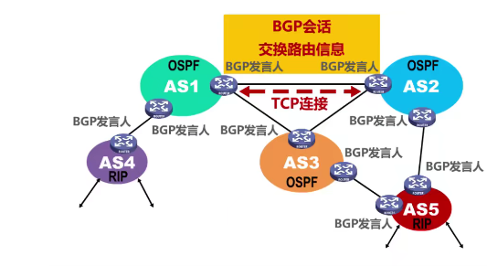

BGP 发言人交换网络可达性的信息（要到达某个网络所要经过的一些列自治系统），当 BGP 发言人互相交换了网络可达性的信息后，各 BGP 发言人就根据所采用的策略从收到的路由信息中找到到达各自治系统的较好的路由，即构造出树型结构、不存在回路的自治系统连通图

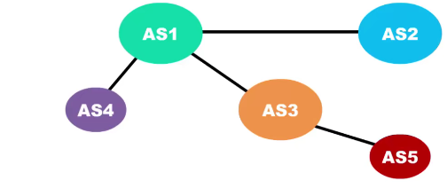

#### BGP 报文
1. 打开（Open）报文：用来与相邻的另一个 BGP 发言人建立关系，使通信初始化
2. 更新（Update）报文：用来通告某一路由的信息，以及列出要撤销的多条路由
3. 保活（Keepalive）报文：用来周期性证实邻站的连通性
4. 通知（Notification）报文：用来发送检测到的差错

## 网际控制报文协议 ICMP
### 作用
一个新搭建好的网络，往往需要先进行一个简单的测试，来验证网络是否畅通，但是 IP 地址并不提供可靠传输，如果丢包了，IP 协议并不能通知传输层是否丢包以及丢包的原因

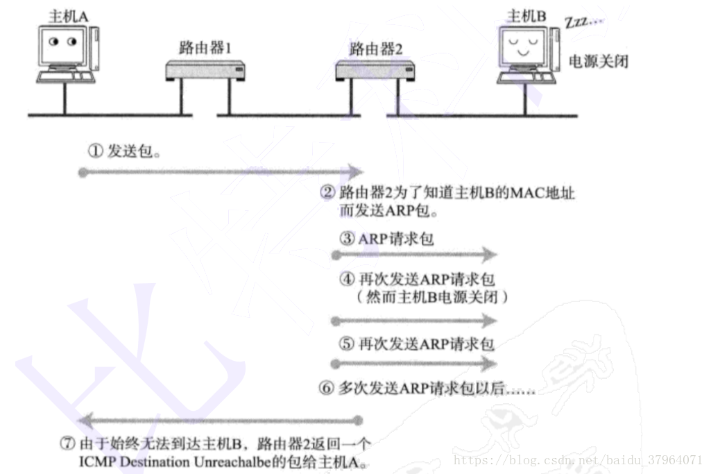

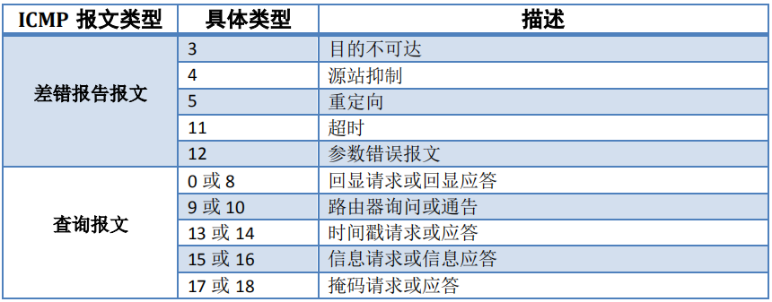

作用：

1. 确认 IP 包是否成功到达目标地址
2. 通知在发送过程中 IP 包被丢弃的原因

注意：不应该发送 ICMP 差错报告报文的情况

1. 对 ICMP 差错报告报文不再发送 ICMP 差错报告报文
2. 对第一个分片的数据报片的所有后续数据报片都不再发送 ICMP 差错报文
3. 对具有多播地址的数据报都不发送 ICMP 差错报文
4. 对具有特殊地址（如 127.0.0.0 或 0.0.0.0）的数据报不发送 ICMP 差错报文

### ICMP 询问报文
1. 回送请求和回答
+ ICMP 回送请求报文是由主机或路由器向一个特定的目的主机发出的询问
+ 收到此报文的主机必须给源主机或路由器发送 ICMP 回送回答报文
+ 这种询问报文用来测试目的站是否可达及了解其有关状态
2. 时间戳请求和回答
+ ICMP 时间戳请求报文是请某个主机回答当前的日期和时间
+ 在 ICMP 时间戳回答报文中有一个 32 位的字段，其中写的整数代表从 1900 年 1 月 1 日到当前时刻一共有多少秒
+ 时间戳请求与回答可用于时钟同步和时间测量

### 差错报文分类
#### 终点不可达
当路由器或主机不能交付数据报时，就向源点发送终点不可达报文

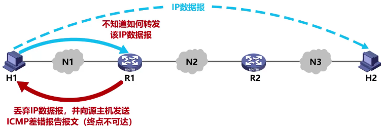

#### 源点抑制
当路由器或主机由于阻塞而丢弃数据报时，就向源点发送源点抑制报文，使源点知道应当把数据报的发送速率放慢

#### 时间超过
当路由器收到一个目的 IP 地址不是自己的 IP 数据报时，会将其生存时间 TTL 字段的值减 1。若结果不为 0，则将该 IP 数据报转发出去；若结果为 0，除丢弃该 IP 数据报外，还要向源点发送时间超过报文。当终点在预先规定的时间内不能收到一个数据报的全部数据报片时，就把已收到的数据报片都丢弃，也会向源点发送时间超过报文

#### 参数问题
当路由器或目的主机收到 IP 数据报后，根据其首部中的校验和字段发现首部在传输过程中出现了误码，就丢弃该数据报，并向源点发送参数问题报文

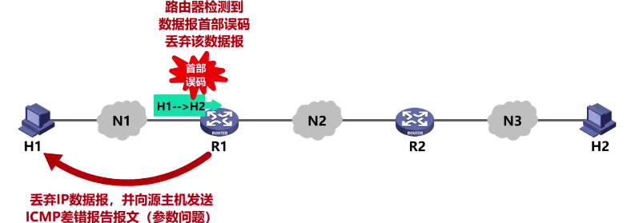

#### 改变路由（重定向）
路由器把改变路由报文发送给主机，让主机知道下次应将数据报发送给另外的路由器（可通过更好的路由）

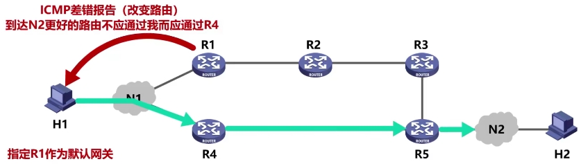

### 应用
#### ping
使用的是 ICMP 回显请求报文、回显应答报文。ping 是一个应用程序，该程序发送一份 ICMP 回显请求报文给目标主机，并等待目标主机返回 ICMP 回显应答报文。ping 命令执行成功，说明链路层、网络层、传输层都能通信正常

#### tracert
打印出可执行程序主机，一直到目标主机之前经历多少路由器

1. IP 数据报首部中生存时间字段 TTL 的值被设置为 1，到达 R1 后，TTL 减少为 0，丢弃 IP 数据报并给源主机发送 ICMP 差错报告，H1 就知道了第一个路由器

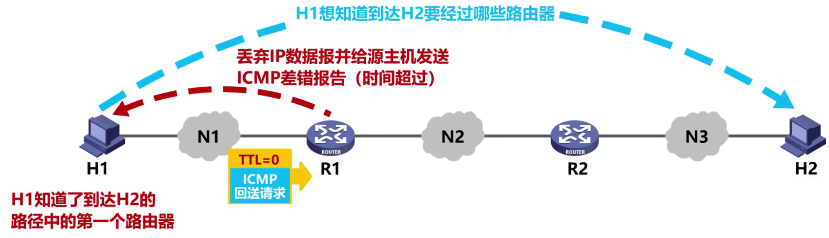

2. H1 继续发送 TTL 值为 2 的 IP 数据报，同样，H1 就知道了第 2 个路由器

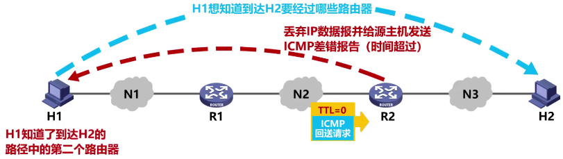

3. H1 继续发送 TTL 值为 3 的 IP 数据报，该数据报到达主机 H2，H2 解析该数据报，发现其内部封装的是 ICMP 回送请求报文，于是给 H1 发送封装有 ICMP 回送请求报文的 IP 数据报，这样 H1 知道了已经跟踪到最后一站，即目的主机

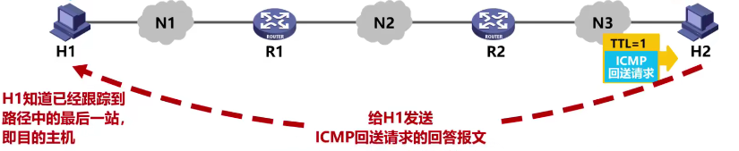

## 虚拟专用网 VPN
由于 IPv4 地址的紧缺，一个机构能够申请到的 IPv4 地址数量往往小于本机构所拥有的本机数量，因此，虚拟专用网中的各主机所分配的地址应该是本机构可自由分配的专用地址，而不是需要申请的、在因特网上使用的公有地址

注意：私有地址只能用于一个机构的内部通信，而不能用于和因特网上的主机通信，即私有地址只能用作本地地址而不能用作全球地址，在因特网中的所有路由器对目的地址是私有地址的 IP 数据报一律不进行转发

1. 先封装成内部 IP 数据报发送给路由器 R1，R1 收到后发现目的网络必须通过因特网才能到达，就将该内部 IP 数据包进行加密，然后重新添加上数据报的首部，封装成在因特网上可以发送的外部数据报
2. 路由器 R2 收到该外部数据报后，去掉其首部，将其数据部分进行解密，恢复其原来的内部数据报，再根据原来的目的地址发送数据

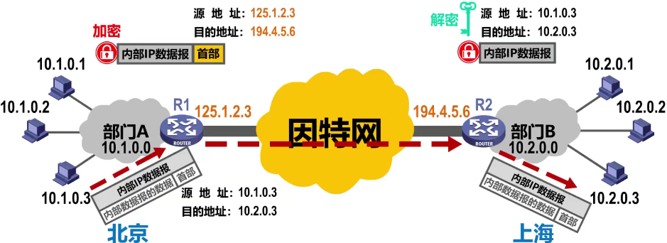

虽然通过了公网的因特网，但在效果上好像是在本机构的专用网上传送一样，从逻辑上看，R1 和 R2 之间好像是一条直通的点对点链路，因此也称为 IP 隧道技术

## 网络地址转换 NAT
从内网出去的 IP 数据报，将其 IP 地址替换为 NAT 服务器拥有合法的公共 IP 地址，并将替换关系记录到 NAT 转换表中；从公共互联网返回的 IP 数据报，依据其目的的 IP 地址检索 NAT 转换表，并利用检索到的内部私有 IP 地址替换目的 IP 地址，然后将 IP 数据报转发到内部网络

1. 静态 NAT：一个内部主机唯一占用一个公网 IP，静态 NAT 并不能节约公有 IP 地址资源，同时，静态 NAT 技术要求私有 IP 地址与公有 IP 地址保持固定不变的一一对应关系
2. 动态 NAT：当某个私网用户发起与 Internet 的通信时，NAT 会先检查公有 IP 地址资源池中是否还有可用地址。如果没有，则这次与 Internet 的通信就无法进行；如果有，则 NAT 会在公有地址资源池中选择一个公有 IP 地址，并在动态地址映射表中创建一个表项，该表项反映了该公有 IP 地址与该用户的私有 IP 地址之间的映射关系。当该用户结束了与 Internet 的通信后，NAT 必须将该表项从动态地址映射表中清除，同时将该表项中的公有 IP 地址释放回公有 IP 地址资源池。简单说，就是在使用动态 NAT 技术时，同一个公有 IP 地址可以分配给不同的私网用户使用，但是在使用的时间上必须错开

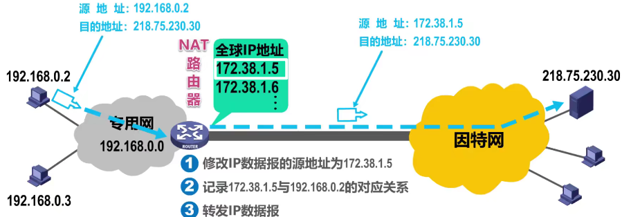

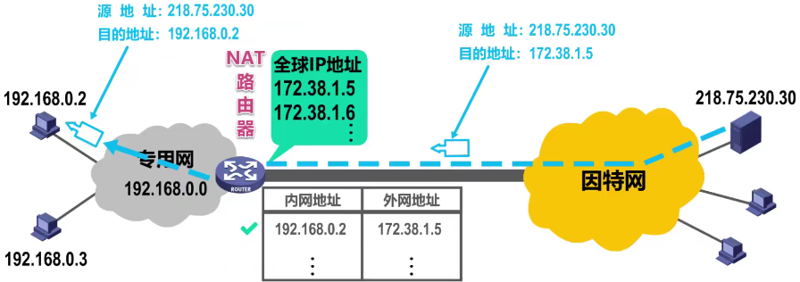

该转换方法存在一个问题：如果 NAT 路由器具有 N 个全球 IP 地址，那么至多只能有 N 个内网主机能够同时和因特网上的主机通信。

由于绝大多数的网络应用都是使用运输层协议 TCP 或 UDP 来传送数据，因此可以使用运输层的端口号和 IP 地址一起进行转换，这种将端口号和 IP 地址一起进行转换的技术叫做网络地址与端口号转换  NAPT 

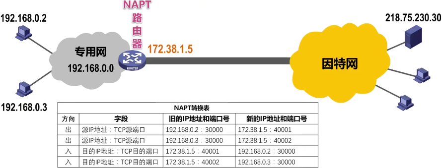

内网主机与外网主机间的通信，不能由外网主机首先发起，因为在 NAPT 转换表中找不到相应的记录，无法把数据报转发给内网中的主机。因此，使用私有地址的主机不能直接充当因特网服务器

## 地址解析协议 ARP
计算机 A 是如何知道计算机 B 的 MAC 地址的？ARP 协议也是通过广播的形式给同一个子网中的每台电脑发送一个数据包（会包含接收方的 IP 地址），对方收到这个数据包之后，会取出 IP 地址与自身的对比，如果相同，则把自己的 MAC 地址回复给对方，否则就丢弃。如何知道对方计算机的 IP 地址的呢？通过 DNS 服务器来解析域名，然后返回这个域名对应的 IP 地址

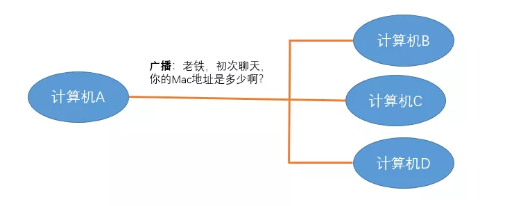

知道了 MAC 地址之后，发送数据是通过广播的形式发送，询问对方的 MAC 地址也是通过广播的形式来发送，那其他计算机怎么知道你是要传送数据还是要询问 MAC 地址呢？在询问 MAC 地址的数据包中，在对方的 MAC 地址这一栏中，填的是一个特殊的 MAC 地址，其他计算机看到这个特殊的 MAC 地址之后，就能知道广播想干吗了

假如两台计算机的 IP 不是处于同一个子网之中，这个时候，就会把数据包发送给网关，然后让网关帮我们进行转发传送

### 工作原理
假设主机 B 要给主机 C 发送数据包。主机 B 知道主机 C 的 IP 地址，但不知道主机 C 的 MAC 地址，因此主机 B 的数据链路层封装 MAC 帧时，无法填写目的 MAC 地址，进而无法构建要发送的 MAC 帧。

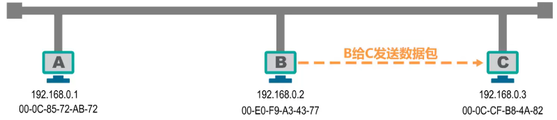

实际上，每台主机都会有一个 ARP 高速缓存表，ARP 高速缓存表中记录有 IP 地址和 MAC 地址的对应关系

### 工作过程
1. 当主机 B 要给主机 C 发送数据包时，会首先在自己的 ARP 高速缓存表中查找主机 C 的 IP 地址所对应的 MAC 地址，但是未找到。因此，主机 B 需要发送 ARP 请求报文来获取主机 C 的 MAC 地址

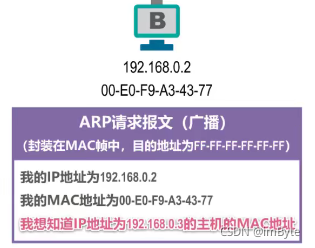

2. 主机 B 发送封装有 ARP 请求报文的广播帧，总线上的其他主机都能收到该广播帧。主机 A 对此不予理会，主机 C 进行响应

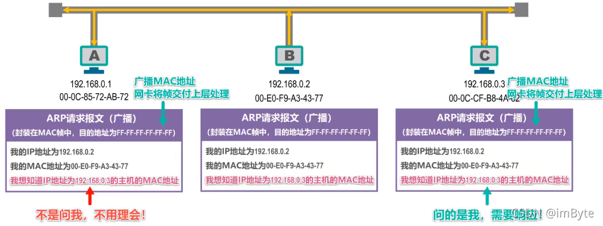

3. 主机 C 将 B 的 IP 地址与 MAC 地址记录到自己的 ARP 高速缓存表中，然后给 B 发送 ARP 响应报文，以告知自己的 MAC 地址

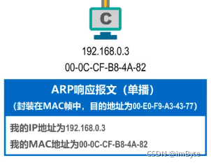

4. 主机 C 给主机 B 发送封装 ARP 响应报文的单播帧，总线上的其他主机都能收到该单播帧。主机 A 丢弃该帧；主机 B 收到发现匹配后交予上层处理，上层解析后，将其记录到 ARP 缓存表中

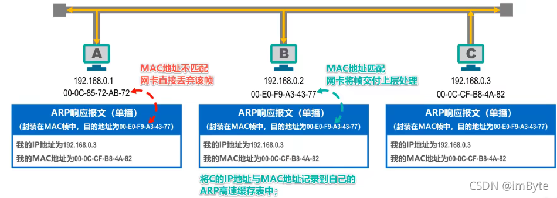

5. 于是，主机 B 就可以向主机 C 发送数据包了

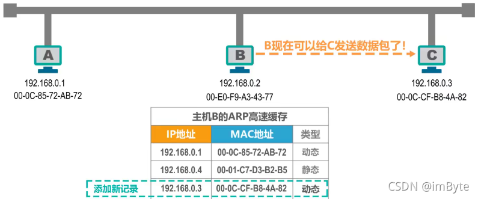

### 缓存表分类
ARP 高速缓存表中的每一条记录都有其类型，分为 动态 和 静态 两种：

ARP 协议只能在一段链路或一个网络上使用，而不能跨网络使用

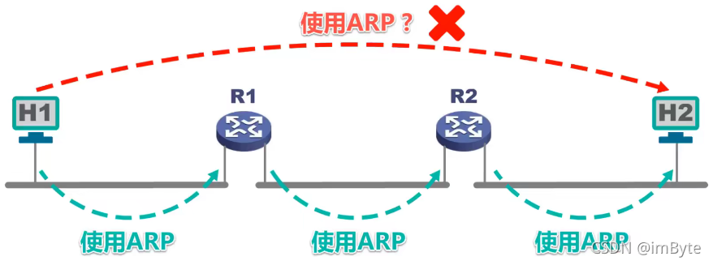

ARP 高速缓存的作用：主机 A 会把主机 B 的 IP 地址和 MAC 地址缓存到一张缓存表里面，下次通信的时候直接从 ARP 缓存表里面查，而不用发送 ARP 请求广播了，从而提供通信效率

为了减少网络上的通信量，主机 A 在发送其 ARP 请求分组时，就将自己的 IP 地址到硬件的映射写入 ARP 请求分组。当主机 B 收到 A 的 ARP 请求分组时，就将主机 A 的这一地址映射写入主机 B 自己的 ARP 高速缓存中，这对主机 B 以后向 A 发送数据报时就更方便了

ARP 是解决同一个局域网上的主机或路由器的 IP 地址和硬件地址的映射问题，如果所要找的主机和源主机不在同一个局域网上，那么就要通过 ARP 找到一个位于本局域网上的某个路由器的硬件地址，然后把分组发送给这个路由器，让这个路由器把分组转发给下一个网络，剩下的工作就由下一个网络来做

### 代理 ARP 协议（Proxy ARP）
代理 ARP 的原理：当出现跨网段的 ARP 请求时，路由器将自己的 MAC 地址返回给 ARP 广播请求发送者，实现 MAC 地址代理，最终使得主机能够通信

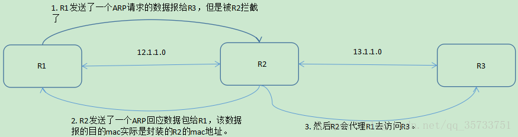

注意：如果 R2 关闭了 ARP 的代理功能，那么 R1 再访问 R3 的时候，R2 并不会把自己的 MAC 地址给 R1，那么 R1 和 R3 之间就无法通信

代理 ARP 的使用场景为：

1. 没有路由功能的主机
2. 有路由功能，目的地指向本地出口

