## 作用

通过物理层、数据链路层以及网络层的传输，我们已经把数据成功从计算机 A 传送到计算机 B 了，但是计算机 B 里面有各种各样的应用程序，计算机如何知道这些数据是给谁的呢？我们在从计算机 A 传数据给计算机 B 的时候，还得指定一个端口（Port），以供特定的应用程序来接收处理，传输层的功能就是建立端口到端口的通信，相比网络层的功能是建立主机到主机的通信

## 端口号
运行在计算机上的进程使用 进程标识符 PID 来标志。而因特网上的计算机并不是使用统一的操作系统，不同的操作系统（windows、Linux、Mac OS）又使用 不同格式的进程标识符 。

为了使运行不同操作系统的计算机的应用进程之间能够进行网络通信，就必须 使用统一的方法对 TCP/IP 体系的应用进程进行标识 。TCP/IP 体系的运输层使用 端口号 来区分应用层的不同应用进程

使用端口（Port）来标记不同的网络进程，端口（Port）使用 16 比特位表示（0-65535）

1. 0~1023：IANA 把这些端口号指派给了 TCP/IP 体系中最重要的一些应用协议，如：FTP：21/20、HTTP：80、DNS：53
2. 1024~49151：它是供没有熟知端口号的应用程序使用的，使用这类端口号必须在 IANA 登记，以防重复
3. 49152~65535：留给客户进程选择暂时使用，当服务器进程收到客户进程的报文时，就知道了客户进程所使用的动态端口号，通信结束后，这个端口号可供其他客户进程以后使用

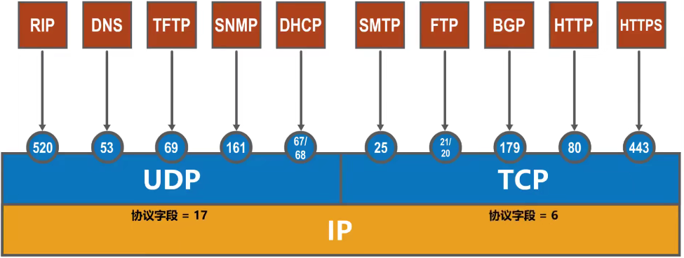

不管在运输层使用 UDP 协议还是 TCP 协议，在网络层都需要使用 IP 协议。IP 数据报首部中协议字段 的值，表明了 IP 数据报数据载荷部分封装的是何种协议数据单元

## 复用与分用
1. 复用：指发送方不同的应用进程都可以使用同一个传输层协议发送数据
2. 分用：指接收方的传输层在剥去报文的首部后能够把这些数据正确交付到目的应用进程

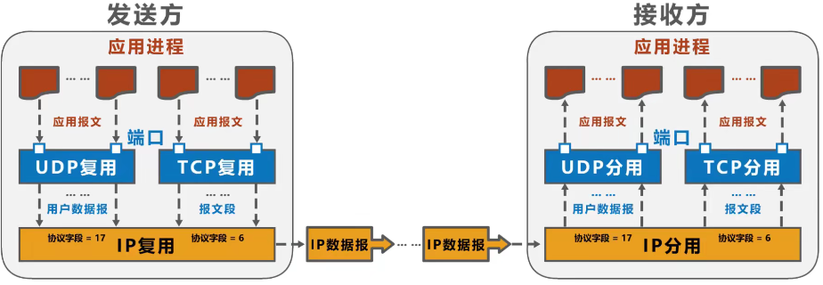

**复用与分用的过程**

发送方

1. 发送方的某些应用进程所发送的不同应用报文，在运输层使用 UDP 协议封装，称为 UDP 复用；在运输层使用 TCP 协议封装，称为 TCP 复用
2. 运输层采用端口号来区分不同的应用进程
3. 不管是运输层 UDP 协议封装成的 UDP 用户数据报，还是使用 TCP 协议封装成的 TCP 报文段，在网络层都需要使用 IP 协议封装成 IP 数据报，称为 IP 复用
4. IP 数据报首部中协议字段的值用来表明 IP 数据报的数据载荷部分封装的是何种协议数据单元

接收方

1. 接收方的网络层收到 IP 数据报后进行 IP 分组。若协议字段为 17，则将用户数据报上交给运输层的 UDP；若协议字段为 6，则上交给运输层的 TCP
2. 运输层对 UDP 用户数据报进行 UDP 分用，对 TCP 报文段进行 TCP 分用，即根据端口号将其交付给上层相应的应用进程

## 套接字
套接字 Socket =（IP 地址：端口号）

## UDP
UDP 协议只在 IP 的数据报服务上增加了两个最基本的服务：复用和分用 和 差错检测 。

1. UDP 是无连接协议，两个实体之间的通信不需要先建立好连接，需要通信时，直接将信息发送到网络中，让该信息的传递在网上尽力而为地传送到目的地
2. UDP 不能保证可靠的交付数据
3. UDP 是面向报文传输的，发送方 UDP 对应用层交下来的报文，在添加首部后就向下交付给 IP 层，一次发送一个报文，不合并也不拆分
4. UDP 没有拥塞控制，因此即使网络出现拥塞也不会降低发送速率
5. UDP 首部开销很小，TCP 有 20B 的首部开销，UDP 有 8B 的首部开销
6. 支持一对一、一对多、多对一和多对多通信

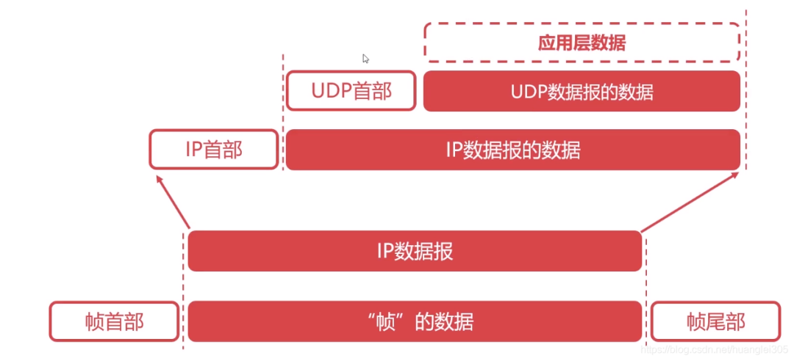

### 如何实现可靠的 UDP？
传输层无法保证数据的可靠传输，只能通过应用层来实现了

1. 提供超时重传，能避免数据包丢失
2. 提供确认序列号，可以对数据报进行确认和排序

本端：首先在 UDP 数据报定义一个首部，首部包含确认序列号和时间戳，时间戳是用来计算 RTT（数据报传输的往返时间），计算出合适的 RTO（重传的超时时间），然后以等-停的方式发送数据报，即收到对端的确认之后才发送下一个的数据报。当时间超时，本端重传数据报，同时 RTO 扩大为原来的两倍，重新开始计时

对端：接收到一个数据报之后取下该数据报首部的时间戳和确认序列号，并添加本端的确认数据报首部之后发送给对端，根据此序列号对已收到的数据报进行排序并丢弃重复的数据报

### 什么时候 UDP 代替 TCP？
在弱网（2G、3G、信号不好）环境下，使用 TCP 连接的延迟很高，影响体验，把 UDP 作为弱网里面的 TCP 来使用，就必须保证数据传输能像 TCP 一样可靠

## TCP
TCP 是在不可靠的 IP 层之上实现的可靠的数据传输协议，它主要解决传输的可靠、有序、无丢失和不重复问题。

1. TCP 是面向连接的协议，在通信双方通信前，必须先建立连接，整个连接情况一直被实时地监控和管理，通信结束后，应该释放这个连接
2. TCP 是面向字节流的协议，TCP 把应用程序交付的数据仅视为一连串无结构的字节流
3. TCP 的一个连接有两端，即点对点通信
4. TCP 提供可靠的传输服务，传输的数据无差错、不丢失、不重复、按序到达
5. TCP 协议提供全双工通信（每条 TCP 连接只能一对一），允许通信双方的应用进程在任何时候都能发送数据，为此 TCP 的双端都设有发送缓存和接收缓存，用于存放临时数据

### 拥塞控制
两台主机在传输数据包的时候，如果发送方迟迟没有收到接收方反馈的 ACK，那么发送方就会认为它发送的数据包丢失了，进而会重新传输这个丢失的数据包。然而实际情况有可能此时有太多主机正在使用信道资源，导致网络拥塞了，而 A 发送的数据包被堵在了半路，迟迟没有到达 B，这个时候 A 就会误认为是发生了丢包情况，进而重新传输这个数据包。结果就是不仅浪费了信道资源，还会使网络更加拥塞

#### 慢启动算法
1. 先发送一个数据包试探下，如果该数据包没有发生超时事件（也就是没有丢包），那么下次发送时就发送 2 个，如果还是没有发送超时事件，下次就发送 3 个，以此类推，即 N = 1，2，3，......
2. 一个一个增加太慢了，所以可以在刚开始发送 1 个，如果没有发生超时事件，就发送 2 个，如果还是没有发生超时事件就发送 4 个，以此类推，即 N = 1，2，4，......
3. 为了解决过慢或过快的问题，把第一种和第二种方法结合起来，刚开始以指数的速度增长，增长到某一个值，我们把这个值称之为阈值。当增长到阈值时，就一个一个线性增长

注意：指数增长阶段称之为慢启动，线性增长阶段称之为拥塞避免

#### 拥塞避免算法
当出现超时事件时，我们就认为网络出现了拥塞了，不能再继续增长了，就把这个时候的 N 的值称之为瓶颈值，用 MAX 表示。接着就回到最初的状态，也就是 1，2，4，.....开始，不过这个时候我们还会把阈值调小，调为 MAX 值的一半

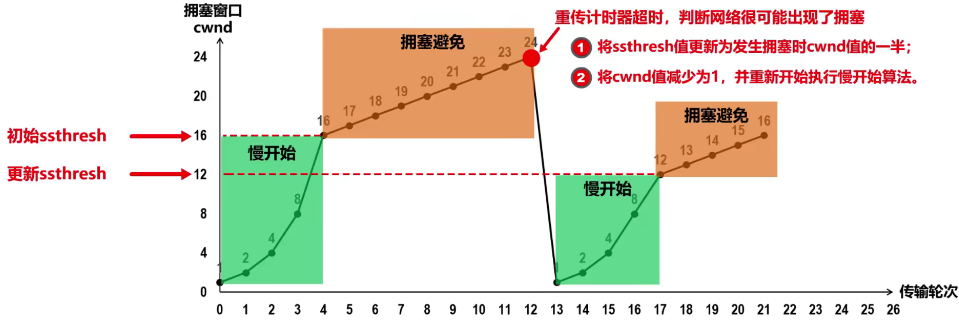

#### 快重传与快恢复算法
超时事件不一定是网络拥塞，有可能是因为某个数据包出现了丢失或者损害了，导致了这个数据包超时事件发生了。为了防止这种情况，我们通过冗余 ACK 来处理。如果 A 给 B 发送 M1，M2，M3，M4，....N 个数据包，如果 B 收到了 M1，M2，M4....却始终没有收到 M3，这个时候就会重复确认 M2，意在告诉 A，M3 还没收到，可能是丢失

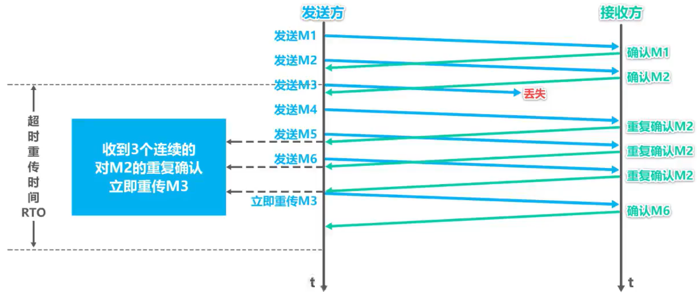

当 A 连续收到了三个确认 M2 的 ACK，且 M3 超时事件还没发送，A 就知道 M3 可能丢失了，这个时候 A 就不必等待 M3 设置的计时器到期了，而是快速重传 M3，并且把阈值设置为 MAX 的一半，但是这个时候并非把控制窗口 N 设置为 1，而是让 N = 阈值，再一个一个增长，这种情况称之为快速恢复

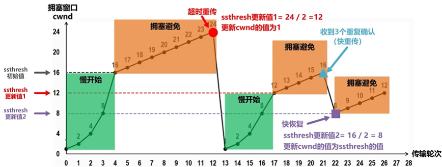

### 流量控制
双方在通信的时候，发送方的速率与接收方的速率不一定相等，如果发送方的发送速率太快，会导致接收方处理不过来，这时候接收方只能把处理不过来的数据存在缓存区里（失序的数据包也会被存放在缓冲区里）。如果缓存区满了，发送方还在疯狂发送数据，接收方只能把收到的数据包丢掉，大量的丢包会极大地浪费网络资源，因此需要控制发送方的发送速率，让接收方与发送方处于一种动态平衡才好。

对发送方发送速率的控制，称之为流量控制

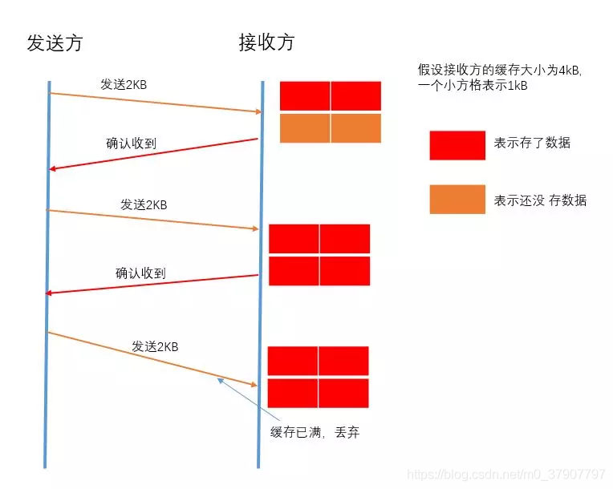

#### 滑动窗口
接收方每次收到数据包，可以在发送确定报文的时候，同时告诉发送方自己的缓冲区还剩余多少是空闲的，我们也把缓冲区的剩余大小称之为接收窗口大小，用变量 win 来表示接收窗口的大小。发送方收到之后，便会调整自己的发送速率，也就是调整自己发送窗口的大小，当发送方收到接收窗口的大小为 0 时，发送方就会停止发送数据，防止出现大量丢包情况的发生

1. 在通信过程中，接收方根据自己接收缓存的大小，动态地调整发送方的发送窗口大小，称为 接受窗口 rwnd，即调整 TCP 报文段首部中的 “窗口” 字段值，来限制发送方向网络注入报文的速率。
2. 同时，发送方根据其对当前网络拥塞程度的估计而确定的窗口值，称为 拥塞窗口 cwnd，其大小与网络的带宽和时延密切相关

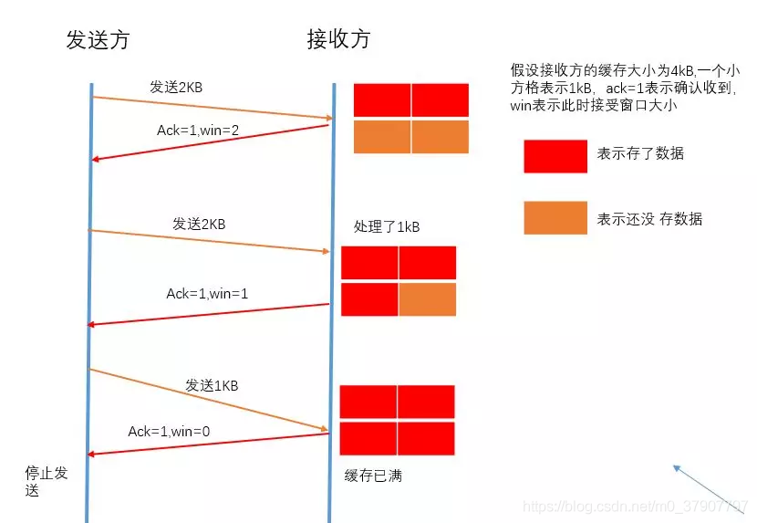

#### 持续计时器与零窗口探测报文
当接收方处理好数据，接受窗口 win > 0 时，接收方发个通知报文去通知发送方，告诉他可以继续发送数据了，当发送方收到窗口大于 0 的报文时，就继续发送数据。这时可能会遇到一个问题：接收方发了通知报文后，继续等待发送方发送数据，而发送方则在等待接收方的通知报文，此时双方会陷入一种僵局

解决方法：当发送方收到接受窗口 win = 0 时，这时发送方停止发送报文，并且同时开启一个定时器，每隔一段时间就发个测试报文去询问接收方，打听是否可以继续发送数据了，如果可以，接收方就告诉他此时接受窗口的大小；如果接受窗窗口大小还是为 0，则发送方再次刷新启动定时器

1. 只要 TCP 连接的一方收到对方的零窗口通知，就启动持续计时器。若持续计时器超时，就发送一个零窗口探测报文，仅携带 1 字节数据。
2. 而对方在确认这个探测报文段时，给出自己现在的接受窗口值。如果接收窗口仍为 0，那么收到这个报文段的一方就重新启动持续计时器；如果接收窗口不是 0，那么死锁局面就被打破了。

**接收窗口为 0 还怎么接收探测报文 ？**

答：TCP 规定，即使接收窗口为 0，也必须接收零窗口探测报文段、确认报文段以及携带有紧急数据的报文段。

**如果零窗口探测报文也丢失了呢 ？**

答：零窗口探测报文段也有重传计时器。

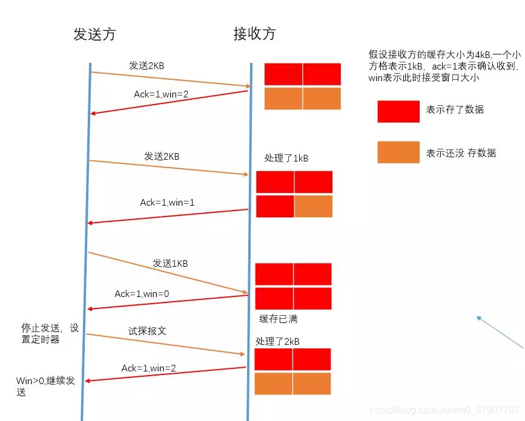

### 拥塞控制和流量控制的区别
1. 拥塞控制是作用于网络的，它是防止过多的数据注入到网络中，避免出现网络负载过大的情况，拥塞控制是一个全局性的过程，涉及到所有的主机、路由器等
2. 流量控制指点对点通信量的控制，是端到端中的问题，主要抑制发送端发送数据的速率，以便使接收端来得及接收

### 超时重传
不能直接使用某次测量得到的 RTT 样本来计算超时重传时间 RTO

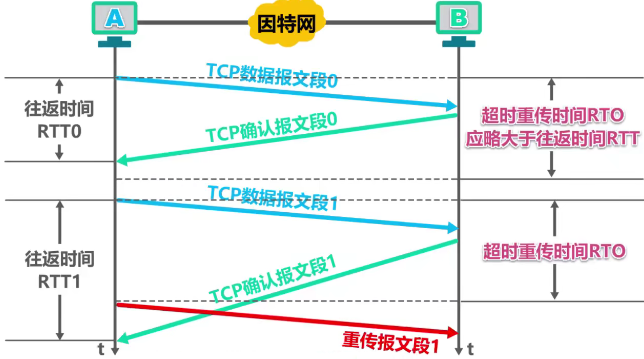

#### 超时重传时间 RTO
可以利用每次测量得到的 RTT 样本，计算加权平均往返时间 RTTs（称为平滑的往返时间）

超时重传时间 RTO 应略大于加权平均往返时间 RTTs

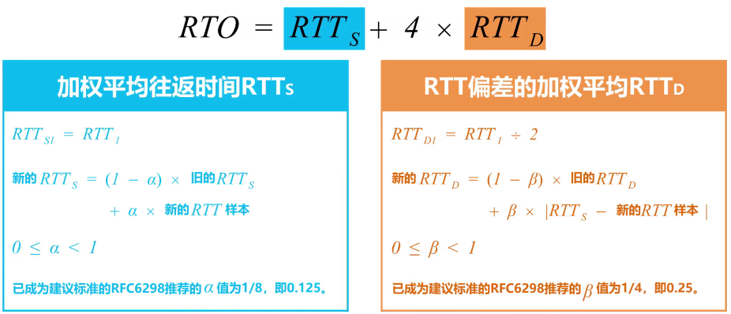

#### 往返时间 RTT
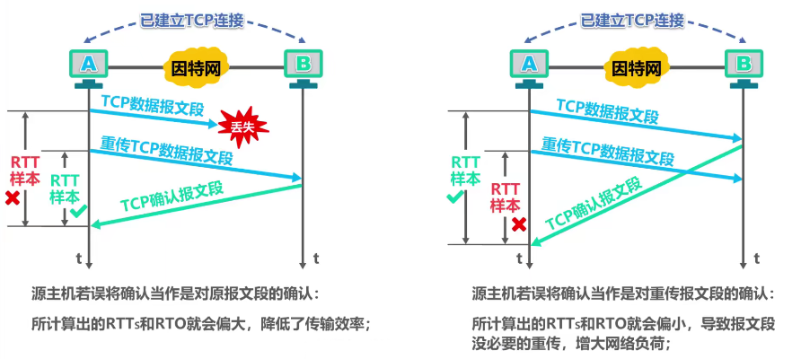

针对出现超时重传时无法测准往返时间 RTT 的问题，Karn 提出了一个算法

Karn 算法：在计算加权平均往返时间 RTTs 时，只要报文段重传，就不采用其往返时间 RTT 样本

为解决时延突然增大并且长时间维持高时延时，报文段都会重传，导致超时重传时间无法更新，报文段反复重传的问题。需要对 Karn 算法进行修正：报文段每重传一次，就把超时重传时间 RTO 增大一些，典型的做法是将新 RTO 的值取为旧 RTO 值的 2 倍

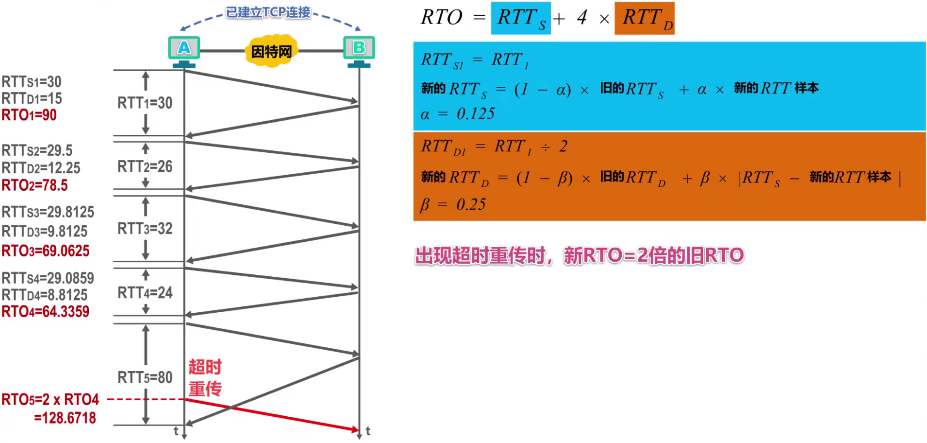

### 可靠传输
TCP 基于 以字节为单位的滑动窗口 来实现可靠传输

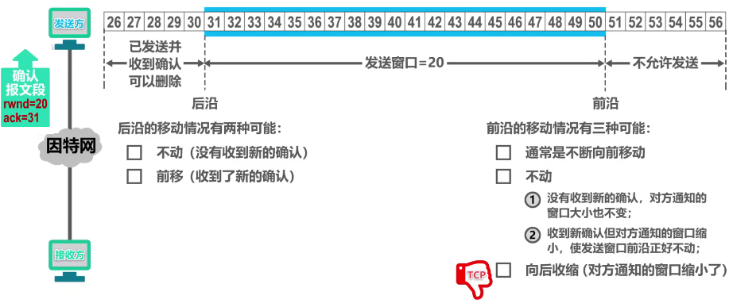

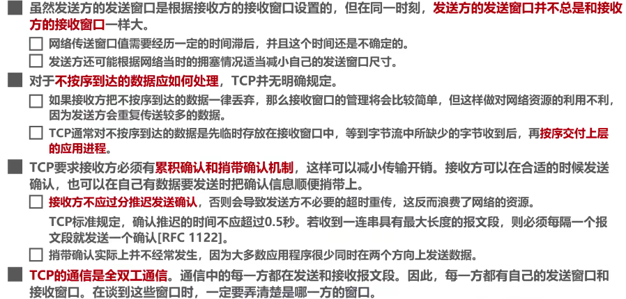

### 三次握手
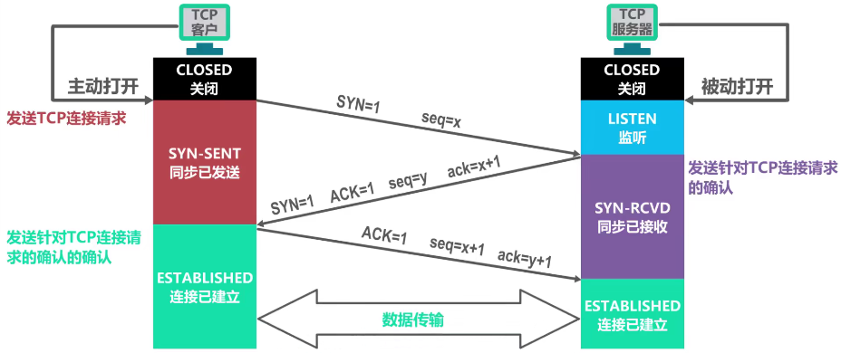

1. TCP 客户进程向 TCP 服务进程发送 TCP 连接请求报文段，并进入 SYN - SENT（同步已发送）状态。TCP 连接请求报文首部中的同步位置 SYN 被设置为 1，表明这时一个 TCP 连接请求报文段。序号字段 seq 被设置了一个初始值 x，作为 TCP 客户进程所选择的初始序号。

注意： TCP 规定，SYN 被设置为 1 的报文段不能携带数据，但要消耗掉一个序号。

2. TCP 服务进程收到连接请求报文端后，如果同意建立连接，则向 TCP 客户进程发送 TCP 连接请求确认报文段，并进入 SYN - RCVD（同步收到）状态。该报文段首部中的同步位 SYN 和确认位 ACK 都设置为 1，表明这时一个 TCP 连接请求确认报文段。序号字段 seq 被设置了一个初始值 y，作为 TCP 服务器进程所选择的初始序号。确认号字段 ack 的值被设置成了 x + 1，这是对 TCP 客户进程所选择的初始序号的确认。

注意：确认报文段也不能携带数据，但也要消耗掉一个序号。

3. 当 TCP 客户进程收到 TCP 连接请求确认报文段后，还要向 TCP 服务器发送一个普通的 TCP 确认报文段，并进入 ESTABLISHED（已建立连接）状态。该报文段首部中的确认位 ACK 被设置为 1，表明这是一个普通 TCP 确认报文段。序号字段 seq 被设置为 x + 1，这是因为 TCP 客户进程发送的第一个 TCP 报文段的序号为 x，因此第二个序号为 x + 1。确认号字段 ack 被设置为 y + 1，这是对 TCP 服务器进程所选择的初始序号的确认。TCP 服务器进程收到该确认报文段后，也进入 ESTABLISHED（已建立连接）状态。

注意：TCP 规定，普通的 TCP 确认报文段可以携带数据。但如果不携带数据，则不消耗序号，这种情况下，所发送的下一个数据报文段序号仍是 x + 1。

### 四次挥手
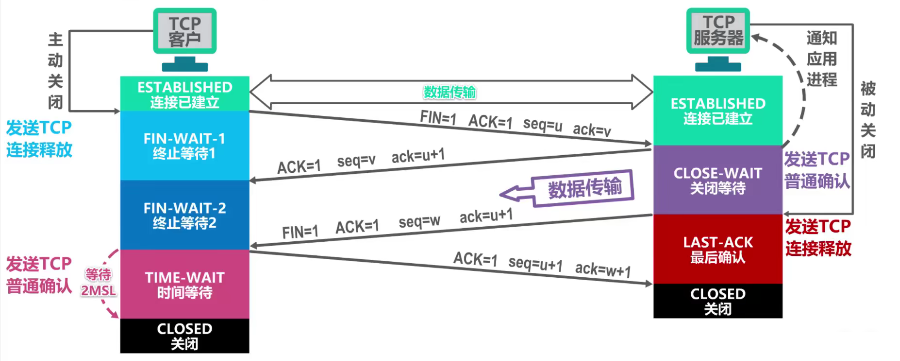

## UDP 和 TCP 区别
1. 使用 UDP 协议的通信双方，可以随时发送数据；使用 TCP 协议的通信双方，在进行数据传输之前，必须 使用 “ 三报文握手 ” 建立 TCP 连接 ，TCP 连接建立成功后才能进行数据传输。数据传输结束后，必须 使用 “ 四报文挥手 ” 来释放 TCP 连接

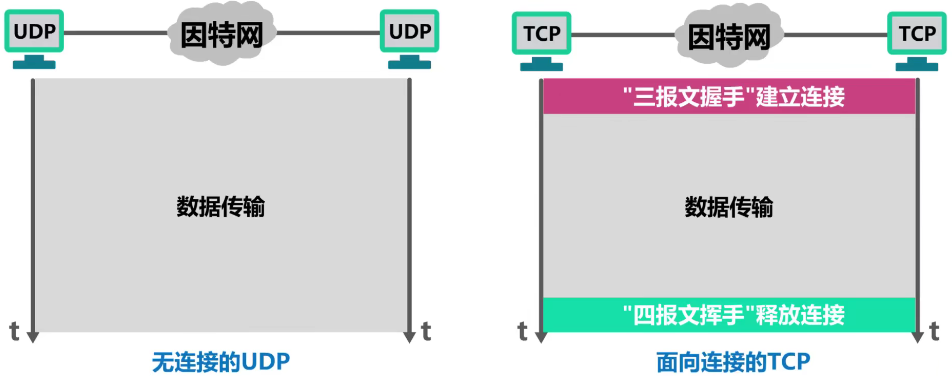

2. UDP 支持单播、多播以及广播。也就是支持一对一、一对多、一对全的通信。TCP 仅支持单播，也就是一对一通信。

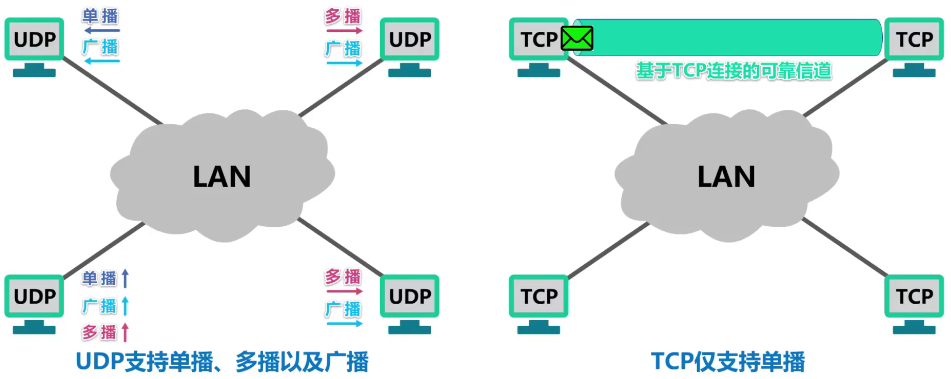

3. UDP 是面向应用报文的，UDP 对应用进程交下来的报文既不合并也不拆分，而是保留这些报文的边界；TCP 是面向字节流的。

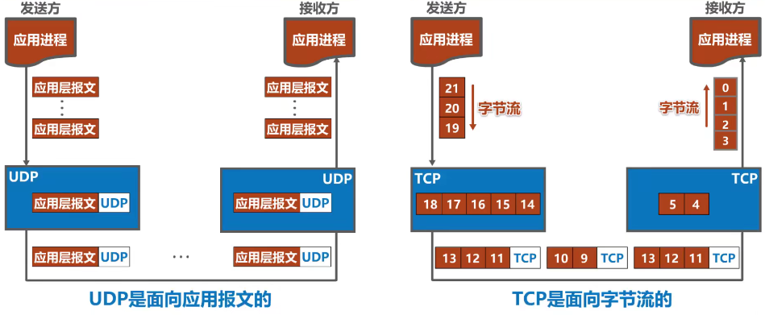

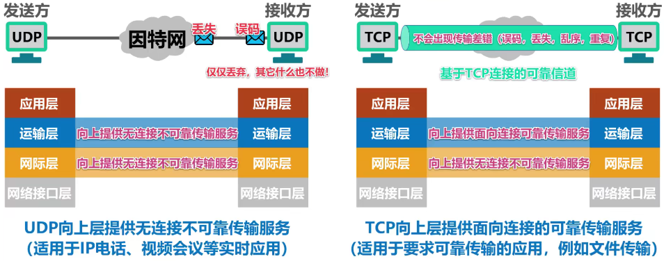

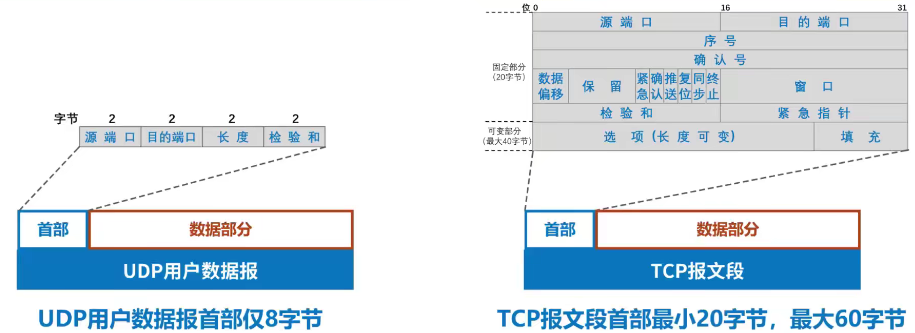

## 应用场景
1. TCP：效率要求相对低，但对准确性要求相对高的场景，因为传输中需要对数据确认、重发、排序等操作，相比之下效率没有 UDP 高。例如：文件传输（准确高要求高，但是速度可以相对慢），接收邮件，远程登录
2. UDP：效率要求相对高，但对准确性要求相对低的场景。例如：QQ 聊天、在线视频、网络语音电话（即时通讯速度要求高，但是出现偶尔断续不是太大问题，并且此处完全不可以使用使用重发机制）

## 常用协议
基于可靠的 TCP 协议

1. HTTP（超文本传输协议）：80
2. HTTPS：443
3. FTP（文件传输协议）：21
4. TELNET（远程登录）：23
5. SMTP（简单邮件传输协议）：25
6. POP3（接收邮件）：110

基于不可靠的 UDP 协议

1. DNS（域名解析服务）：53
2. DHCP（动态主机配置协议）：67、68
3. TFTP（简单文件传输协议）：69
4. SNMP（简单网络管理协议）：161

