## 客户/服务器（C/S）方式

各个计算机之间以客户机和服务器的关系进行工作与交换信息，客户机首先向服务器发送请求，然后服务器完成请求的工作，并把结果返回给客户机。

客户是服务请求方，服务器是服务提供方，服务器总是处于运行状态，并等待客户的服务请求。

服务器具有固定端口号（例如：HTTP 服务器的默认端口为 80），而且运行服务器的主机具有固定的 IP 地址，客户必须提前知道服务器的地址，而服务器不需要提前知道客户地址

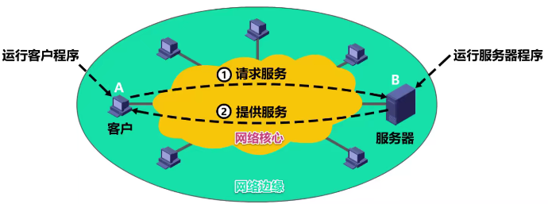

## 对等（P2P）方式
在 P2P 方式中，没有固定的服务请求者和服务提供者，分布在网络边缘各端系统中的应用进程是对等的，被称为对等方。对等方相互之间直接通信，每个对等方既是服务的请求者，又是服务的提供者。但实际上，P2P 方式上从本质上来说也是客户/服务器方式

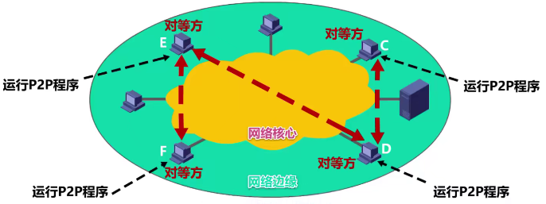

1. P2P 方式的最突出特性之一就是可扩展性。因为系统每增加一个对等方，不仅增加的是服务的请求者，同时也增加了服务的提供者，系统性能不会因规模的增大而降低
2. P2P 方式具有成本上的优势，不需要庞大的服务器设施和服务器带宽
3. P2P 方式的缺点：获取服务同时还要对外提供服务，会占用比较多的内存，影响整机速度

## 动态主机配置协议 DHCP
### 作用
DHCP：指的是由服务器控制一段 IP 地址范围，客户机登录服务器时就可以自动获得服务器分配的 IP 地址和子网掩码等网络配置信息

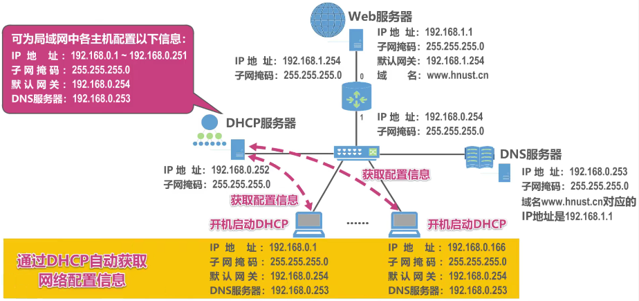

### 工作过程
1. DHCP 使用客户/服务器方式，DHCP 服务器上运行 DHCP 服务器进程，用户主机上运行 DHCP 客户进程，使用的是 UDP 所提供的服务
2. DHCP 服务器使用的 UDP 端口是 67，DHCP 客户使用的 UDP 端口为 68

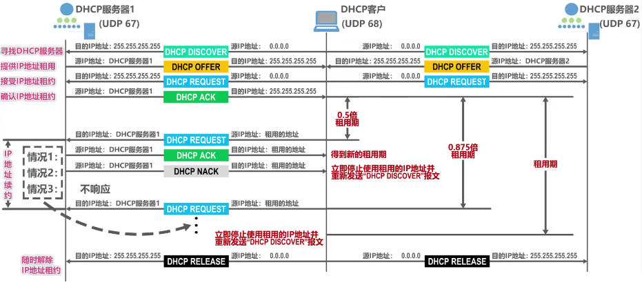

1. 寻找 DHCP 服务器：当启用主机的 DHCP 后，DHCP 客户广播发送 DHCP 发现报文，源地址：0.0.0.0，因此此时主机未分配到 IP 地址，对于 DHCP 发现报文，里面装着事务 ID 和 DHCP 客户端 MAC 地址
2. 提供 IP 地址租用：服务器收到报文时，根据报文中 MAC 地址来查找对应配置信息，如果有，根据这些配置信息构建和发送 DHCP 提供报文；如果没有，采取默认配置信息构建和发送 DHCP 提供报文，为了客户可以收到，同样广播发送
3. 接收 IP 地址租约：客户根据 DHCP 提供报文中的事务 ID 判断该报文是否为自己所请求的，DHCP 提供报文中还封装有配置信息，如：IP 地址、子网掩码、地址租期、默认网关、DNS 服务器。此后，向服务器发送 DHCP 请求报文，这时客户才确定要选择哪个服务器作为自己的 DHCP 服务器，它首先要争得该 DHCP 服务器的同意才能正式使用租用来的 IP 地址
4. 确认 IP 地址租约：被选择的 DHCP 服务器接收请求后，会向客户发送 DHCP 确认报文，客户接收该确认报文后，就可以使用所租用的 IP 地址了
5. IP 地址续约：租用期过一半时，客户会向服务器发送 DHCP 请求报文，请求更新租用期，DHCP 服务器若同意，则发回 DHCP 确认报文，那么客户就得到新的租用期；DHCP 服务器若不同意，则发回否认报文，这时客户必须立即停用租用的 IP 地址，同时重新发送 DHCP 发现报文重新申请 IP 地址；如果 DHCP 服务器没有响应，则在租用期过 87.5%后客户再次发送 DHCP 请求报文请求其更新租期
6. 随时解约：DHCP 可随时终止 IP 的租用，只需向服务器发送 DHCP 释放报文段即可

注意：DHCP 服务器挑选 IP 地址时，使用 ARP 确保所选 IP 地址未被占用，DHCP 客户在使用租用的 IP 地址前，也会使用 ARP 检测该 IP 地址是否被占用

### DHCP 中继代理
当 DHCP 客户发送的 DHCP 发现报文通过路由器转发时，因为是广播转发的，而路由器为避免广播风暴一般不会对广播消息进行转发

解决方法：给该路由器配置 DHCP 服务器的 IP 地址，并使之称为 DHCP 中继代理，当该路由器收到广播的 DHCP 发现报文后，会将其单播转发给 DHCP 服务器

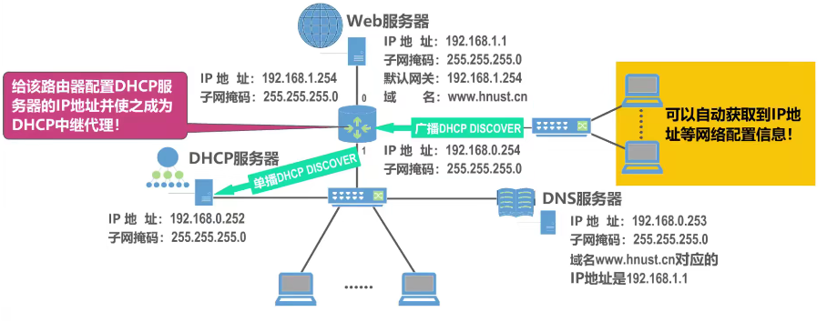

之所以设置 DHCP 中继代理，是因为不想每个网络都设置一个 DHCP 服务器，而要让不同网络使用一个 DHCP 服务器就要用到路由器，继而引出了中继代理

## 域名解析系统 DNS
是进行域名和与之相对应的 IP 地址转换的服务器，DNS 中保存了一张域名和与之相对应的 IP 地址的表，以解析消息的域名

在用户 PC 中使用页面浏览器来访问 Web 服务器的内容，在网页浏览器的地址栏中输入 Web 服务器的域名，用户 PC 中的 DNS 客户端进程会发送一个 DNS 查询请求报文，该报文使用 UDP 协议封装成 UDP 用户数据报，之后将其封装在 IP 数据报中发送给 DNS 服务器

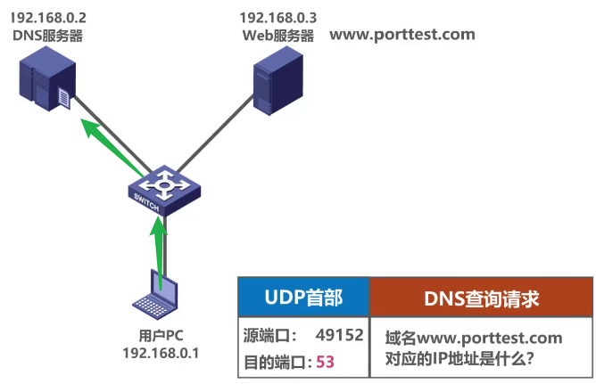

DNS 服务器收到后，从中解封出 UDP 用户数据报，因为端口号 53（DNS 应用程序端口号为 53），所以将数据报的数据载荷部分（查询请求报文）交付给本服务器中的 DNS 服务器端进程，该进程解析查询请求报文的内容后，给用户 PC 发送 DNS 响应报文后，之后，通过系列封装成为 IP 数据报，通过以太网发送给用户 PC

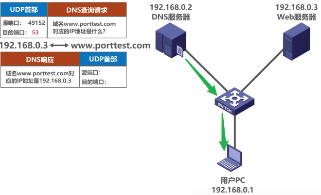

用户 PC 收到后，解封出 UDP 用户数据报，根据端口号，将其交付给 PC 中 DNS 客户端进程，该进程解析 DNS 响应报文的内容，得到之前请求域名所对应的 IP 地址为 192.168.0.3。于是，用户 PC 中的 HTTP 客户端进程可以向 Web 服务器发送 HTTP 请求报文了，该报文需要 TCP 协议封装成 TCP 报文段，之后封装在 IP 数据报中由以太网传输

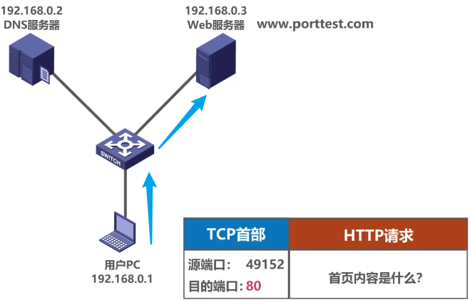

Web 服务器收到该数据包后解封出 TCP 报文段，根据其首部中目的端口号为 80，因此将 HTTP 请求报文交给本服务器中的 HTTP 服务器端进程，该进程解析报文查找内容后，给用户 PC 发送 HTTP 响应报文

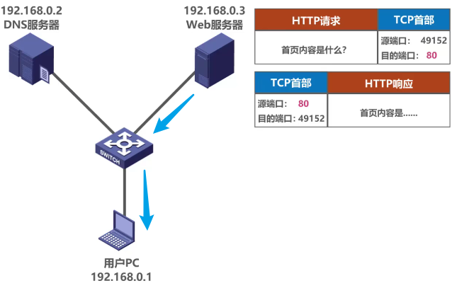

用户 PC 收到并解封，将 HTTP 响应报文交付给用户 PC 中的 HTTP 客户端进程，该进程解析 HTTP 响应报文内容，并在网页浏览器中进行，这样我们就可以成功地从网页中看到 Web 服务器提供的首页内容

### 域名分类


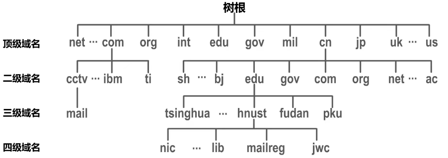


顶级域名分类：

1. 国家顶级域名 nTLD：国家和某些地区的域名。如 cn 表示中国、us 表示美国、uk 表示英国等。
2. 通用顶级域名 gTLD：最常见的通用顶级域名有七个，即： com（公司企业）、net（网络服务机构）、org（非营利性组织）、int（国际组织）、edu（教育机构）、gov（国家或政府部门）、mil（军事部门）
3. 反向域 arpa：用于反向域名解析，即 IP 地址反向解析为域名。

**二级域名分类**

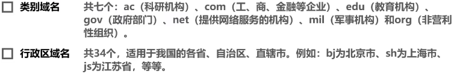

### 域名解析过程
域名解析：指把域名映射成 IP 地址或把 IP 地址映射成域名的过程。前者称为正向解析，后者称为反向解析，当客户端需要域名解析时，通过本机的 DNS 客户端构成一个 DNS 请求报文，以 UDP 数据报方式发往本地域名服务器

1. 递归查询

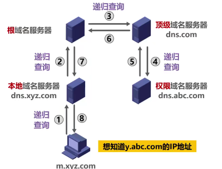

2. 迭代查询

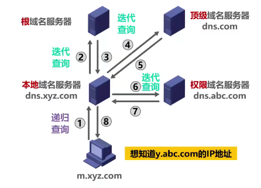

由于递归查询对于被查询的域名服务器负担太大，通常采用以下模式：从请求主机到本地域名服务器的从查询是递归查询，而其余的是迭代查询

### 高速缓存
为了提高 DNS 的查询效率，并减轻根域名服务器的负荷和减少因特网上的 DNS 查询报文数量，在域名服务器中广泛地使用了高速缓存，高速缓存用来存放最近查询过的域名以及从何处获得域名映射信息的记录。由于域名到 IP 地址的映射关系并不是永久不变，为保持高速缓存中的内容正确，域名服务器应为各项内容设置计时器并删除超过合理时间的信息

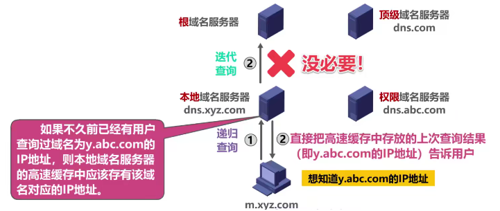

## 文件传送协议 FTP
FTP 提供以下功能：

1. 提供不同种类主机系统之间的文件传输能力
2. 以用户权限管理的方式提供用户对远程 FTP 服务器上的文件管理能力
3. 以匿名 FTP 的方式提供公用文件共享的能力

FTP 的服务器进程由两大部分组成：

1. 一个主进程，负责接收新的请求
2. 若干从属进程，负责处理单个请求

FTP 在工作时使用两个并行的 TCP 连接：一个是控制连接（端口号 21）、一个是数据连接（端口号 20）

**控制连接（21）**

控制连接用来传输控制信息（如连接请求、传送请求等），并且控制信息都以 7 位 ASCII 格式传送。FTP 客户发出的传送请求，通过控制连接发送给服务器端的控制进程，但控制连接并不用来传送文件

在传送文件时还可以使用控制连接（如客户在传输中途发一个中止传输的命令），因此控制连接在整个会话期间一直保持打开状态

**数据连接（20）**

数据连接有两种传输模式：主动模式 PORT 和被动模式 PASV

1. 主动模式的工作原理：客户端连接到服务器的 21 端口，登录成功后要读取数据时，客户端随机开放一个端口，并发送命令告知服务器，服务器收到 POST 命令和端口号后，通过 20 端口和客户端开放的端口连接，发送数据

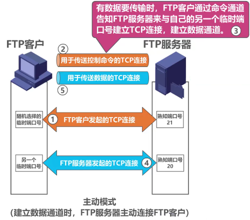

2. 被动模式的工作原理：客户端连接到服务器的 21 端口，要读取数据时，发送 PASV 命令到服务器，服务器在本地随机开放一个端口，并告知客户端，客户端再连接到服务器开放的端口进行数据传输

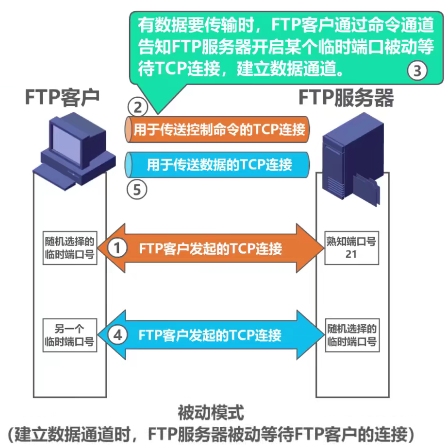

## 简单邮件传输协议 SMTP
SMTP 使用的是 TCP 连接，端口号为 25

1. 连接建立

发送人邮件发送到发送方邮件服务器的邮件缓存后，SMTP 客户周期性对邮件缓存扫描一次，如果发现有邮件，就使用 SMTP 端口号（25）与接收方服务器的 SMTP 服务器建立 TCP 连接。连接建立后，接收方 SMTP 服务器发出 220 Service ready（服务器就绪），然后 SMTP 客户向 SMTP 服务器发送 HELLO 命令，附上发送方的主机名

2. 邮件发送

连接建立后，就可开始传送邮件，邮件的传送从 MALL 命令开始，MALL 命令后面有发件人的地址，若 SMTP 服务器已准备好接收邮件，则回答 250 OK。接着 SMTP 客户端发送一个或多个 RCPT 命令，格式为 RCPT TO: <收件人地址>。每发送一个 RCPT 命令，都应有相应的信息从 SMTP 服务器返回，如：250 OK 或 550 No such user here（无此用户）

RCPT 命令的作用是：先弄清接收方系统是否已做好接收邮件的准备，然后才能发送邮件，避免造成通信资源的浪费

获得 OK 的回答后，客户端就使用 DATA 命令，表示要开始传输邮件的内容。正常情况下，SMTP 服务器回复的信息是 354 Start mail input; end with <CRLF>.<CRLF>，此时客户端就可以开始传送邮件内容

3. 连接释放

邮件发送完毕后，SMTP 客户应发送 QUIT 命令，SMTP 服务器返回的信息是 221（服务器关闭），表示 SMTP 同意释放 TCP 连接

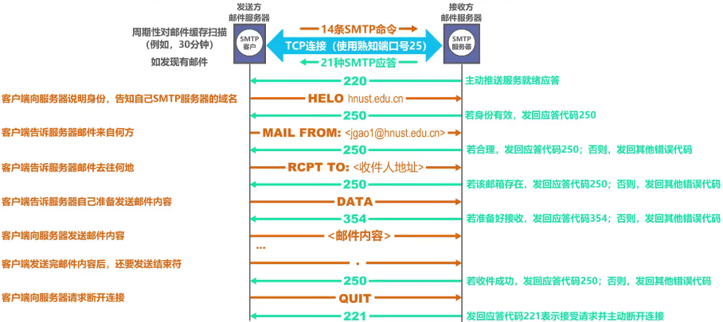

## 多用途网络邮件扩充 MIME
由于 SMTP 协议只能传送 ASCII 码文本数据，不能传送可执行文件或其他的二进制对象

MIME 主要包括以下三部分内容：

1. 增加了 5 个新的邮件首部字段，这些字段提供了有关邮件信息
2. 定义了许多邮件内容的格式，对多媒体电子邮件的表示方法进行了标准化
3. 定义了传送编码，可对任何内容格式进行转换，而不会被邮件系统改变

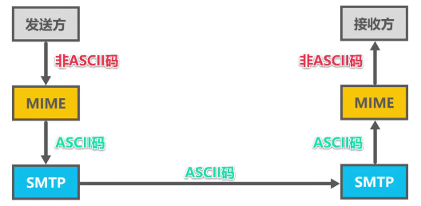

## 安全外壳协议 SSH
专为远程登录会话和其他网络服务提供安全性的协议，可有效弥补网络中的漏洞。通过 SSH，可以把所有传输的数据进行加密，也能够防止 DNS 欺骗和 IP 欺骗，还有一个额外的好处就是传输的数据是经过压缩的，所以可以加快传输的速度

SSH 之所以能够保证安全，原因在于它采用了非对称加密技术（RSA）加密了所有传输的数据，但并不是说 SSH 就是绝对安全的，因为它本身提供两种级别的验证方法：

1. 基于口令的安全验证：只要你知道自己账号和口令，就可以登录到远程主机，所有传输的数据都会被加密，但是不能保证你正在连接的服务器就是你想连接的服务器，可能会有别的服务器在冒充真正的服务器，即受到“中间人攻击”这种方法的攻击
2. 基于密钥的安全验证：必须为自己创建一对密钥，并把公钥放在需要访问的服务器上，如果要连接到 SSH 服务器上，客户端软件就会向服务器发出请求，请求用你的密钥进行安全凭证。服务器收到请求之后，先在服务器上你的主目录下寻找你的公钥，然后把它和你发送过来的公钥进行比较，如果两个密钥一致，服务器就用公钥加密“质询”并把它发送给客户端软件，客户端软件收到“质询”之后就可以用你的私钥在本地解密再把它发送给服务器完成登录

与第一种相比，第二种不仅加密所有传输的数据，也不需要在网络上传送口令，因此安全性更高，可以有效防止中间人攻击

## 简单网络管理系统 SNMP
用于监控目标设备的操作系统、硬件设备、服务应用、软硬件配置、网络协议状态、设备性能及资源利用率、设备报错事件信息、应用程序状态等软硬件信息

SNMP 的通信字符串主要包含两类命令：GET 命令、SET 命令

1. GET 命令从设备读取数据，这些数据通常是操作参数，例如：连接状态、接口名称等
2. SET 命令允许设置设备的某些参数，这类功能一般有限制，例如：关闭某个网络接口、路由器参数等功能

GET、SET 命令都可能被用于拒绝服务攻击（Dos）和恶意修改网络参数

## 超文本传输协议 HTTP
**HTTP1.0、1.1、2.0**

1. HTTP1.0 规定浏览器与服务器只保持短暂的连接，浏览器的每次请求都需要与服务器建立一个 TCP 连接，服务器完成请求处理后立即断开 TCP 连接
2. HTTP1.1 后 TCP 连接默认不关闭，可以被多个请求复用。引入了管道机制，即在同一个 TCP 连接里面，客户端可以同时发送多个请求，这样就进一步改进了 HTTP 协议的效率
3. HTTP2 采用了多路复用，即在一个连接里，客户端和浏览器都可以同时发送多个请求或回应，而且不用按照顺序一一对应。HTTP2 进行了二进制分帧，即 HTTP2 会将所有传输的信息分割为更小的消息和帧，并对它们采用二进制格式的编码

**无连接、无状态**

1. 无连接：限制每次连接只处理一个请求，服务器处理完客户的请求，并收到客户的应答后，即断开连接，采用这种方式可以节省传输时间

随着时间的推移，网页变得越来越复杂，里面可能嵌入了很多图片，这时候访问图片都需要建立一次 TCP 连接就显得很低效，Kepp-Alive 被提出用来解决这效率低的问题

2. 无状态：指协议对于事务处理没有记忆能力，服务器不知道客户端是什么状态，即给服务器发送 HTTP 请求之后，服务器根据请求，会给我们发送数据过来，但是发送完不会记录任何信息

HTTP 是一个无状态协议，这意味着每个请求都是独立的，Keep-Alive 没能改变这个结果。缺少状态意味着如果后续处理需要前面的信息，则它必须重传，这样可能导致每次连接传送的数据量增大，另一方面，在服务器不需要先前信息时它的应答就较快。客户端与服务器进行动态交互的 Web 应用程序出现之后，HTTP 的无状态阻碍了这些应用程序的实现，简单的购物车程序也要知道用户在之前选择了什么商品，于是 Cookie 和 Session 产生了

**HTTP 请求消息的组成部分**

POST 请求分为 4 个组成部分：

1. 请求行
2. 请求头部
3. 空行
4. 请求体

GET 请求分为 3 个，没有请求体：

1. 请求行
2. 请求头部
3. 空行

**请求行**

请求行由请求方式、URL 和 HTTP 版本协议 3 个部分组成，它们之间使用空格隔开

```plsql
请求方式   空格    url       空格    协议版本  回车符 换行符
post            /api/login          HTTP/1.1
```

**请求头部**

请求头部用来描述客户端的基本信息，从而把客户端相关的信息告知服务器

格式为：头部字段 冒号 值 回车符 换行符


**空行**

最后一个请求头字段的后面是一个空行，通知服务器请求头部至此结束，请求消息中的空行，用来分隔请求头部与请求体。谷歌浏览器是一个分隔符

**请求体**

请求体中存放的是要通过 POST 方式提交到服务器的数据，而 GET 请求没有请求体，只有 POST 有请求体

**HTTP 常见文件格式**

1. text/html：HTML 格式
2. text/plain：纯文本格式
3. image/jpeg：jpg 图片格式
4. application/json：JSON 数据
5. application/x-www-form-urlencoded：form 表单数据被编码为 key/value 格式发送到服务器（表单默认的提交数据格式）
6. multipart/form-data：在表单上传文件时使用

