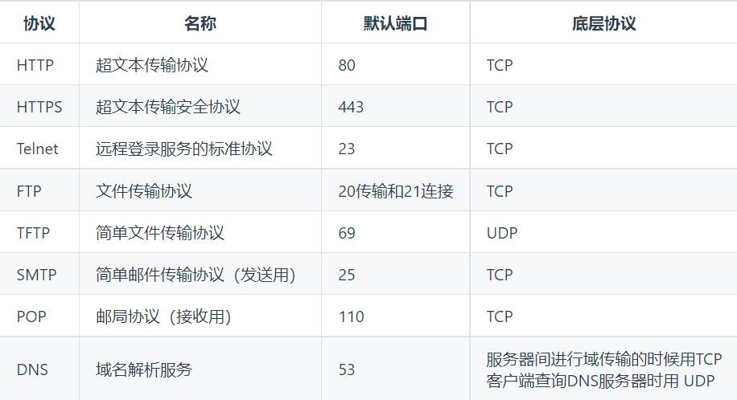
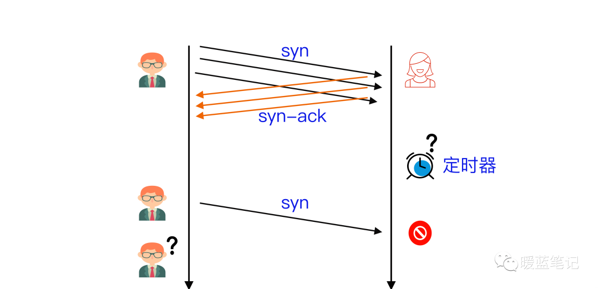

### OSI七层模型

1. 物理层：底层数据传输，如：网线，网卡标准
2. 数据链路层：定义数据的基本格式，如何传输，如何标识，如网卡MAC地址
3. 网络层：定义IP编制，定义路由功能，如不同设备的数据转发
4. 传输层：端到端传输数据的基本功能，如TCP、UDP
5. 会话层：控制应用程序之间会话能力，如不同软件数据分发给不同软件
6. 表示层：数据格式标识，基本压缩加密功能
7. 应用层：各种应用软件，包括Web应用
+ 四层传输层数据被称为数据段（Segment）
+ 三层网络层数据被称为数据包（package）
+ 二层数据链路层数据被称为数据帧（Frame）
+ 一层物理层数据被称为比特流（bit）


#### 为什么把TCP/IP协议栈分成5层？
1. 隔层之间是独立的
2. 灵活性好
3. 结构上可以分隔开
4. 易于实现和维护
5. 能促进标准化工作

#### 应用层协议


### DNS
#### DNS的工作原理
将主机域名转换为IP地址，属于应用层协议，使用UDP传输

1. 当用户输入域名时，浏览器先检查自己的缓存中是否包含这个域名映射的IP地址，有则解析结束
2. 若没有，则检查操作系统缓存（如Windows的hosts）中有没有解析过的结果，有则解析结束
3. 若没有，则请求本地服务器解析（LDNS）
4. 若LDNS没有命中就直接跳到根域名服务器请求解析，根域名服务器返回给LDNS一个主机域名服务器地址
5. 此时LDNS再发送请求给上一步返回的gTLD（通用顶级域），接收请求的gTLD查找并返回这个域名对应的Name Server的地址，Name Server根据映射关系表找到目标IP，返回给LDNS
6. LDNS缓存这个域名和对应的IP，把解析的结果返回给用户，用户根据TTL值缓存到本地系统缓存中，域名解析过程至此结束

#### 为什么域名解析用UDP协议？
1. 因为UDP快，UDP的DNS协议只要一个请求、一个应答就好了。而使用基于TCP的DNS协议要三次握手、发送数据以及应答、四次挥手
2. UDP协议传输内容不能超过512字节，不过客户端向DNS服务器查询域名，一般返回的内容都不超过512字节，用UDP传输即可

#### DNS负载均衡
当一个网站有足够多的用户的时候，假如每次请求的资源都位于同一台机器上面，那么这台机器随时可能会崩掉。

处理办法：用DNS负载均衡技术，它的原理是在DNS服务器中为同一台主机名配置多个IP地址，在应答DNS查询时，DNS服务器对每个查询将以DNS文件中主机记录的IP地址按顺序返回不同的解析结果，将客户端的访问引导到不同的机器上去，使得不同的客户端访问不同的服务器，从而达到负载均衡的目的。例如：可以根据每台机器的负载量，该机器离用户地理位置的距离等等

#### DNS劫持
指通过某些手段取得某域名的解析控制权，修改此域名的解析结果，导致对该域名的访问由原IP地址转入到修改后的指定IP，其结果就是对特定的网址不能访问或访问的是假网址

危害：

1. 钓鱼诈骗
2. 出现恶意广告
3. 网上购物个人账户泄密

#### host文件
1. 加快域名解析：在host文件中配置域名和IP的映射关系，提高域名解析速度
2. 屏蔽网站：把网站的域名映射到一个错误的IP地址，防止一些木马网站的访问
3. 方便局域网用户

### Cookie和Session
#### Cookie是什么？
HTTP协议是无状态的，主要是为了让HTTP协议尽可能简单，使得它能够处理大量事务，HTTP/1.1引入Cookie来保存状态信息。Cookie是服务器发送到用户浏览器并保存在本地的一小块数据，它会在浏览器之后向同一服务器再次发起请求时携带上，用于告知服务器两个请求是否来自同一浏览器，由于之后每次请求都会需要携带Cookie数据，因此会带来额外的性能开销

注意：如果客户端的浏览器禁用了Cookie，一般情况下，会使用一种叫做URL重写的技术来进行会话跟踪，即每次HTTP交互，URL后面都会被附加上一个诸如sid=xxx的参数，服务端据此来识别用户

#### Cookie作用
1. 会话状态管理（如用户登录状态、购物车、游戏分数）
2. 个性化设置（如用户自定义设置、主题等）
3. 浏览器行为跟踪（如跟踪分析用户行为等）

#### Session是什么？
除了可以将用户信息通过Cookie存储在用户浏览器中，也可以利用Session存储在服务器端，存储在服务器端的信息更加安全。Session可以存储在服务器上的文件、数据库或者内存中，也可以将Session存储在Redis这种内存型数据库中，效率会更高

#### Session工作原理
Session的工作原理是客户端登录完成之后，服务器会创建对应的Session，Session创建完之后，会把Session的ID发送给客户端，客户端再存储到浏览器中，这样客户端每次访问服务器时，都会带着SessionID，服务器拿到SessionID之后，在内存找到与之对应的Session，这样就可以正常工作了

#### Cookie和Session的区别
1. 存储位置不同：cookie存放于客户端；session存放于服务端
2. 存储容量不同：单个cookie保存的数据<=4KB，一个站点最多保存20个cookie；而session没有上限
3. 存储方式不同：cookie只能保存ASCII字符串，并需要通过编码当时存储为Unicode字符或者二进制数据；session中能够存储任何类型的数据，例如字符串、整数、集合等
4. 隐私策略不同：cookie对客户端是可见的，别有用心的人可以分析存放在本地的cookie并进行cookie欺骗，所以它是不安全的；session存储在服务器上，对客户端是透明的，不存在敏感信息泄露的风险
5. 生命周期不同：可以通过设置cookie的属性，达到cookie长期有效的效果；session依赖于名为JSESSIONID的cookie，而该cookie的默认过期时间为-1，只需关闭窗口该session就会失效，因此session不能长期有效
6. 服务器压力不同：cookie保存在客户端，不占用服务器资源；session保存在服务器上，每个用户都会产生一个session，如果并发量大的话，则会消耗大量的服务器内存
7. 浏览器支持不同：cookie是需要浏览器支持的，如果客户端禁用了cookie，则会话跟踪就会失效；运用session就需要使用URL重写的方式，所有用到session的URL都要进行重写，否则session会话跟踪也会失效
8. 跨域支持不同：cookie支持跨域访问，session不支持跨域访问

session的工作原理：<font style="background-color:#FADB14;">session依赖于cookie</font>

当客户端首次访问服务器时，服务器会为其创建一个session对象，该对象具有一个唯一标识SESSIONID，并且在相应阶段，服务器会创建一个cookie，并将SESSIONID存入其中。客户端通过相应的cookie而持有SESSIONID，所以当它再次访问服务器时，会通过cookie携带这个SESSIONID，服务器获取到SESSIONID后，就可以找到与之对应的session对象，进而从这个session中获取客户端的状态。如果客户端的浏览器禁用了Cookie，会使用一种叫做URL重写的技术来进行会话跟踪，即每次HTTP交互，URL后面会被附加上一个诸如sid=xxxxxx这样的参数，服务端据此来识别用户

#### Cookie和Sesion的适用场景
1. Cookie只能存储ASCII码字符串，而Session则可以存储任何类型的数据，因此在考虑数据复杂性时首选Session
2. Cookie存储在浏览器中，容易被恶意查看，如果非要将一些隐私数据存在Cookie中，可以将Cookie值进行加密，然后在服务器进行解密
3. 对于大型网站，如果用户所有的信息都存储在Session中，那么开销是非常大的，因此不建议将所有的用户信息存储到Session中

### POST和GET
#### 区别
1. GET是幂等的；POST是不幂等的
2. GET用于获取资源；而POST用于传输实体主体
3. GET在浏览器回退时是无害的，而POST会再次提交请求
4. GET请求会被浏览器主动缓存；而POST不会，除非手动设置
5. GET提交的数据最大是2K（限制实际上取决于浏览器）；POST理论上没有限制
6. GET把请求的数据放在URL上，以？分割URL和传输数据，参数之间以&相连，所以GET不安全；而POST把数据放在HTTP的包体内（request body），不能因为POST参数存储在实体主体中就认为它的安全性更高，因为照样可以通过一些抓包工具查看
7. URL只支持ASCII码，因此GET的参数中如果存在中文等字符就需要先进行编码，避免歧义，例如：name=value，value的值是va&lu=e这个字符串，在实际传输过程中就会变成name=va&lu=e，本意是只有一个键值对，但是服务端却会解析成两个键值对，这样就产生了歧义；POST参数支持标准字符集
8. GET产生一个TCP数据包，浏览器会把http head和data一并发送出去，服务器响应200（返回数据）；POST产生两个TCP数据包，浏览器先发送header，服务器响应100 continue，浏览器再发送data，服务器响应200 ok（返回数据）

#### 安全性
安全的HTTP方法不会改变服务器状态，只是可读的

GET方法是安全的，而POST却不是，因为POST的目的是传送实体主体内容，上传成功之后，服务器可能把这个数据存储到数据库中，因此状态也就发生了改变

1. 安全的方法还有：HEAD、OPTIONS
2. 不安全的方法还有：PUT、DELETE

#### 幂等性
幂等的HTTP方法，同样的请求被执行一次与连续执行多次的效果是一样的，服务器的状态也是一样的，幂等方法不应该具有副作用（统计用途除外）

所有的安全方法都是幂等的，在正确实现的条件下，GET、HEAD、PUT和DELETE等方法都是幂等的，而POST、PATCH方法不是

```xml
GET /pageX HTTP/1.1 是幂等的，连续调用多次，客户端接收到的结果都是一样的：

GET /pageX HTTP/1.1
GET /pageX HTTP/1.1
```

```xml
POST /add_row HTTP/1.1 不是幂等的，如果调用多次，就会增加多行记录：

POST /add_row HTTP/1.1   -> Adds a 1nd row
POST /add_row HTTP/1.1   -> Adds a 2nd row
POST /add_row HTTP/1.1   -> Adds a 3rd row
```

```xml
PUT /add_row HTTP/1.1 是幂等的，第一次会更新数据，后面调用多次数据不变

PUT /add_row HTTP/1.1   -> 更新资源
PUT /add_row HTTP/1.1   -> 数据不变
PUT /add_row HTTP/1.1   -> 数据不变
```

```xml
DELETE /idX/delete HTTP/1.1 是幂等的，第一次会删除，后面调用多次不变

DELETE /idX/delete HTTP/1.1   -> Returns 200 if idX exists
DELETE /idX/delete HTTP/1.1   -> Returns 404 as it just got deleted
DELETE /idX/delete HTTP/1.1   -> Returns 404
```

#### 可缓存
如果要对响应进行缓存，需要满足以下条件：

1. 请求报文的HTTP方法本身是可缓存的，包括GET和HEAD，但是PUT和DELETE不可缓存，POST在多数情况下不可缓存
2. 响应报文的状态码是可缓存的，包括：200，203，204，206，300，301，404，405，410，414和501
3. 响应报文的Cache-Control首部字段没有指定不进行缓存

#### XMLHttpRequest
XMLHttpRequest是一个API，他为客户端提供了在客户端和服务器之间传输数据的功能，并提供了一个通过URL来获取数据的简单方式，并且不会使整个页面刷新，这使得网页只更新一部分页面而不会打扰到用户

在使用XMLHttpRequest的POST方法时，浏览器会先发送Header再发送Data，但是不是所有的浏览器会这么做，例如火狐就不会。而GET方法Header和Data会一起发送

#### GET方法参数写法是固定的呢？
解析报文的过程是通过获取TCP数据，用正则等工具从数据中获取Header和Body，从而提取参数，可以自己约定参数的写法，只要服务端能够解释出来就行

#### GET请求的参数能放到body里面吗？
GET请求是可以将参数放到BODY里面的，官方并没有明确禁止，但给出的建议是这样不符合规范，无法保证所有的实现都支持。这就意味着，如果你试图这样做，可能会出现各种未知的问题，所以应当避免

#### GET方法的长度限制是怎么回事？
HTTP协议没有Body和URL的长度限制，对URL限制的大多是浏览器和服务器的原因。

服务器是因为处理长URL要消耗比较多的资源，为了性能和安全（防止恶意构造长URL来攻击）考虑，会给URL长度加限制

#### POST比GET安全？
从传输的角度来说，它们都是不安全的，因为HTTP在网络上是明文传输的，只要在网络节点上捉包，就能完整地获取数据报文。要想安全传输，就只有加密，也就是HTTPS

#### POST方法会产生两个TCP数据包？
有些文章中提到，POST会将header和body分开发送，先发送header，服务端返回100状态码再发送body。HTTP协议中没有明确地说明POST会产生两个TCP数据包，而且实际测试（Chrome）发现，header和body不会分开发送

所以，header和body分开发送是部分浏览器或框架的请求方法，不属于POST必然行为

### 网络攻击
#### DDos攻击和Dos攻击
1. Dos攻击（拒绝服务）：使得计算机或者网络无法提供正常服务
2. DDos攻击（分布式拒绝服务）：借助客户/服务器技术，将多个计算机联合起来作为一个攻击平台，对一个或者是多个目标发起攻击，从而成倍提高服务攻击的威力

##### 泛洪攻击
指攻击者在短时间内向目标设备发送大量的虚假报文，导致目标设备忙于应付无用报文，而无法为用户提供正常服务

##### SYN攻击
客户端向服务端发送请求连接数据包，服务端向客户端发送明确数据包，客户端不向服务端发送确认数据包，服务器一直等待来自客户端的确认，没有彻底根治的办法，除非不使用TCP



解决方法：

1. 限制同时打开SYN半连接的数目
2. 缩短SYN半连接的Time out时间
3. 关闭不必要的服务

##### UDP攻击
将大量的用户数据报协议（UDP）数据包发送到目标服务器，目的是压倒该设备的处理和响应能力，防火墙保护目标服务器也可能因UDP泛滥而耗尽，从而导致对合法流量的拒绝服务

<font style="background-color:#FBDE28;">攻击原理</font>

正常情况下，当服务器在特定端口接收到UDP数据包时，会经过两个步骤：

1. 服务器首先检查是否正在运行侦听指定端口的请求的程序
2. 如果没有程序在该端口接收数据包，则服务器使用ICMP数据包进行响应，以通知发送方目的地不可达

由于目标服务器利用资源检查并响应每个接收到的UDP数据包的结果，当接收到大量UDP数据包时，目标资源可能会迅速耗尽，导致对正常流量的拒绝服务


#### XSS攻击（跨站点脚本攻击）
指攻击者通过篡改网页，嵌入恶意脚本程序，在用户浏览网页时，控制用户浏览器进行恶意操作的一种攻击方式

<font style="background-color:#FADB14;">反射性XSS攻击</font>

```java
//正常发送消息：
http://www.test.com/message.php?send=Hello,World！

//非正常发送消息：
http://www.test.com/message.php?send=<script>alert(‘foolish!’)</script>！
```

<font style="background-color:#FADB14;">持久性XSS攻击</font>

XSS攻击向量存储在网站数据库，当一个页面被用户打开的时候执行。也就是说，每当用户使用浏览器打开指定页面时，脚本被执行

```java
<input type="text" name="content" value="这里是用户填写的数据">

//在value中填写
<script>alert(‘foolish!’)；</script> <!--或者html其他标签（破坏样式。。。）、一段攻击型代码-->
```

防范方法：

1. 前端和服务器同时需要对字符串输入的长度限制
2. 前端和服务器同时对HTML转义处理，将其中的<、>等特殊字符进行转义编码

#### CSRF攻击（跨站点请求伪造）
指攻击者通过跨站请求，以合法的用户的身份进行非法操作。即攻击者盗用你的身份，以你的名义向第三方网站发送恶意请求

防范方法：

1. 验证码
2. 安全框架
3. token机制：在HTTP请求中进行token验证，如果请求中没有token或者token内容不正确，则认为CSRF攻击而拒绝该请求
4. referer识别：在HTTP Header中有一个字段Referer，它记录了HTTP请求的来源地址，如果Referer是其他网站，就可能是CSRF攻击，则拒绝该请求

#### IP欺骗
通过IP地址的伪装使得某台主机能够伪装另外的一台主机，而这台主机往往具有某种特权或者被另外的主机所信任

使用场景：假设现在有一个合法用户（1.1.1.1）已经同服务器建立正常的连接，攻击者构造攻击的TCP数据，伪造自己的IP为1.1.1.1，并向服务器发送一个带有RSI位的TCP数据段。服务器接收到这样的数据后，认为从1.1.1.1发送的连接有错误，就会清空缓冲区中建立好的连接。这时如果1.1.1.1再发送合法数据，服务器已经没有这样的连接了，该用户就必须重新开始建立连接

### 加密和解密
#### RSA算法（非对称加密）
算法流程：

1. 选择两个质数p和q，算出他们的乘积n=p×q，算出对应的欧拉函数φ(n)【φ(n)=φ(p)×φ(p)=(p-1)(q-1)】
2. 选择一个e，使得e<φ(n)并且e与φ(n)互质
3. 算出e的一个相对于φ(n)的模反元素d
4. (e,n)为公钥，(d,n)为私钥，信息（明文）m长度小于n
5. 加密：c=m^e (mod n)
6. 解密：m=c^d (mod n)

#### MD5加密
加密是不可逆的，不能进行解密

### 转发和重定向
1. 直接转发方式（forward）：客户端和浏览器只发出一次请求，由第二个信息资源响应该请求，在请求对象request中，保存的对象对于每个信息资源是共享的
2. 间接转发方式（redirect）：实际是两次HTTP请求，服务端在响应第一次请求的时候，让浏览器再向另外一个URL发出请求，从而达到转发的目的

直接转发相当于：A找B借钱，B说没有，B去找C借，借不借得到都会把消息传递给A

间接转发相当于：A找B借钱，B说没有，让A去找C借

<font style="background-color:#FADB14;">区别</font>

1. 请求次数：重定向是浏览器向服务器发送一个请求并收到响应后再次向一个新地址发出请求；转发是服务器收到请求后为了完成响应跳转到一个新的地址，重定向至少请求两次，转发请求一次
2. 地址栏不同：重定向地址栏会发生变化；转发地址栏不会发生变化
3. 是否共享数据：重定向两次请求不共享数据；转发一次请求共享数据（在request级别使用共享数据，使用重定向必然出错）
4. 跳转限制：重定向可以跳转到任意URL；转发只能跳转本站点资源
5. 发生行为不同：重定向是客户端行为；转发是服务器行为

### URI和URL
1. URL，即统一资源定位符，它标识一个互联网资源，并指定对其进行操作或获取该资源的方法
2. URI是统一资源标识符，URL是URI的一个子集，URI是一种语义上的抽象概念，可以是绝对的，也可以是相对的，而URL则必须提供足够的信息来定位，是绝对的。只要能唯一标识资源的就是URI，在URI的基础上给出其资源的访问方式的就是URL

