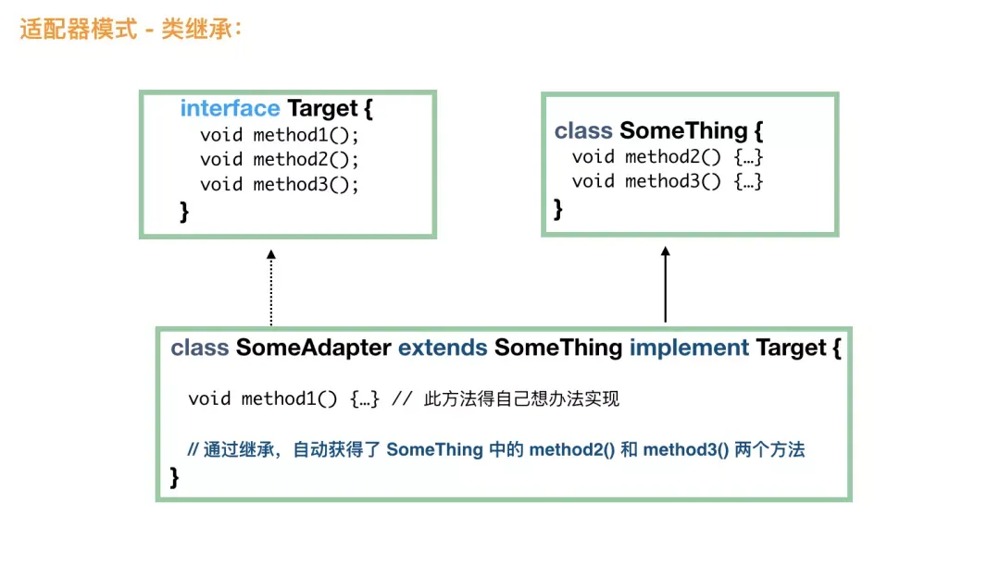

将一个类的接口转换成客户希望的另外一个接口。使得原本由于接口不兼容而不能一起工作的那些类可以一起工作。 

#### 默认适配器模式

```java
public interface FileAlterationListener {  
    void onStart(final FileAlterationObserver observer);  
    void onDirectoryCreate(final File directory);  
    void onDirectoryChange(final File directory);  
    void onDirectoryDelete(final File directory);  
    void onFileCreate(final File file);  
    void onFileChange(final File file);  
    void onFileDelete(final File file);  
    void onStop(final FileAlterationObserver observer);  
}  
```

此接口的一大问题是抽象方法太多了，如果要用这个接口，意味着要实现每一个抽象方法，如果只是想要监控文件夹中的文件创建和文件删除事件，可是还是不得不实现所有的方法，很明显，这不是期望的。

所以，需要下面的一个适配器，它用于实现上面的接口，但是所有的方法都是空方法，这样，就可以转而定义自己的类来继承下面这个类即可。

```java
public class FileAlterationListenerAdaptor implements FileAlterationListener {  
  
    public void onStart(final FileAlterationObserver observer) {  
    }  
  
    public void onDirectoryCreate(final File directory) {  
    }  
  
    public void onDirectoryChange(final File directory) {  
    }  
  
    public void onDirectoryDelete(final File directory) {  
    }  
  
    public void onFileCreate(final File file) {  
    }  
  
    public void onFileChange(final File file) {  
    }  
  
    public void onFileDelete(final File file) {  
    }  
  
    public void onStop(final FileAlterationObserver observer) {  
    }  
}  
```

```java
public class FileMonitor extends FileAlterationListenerAdaptor {  
    public void onFileCreate(final File file) {  
        // 文件创建  
        doSomething();  
    }  
  
    public void onFileDelete(final File file) {  
        // 文件删除  
        doSomething();  
    }  
}  
```

#### 对象适配器模式

```java
public interface Duck {  
    public void quack(); // 鸭的呱呱叫  
    public void fly(); // 飞  
}  
  
public interface Cock {  
    public void gobble(); // 鸡的咕咕叫  
    public void fly(); // 飞  
}  
  
public class WildCock implements Cock {  
    public void gobble() {  
        System.out.println("咕咕叫");  
    }  
    public void fly() {  
        System.out.println("鸡也会飞哦");  
    }  
}  
```

```java
// 毫无疑问，首先，这个适配器肯定需要 implements Duck，这样才能当做鸭来用  
public class CockAdapter implements Duck {  
  
    Cock cock;  
    // 构造方法中需要一个鸡的实例，此类就是将这只鸡适配成鸭来用  
    public CockAdapter(Cock cock) {  
        this.cock = cock;  
    }  
  
    // 实现鸭的呱呱叫方法  
    @Override  
    public void quack() {  
        // 内部其实是一只鸡的咕咕叫  
        cock.gobble();  
    }  
  
    @Override  
    public void fly() {  
        cock.fly();  
    }  
}  
```

```java
public static void main(String[] args) {  
    // 有一只野鸡  
      Cock wildCock = new WildCock();  
      // 成功将野鸡适配成鸭  
      Duck duck = new CockAdapter(wildCock);  
      ...  
}  
```

#### 类适配器模式


