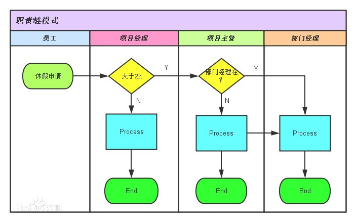

客户端发出一个请求，链上的对象都有机会来处理这一请求，而客户端不需要知道谁是具体的处理对象。使多个对象都有机会处理请求，从而避免了请求的发送者和接受者之间的耦合关系。将这些对象连成一条链，并沿着这条链传递该请求，直到有对象处理它为止，其过程实际上是一个递归调用



```java
public abstract class AbstractLogger {
    public static int INFO=1;
    public static int DEBUG=2;
    public static int ERROR=3;

    protected int level;

    //责任链中的下一个元素
    protected AbstractLogger nextLogger;

    public void setNextLogger(AbstractLogger nextLogger){
        this.nextLogger=nextLogger;
    }

    public void logMessage(int level,String message){
        if (this.level<=level){
            write(message);
        }
        if (nextLogger!=null){
            nextLogger.logMessage(level,message);
        }
    }

    protected abstract void write(String message);
}
```

```java
public class ConsoleLogger extends AbstractLogger{

    public ConsoleLogger(int level){
        this.level=level;
    }

    @Override
    protected void write(String message) {
        System.out.println("Standard Console::Logger: "+message);
    }
}

public class ErrorLogger extends AbstractLogger{

    public ErrorLogger(int level){
        this.level=level;
    }

    @Override
    protected void write(String message) {
        System.out.println("Error Console::Logger: "+message);
    }
}

public class FileLogger extends AbstractLogger{

    public FileLogger(int level){
        this.level=level;
    }

    @Override
    protected void write(String message) {
        System.out.println("File::Logger: "+message);
    }
}
```

```java
public class ChainPatternDemo {

    private static AbstractLogger getChainOfLoggers(){
        AbstractLogger errorLogger=new ErrorLogger(AbstractLogger.ERROR);
        AbstractLogger fileLogger=new FileLogger(AbstractLogger.DEBUG);
        AbstractLogger consoleLogger=new ConsoleLogger(AbstractLogger.INFO);

        errorLogger.setNextLogger(fileLogger);
        fileLogger.setNextLogger(consoleLogger);
        return errorLogger;
    }

    public static void main(String[] args) {
        AbstractLogger loggerChain=getChainOfLoggers();
        loggerChain.logMessage(AbstractLogger.INFO,"This is an information");
        System.out.println("---------------------------");
        loggerChain.logMessage(AbstractLogger.DEBUG,"This is a debug level information");
        System.out.println("---------------------------");
        loggerChain.logMessage(AbstractLogger.ERROR,"This is an error information");
    }
}
```
