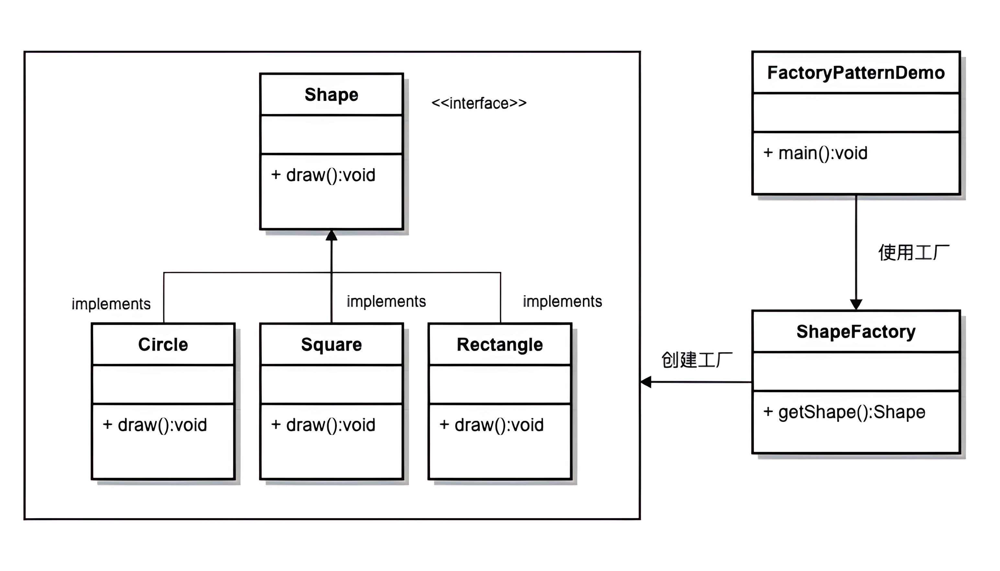

## 基本概念

描述：定义一个用于创建对象的接口，让子类决定实例化哪一个类。使一个类的实例化延迟到其子类。

使用场景：在工厂方法模式中，客户端不需要知道具体产品类的类名，只需要知道所对应的工厂即可，具体的产品对象由具体工厂类创建；客户端需要知道创建具体产品的工厂类。



## 使用案例

```java
abstract class Product {
    public abstract void Show();
}

// 具体产品A类
class ProductA extends Product {
    
    @Override
    public void Show() {
        System.out.println("生产出了产品A");
    }
}
 
// 具体产品B类
class ProductB extends Product {
 
    @Override
    public void Show() {
        System.out.println("生产出了产品B");
    }
}
```

```java
abstract class Factory {
    public abstract Product Manufacture();
}

// 工厂A类 - 生产A类产品
class FactoryA extends Factory {
    
    @Override
    public Product Manufacture() {
        return new ProductA();
    }
}
 
// 工厂B类 - 生产B类产品
class FactoryB extends Factory {
    
    @Override
    public Product Manufacture() {
        return new ProductB();
    }
}
```

```java
// 生产工作流程
public class FactoryPattern {
    
    public static void main(String[] args) {
        // 客户要产品A
        FactoryA mFactoryA = new FactoryA();
        mFactoryA.Manufacture().Show();
 
        // 客户要产品B
        FactoryB mFactoryB = new FactoryB();
        mFactoryB.Manufacture().Show();
    }
}
```

## Logback 源码中的应用

```java
public interface ILoggerFactory {

    public Logger getLogger(String name);
}
```

```java
public class LoggerContext extends ContextBase implements ILoggerFactory, LifeCycle {
    // .....
}
```

```java
public class SubstituteLoggerFactory implements ILoggerFactory {
	// .....
}
```

```java
public class NOPLoggerFactory implements ILoggerFactory {

    public NOPLoggerFactory() {
        // nothing to do
    }

    public Logger getLogger(String name) {
        return NOPLogger.NOP_LOGGER;
    }
}
```

