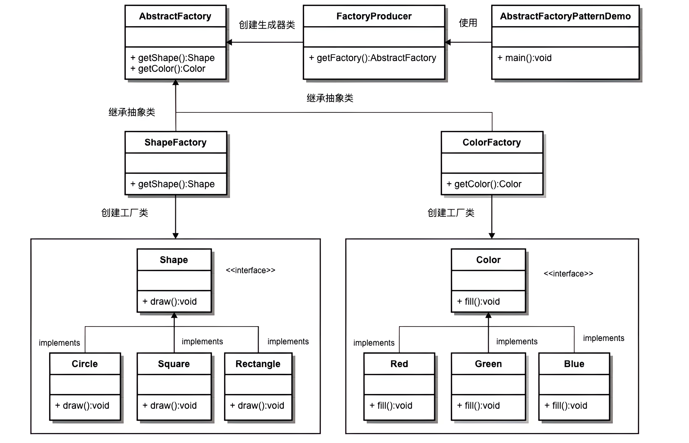

## 基本概念

描述：提供一个创建一系列相关或相互依赖对象的接口，而无须指定它们具体的类。

使用场景：为了参加一些聚会，肯定有两套或多套衣服吧，比如说有商务装（成套，一系列具体产品）、时尚装（成套，一系列具体产品），甚至对于一个家庭来说，可能有商务女装、商务男装、时尚女装、时尚男装，这些也都是成套的，即一系列具体产品。假设一种情况，在您的家中，某一个衣柜（具体工厂）只能存放某一种这样的衣服（成套，一系列具体产品），每次拿这种成套的衣服时也自然要从这个衣柜中取出了。



## 使用案例

```java
public interface Human {
    //打印肤色
    public void printColor();
}

public abstract class Man implements Human{
    public void printGender(){
        System.out.println("性别为男");
    }

    public abstract void printColor();
}

public abstract class Woman implements Human{
    public void printGender(){
        System.out.println("性别为女");
    }

    public abstract void printColor();
}
```

```java
public class BlackMan extends Man{
    @Override
    public void printColor() {
        System.out.println("黑皮肤");
    }
}
public class BlackWoman extends Woman{
    @Override
    public void printColor() {
        System.out.println("黑皮肤");
    }
}

public class WhiteMan extends Man{
    @Override
    public void printColor() {
        System.out.println("白皮肤");
    }
}
public class WhiteWoman extends Woman{
    @Override
    public void printColor() {
        System.out.println("白皮肤");
    }
}

public class YellowMan extends Man{
    @Override
    public void printColor() {
        System.out.println("黄皮肤");
    }
}
public class YellowWoman extends Woman{
    @Override
    public void printColor() {
        System.out.println("黄皮肤");
    }
}
```

```java
public abstract class HumanFactory {
    //创建男人
    public abstract Man createMan();
    //创建女人
    public abstract Woman createWoman();
}

public class BlackHumanFactory extends HumanFactory{
    @Override
    public Man createMan() {
        return new BlackMan();
    }

    @Override
    public Woman createWoman() {
        return new BlackWoman();
    }
}

public class WhiteHumanFactory extends HumanFactory{
    @Override
    public Man createMan() {
        return new WhiteMan();
    }

    @Override
    public Woman createWoman() {
        return new WhiteWoman();
    }
}

public class YellowHumanFactory extends HumanFactory{
    @Override
    public Man createMan() {
        return new YellowMan();
    }

    @Override
    public Woman createWoman() {
        return new YellowWoman();
    }
}
```

```java
public class Demo {
    public static void main(String[] args) {
        HumanFactory factory = null;
        //创建黑人
        factory = new BlackHumanFactory();
        Man blackMan = factory.createMan();
        blackMan.printGender();
        blackMan.printColor();
        Woman blackWoman = factory.createWoman();
        blackWoman.printGender();
        blackWoman.printColor();
    }
}
```

## Spring 源码中的应用

```java
public interface BeanFactory {
	String FACTORY_BEAN_PREFIX = "&";

	Object getBean(String name) throws BeansException;

	<T> T getBean(String name, @Nullable Class<T> requiredType) throws BeansException;

	Object getBean(String name, Object... args) throws BeansException;

	<T> T getBean(Class<T> requiredType) throws BeansException;

	<T> T getBean(Class<T> requiredType, Object... args) throws BeansException;

	boolean containsBean(String name);

	boolean isSingleton(String name) throws NoSuchBeanDefinitionException;

	boolean isPrototype(String name) throws NoSuchBeanDefinitionException;

	boolean isTypeMatch(String name, ResolvableType typeToMatch) throws NoSuchBeanDefinitionException;

	boolean isTypeMatch(String name, @Nullable Class<?> typeToMatch) throws NoSuchBean 	DefinitionException;

	@Nullable
	Class<?> getType(String name) throws NoSuchBeanDefinitionException;
	String[] getAliases(String name);
}
```

在 Spring 中，所有工厂都是 BeanFactory 的子类。通过对 BeanFactory 的实现，我们可以从 Spring 的容器访问 Bean。根据不同的策略调用 getBean()方法，从而获得具体对象。

BeanFactory 的子类主要有 ClassPathXmlApplicationContext、XmlWebApplicationContext、StaticWebApplicationContext、StaticPortletApplicationContext、GenericApplicationContext 和 StaticApplicationContext。在 Spring 中，DefaultListableBeanFactory 实现了所有工厂的公共逻辑。
