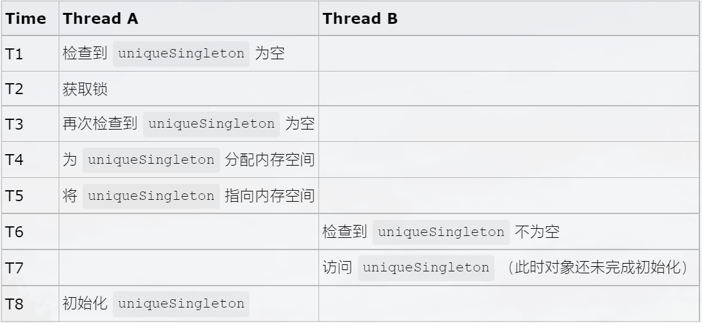

## 基本概念

描述：保证一个类仅有一个实例，并提供一个访问它的全局访问点。

例如：在 windows 桌面上打开了一个回收站，当试图再次打开一个新的回收站时，windows 系统并不会弹出一个新的回收站，在系统运行的过程中只维护一个回收站的实例。假如每次创建回收站时都需要消耗大量的资源，而每个回收站之间资源是共享的，那么在没有必要多次重复创建该实例的情况下，创建了多个实例，这样做就会给系统造成不必要的负担，造成资源浪费。

## 饿汉式（线程安全）

```java
// 饿汉式单例
public class Singleton1 {
    // 指向自己实例的私有静态引用，主动创建
    private static Singleton1 singleton1 = new Singleton1();

    // 私有的构造方法
    private Singleton1() {
    }

    // 以自己实例为返回值的静态的公有方法，静态工厂方法
    public static Singleton1 getSingleton1() {
        return singleton1;
    }
}
```

## 懒汉式（线程不安全）

饿汉式单例模式适用于单例对象较少的情况。这样写可以保证绝对线程安全，执行效率比较高。但是它的缺点也很明显，就是所有对象类在加载的时候就实例化。这样一来，如果系统中有大批量的单例对象存在，而且单例对象的数量也不确定，则系统初始化时会造成大量的内存浪费，从而导致系统内存不可控。

```java
// 懒汉式单例
public class Singleton2 {
    // 指向自己实例的私有静态引用
    private static Singleton2 singleton2;

    // 私有的构造方法
    private Singleton2() {
    }

    // 以自己实例为返回值的静态的公有方法，静态工厂方法
    public static Singleton2 getSingleton2() {
        // 被动创建，在真正需要使用时才去创建
        if (singleton2 == null) {
            singleton2 = new Singleton2();
        }
        return singleton2;
    }
}
```

缺点：单例实例被延迟加载，但是只能在单线程下使用，如果在多线程下，一个线程进入了 if(singleton == null)判断语句块，还未来得及往下执行，另一个线程也通过了这个实例，这时便会产生多个实例，所以在多线程环境下不可使用

## 懒汉式（线程安全）

```java
// 懒汉式单例
public class Singleton2 {
    // 指向自己实例的私有静态引用
    private static Singleton2 singleton2;

    // 私有的构造方法
    private Singleton2() { 
    }

    // 以自己实例为返回值的静态的公有方法，静态工厂方法
    public static synchronized Singleton2 getSingleton2() {
        // 被动创建，在真正需要使用时才去创建
        if (singleton2 == null) {
            singleton2 = new Singleton2();
        }
        return singleton2;
    }
}
```

缺点：如果在线程数量剧增的情况下，用 synchronized 加锁，则会导致大批线程阻塞，从而导致程序性能大幅下降

## 双重加锁机制（线程安全）

**错误的双重检查锁**

```java
public class Singleton3 {
    private static Singleton3 instance;

    private Singleton3() {
    }

    public Singleton3 getInstance() {
        if (instance == null) {
            synchronized (Singleton3.class) {
                if (instance == null) {
                    instance = new Singleton3();//Error
                }
            }
        }
        return instance;
    }
}
```

存在隐患：实例化对象的那行代码（标记为 error 的那行），实际上可以分解成以下步骤：

1. 给 instance 分配内存空间
2. 调用 Singleton3 的构造函数来初始化成员变量
3. 将 instance 对象指向刚分配的内存空间

但是有些编译器为了性能的原因，可能会将第二步和第三步进行重排序，顺序就成了：

1. 分配内存空间
2. 将对象指向刚分配的内存空间
3. 初始化对象



在某个线程创建单例对象时，在构造方法被调用之前，就为该对象分配了内存空间并将对象的字段设置为默认值。此时就可以将分配的内存地址赋值给 instance 字段了，然而该对象可能还没有初始化。若紧接着另外一个线程来调用 getInstance，取到的就是状态不正确的对象，程序就会出错。在这种情况下，T7 时刻线程 B 对 uniqueSingleton 的访问，访问的是一个初始化未完成的对象。

解决方法：在 uniqueSingletion 前加上关键字 volatile，使用了 volatile 关键字后，重排序被禁止，所有的写操作都将发生在读操作之前

**正确的双重校验锁**

```java
public class Singleton4 {
    private volatile static Singleton4 singleton4;

    private Singleton4() {
    }

    public Singleton4 getSingleton4() {
        if (singleton4 == null) {
            synchronized (Singleton4.class) {
                if (singleton4 == null) {
                    singleton4 = new Singleton4();
                }
            }
        }
        return singleton4;
    }
}
```

## 静态内部类（线程安全）

双重检查锁单例写法虽然解决了线程安全问题和性能问题，但是只要用到 synchronized 关键字总是要上锁，对程序性能还是存在一定影响的。

```java
public class Singleton5 {
    
    private Singleton5() {
    }

    private static class SingletonHolder {
        private static final Singleton5 INSTANCE = new Singleton5();
    }

    public static Singleton getUniqueInstance() {
        return SingletonHolder.INSTANCE;
    }
}
```

当外部类 Singleton 被加载时，静态内部类 SingletionHolder 并没有被加载进内存。当调用 getUniqueInstance()方法时，触发了 SingletonHolder.INSTANCE，此时静态内部类 SingletonHolder 才会被加载进内存，并且初始化 INSTANCE 实例，而且 JVM 会确保 INSTANCE 只被实例化一次

缺点：上面的单例模式的构造方法除了加上 private 关键字，没有做任何处理。如果使用反射来调用其构造方法，再调用 getInstance()方法，应该有两个不同的实例。

优化后的代码如下

```java
public class Singleton5 {
    
    private Singleton5() {
        if(SingletonHolder.INSTANCE != null) {
            throw new RuntimeException("不允许创建多个实例");
        }
    }

    private static class SingletonHolder {
        private static final Singleton5 INSTANCE = new Singleton5();
    }

    public static Singleton getUniqueInstance() {
        return SingletonHolder.INSTANCE;
    }
}
```

## 枚举类（线程安全）

```java
public enum Singleton {
    INSTANCE;

    //添加自己需要的操作
    public void doSomeThing() {
    }
}
```

优点：

1. 默认枚举实例的创建就是线程安全的，且在任何情况下都是单例
2. 枚举类天然防止反序列化，其他单例模式可以通过重写 readResolve()方法，从而防止反序列化

```java
private Object readResolve() throws ObjectStreamException{
    return singleton;
}
```
